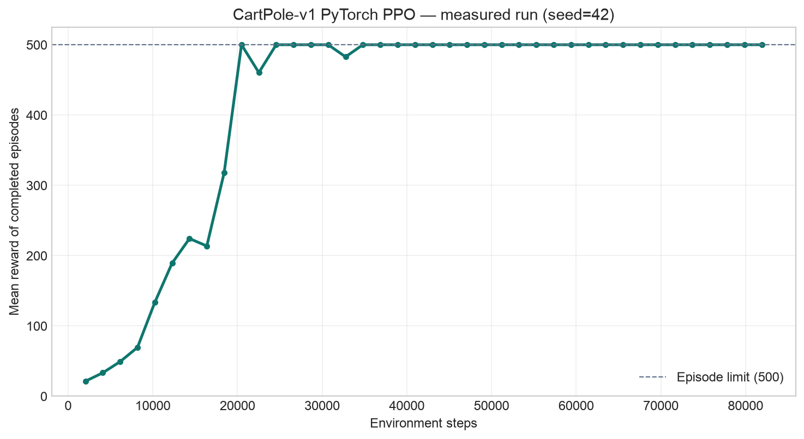

# 1.2 奖励与训练指标

> **本节目标**：从一次真实训练的原始记录出发，学会阅读回合奖励、独立评估和四个 PPO 辅助指标。

> **学习路径**：[1.1 CartPole 控制原理](./principles) → **1.2 奖励与训练指标** → [1.3 PPO 训练可视化](./training)

> **本节证据**：[纯 PyTorch PPO](https://github.com/walkinglabs/hands-on-modern-rl/blob/main/code/chapter01_cartpole/2-pytorch_ppo.py) · [原始训练指标 CSV](https://github.com/walkinglabs/hands-on-modern-rl/blob/main/code/chapter01_cartpole/output/training_metrics_seed42.csv) · [绘图脚本](https://github.com/walkinglabs/hands-on-modern-rl/blob/main/code/chapter01_cartpole/plot_curves.py)

1.1 节说明了 PPO 怎样收集轨迹并更新策略。程序开始运行后，我们还需要判断训练是否有效。CartPole 的回合奖励可以直接衡量任务表现，其他指标则帮助我们解释训练过程。

## 1.2.1 本页数据从哪里来

本页分析仓库中保存的一次实际运行。训练曲线、诊断曲线和控制台数字都来自同一份 CSV，没有把不同脚本或不同随机种子的结果拼在一起。

| 项目     | 本次运行设置                                                 |
| -------- | ------------------------------------------------------------ |
| 日期     | 2026-08-13                                                   |
| 环境     | `CartPole-v1`                                                |
| 算法     | 仓库中的纯 PyTorch PPO                                       |
| 随机种子 | `42`                                                         |
| 训练量   | 40 轮 × 2048 步 = 81,920 个环境步                            |
| 评估     | 训练后使用确定性策略独立运行 20 回合                         |
| 软件版本 | Python 3.12.13、PyTorch 2.13.0、Gymnasium 1.3.0、NumPy 2.5.2 |

复现命令如下。`--swanlab-mode disabled` 只关闭看板记录，不改变训练过程。

```bash
cd code/chapter01_cartpole
python 2-pytorch_ppo.py \
  --seed 42 \
  --iterations 40 \
  --steps-per-rollout 2048 \
  --swanlab-mode disabled \
  --log-csv output/training_metrics_seed42.csv

python plot_curves.py \
  --input output/training_metrics_seed42.csv \
  --output-dir output
```

下面摘录六轮训练日志。每个数字都可以在原始 CSV 中找到。

```text
迭代  1/40 | 回合数:  91 | 平均奖励:   21.4 | KL: 0.0087 | clip%: 14.5%
迭代  5/40 | 回合数:  15 | 平均奖励:  133.4 | KL: 0.0043 | clip%:  5.2%
迭代 10/40 | 回合数:   4 | 平均奖励:  500.0 | KL: 0.0059 | clip%:  7.4%
迭代 11/40 | 回合数:   5 | 平均奖励:  460.4 | KL: 0.0077 | clip%: 12.8%
迭代 20/40 | 回合数:   4 | 平均奖励:  500.0 | KL: 0.0019 | clip%:  1.6%
迭代 40/40 | 回合数:   4 | 平均奖励:  500.0 | KL: 0.0004 | clip%:  0.0%
训练完成！20 回合评估: 500.0 +/- 0.0
```

## 1.2.2 先看回合奖励

CartPole 每存活一步得到 1 分，所以回合奖励与回合长度相等。奖励越高，表示策略让杆子保持直立的时间越长。

训练脚本每轮收集 2048 步。它只统计在这一轮中结束的完整回合；跨越两轮采样边界的回合会继续累计，直到环境真正结束该回合。



<div class="figure-caption">图 1-2：seed=42 的原始训练奖励。每个点表示该轮结束的完整回合的平均奖励。曲线没有平滑，虚线表示单回合 500 步上限。</div>

第一轮结束了 91 个回合，平均奖励为 21.35。策略接近随机，因此多数回合很快结束。

第 10 轮结束了 4 个回合，平均奖励为 500.0。此时累计采样了 20,480 个环境步。

第 11 轮的平均奖励降到 460.4。PPO 训练使用随机动作采样，每轮包含的完整回合数也很少，因此单个点可以暂时下降。后续大多数轮次重新达到 500 分。

这些数字只描述 seed=42 的一次运行。若要比较两个算法的样本效率，需要运行多个随机种子，并使用相同的训练量和评估方法。

## 1.2.3 训练奖励与独立评估

训练时，程序按照策略给出的概率抽取动作。即使向右的概率更大，仍可能抽到向左。这样的随机性让策略继续尝试不同动作，也会给训练奖励带来波动。

独立评估使用确定性策略。程序在每一步选择概率最大的动作，并从新的环境初始状态运行 20 个回合。本次结果为：

```text
mean = 500.0
std  = 0.0
```

平均值 500.0 表示 20 个回合都运行到时间上限，标准差 0.0 表示这 20 个得分没有差异。

训练奖励记录策略在学习和探索时的表现。独立评估检查保存下来的策略在固定规则下能达到什么结果。报告实验时，两者需要分开说明。

## 1.2.4 再看四个辅助指标

奖励已经告诉我们任务完成得怎样。如果奖励没有上升，还需要检查策略是否过早固定、Critic 是否学会预测，以及每次 PPO 更新是否过大。

下面四条曲线与奖励曲线来自同一次运行。


<div class="figure-caption">图 1-3：Value Loss、Policy Entropy、Approximate KL 和 Clip Fraction 的原始值。四幅图共用 seed=42 的同一次训练记录。</div>

### 策略熵：动作选择有多确定

策略熵衡量两个动作概率的分散程度。两个动作都接近 50% 时，熵接近

$$
\ln 2\approx 0.693.
$$

本次运行的策略熵从 0.685 降到 0.421。这说明动作概率逐渐拉开，但策略仍会根据不同状态给出不同结果。

熵下降只表示策略变得更确定。若奖励没有同时上升，策略也可能只是更确定地选择了错误动作。

### 价值损失：Critic 的预测误差

Critic 预测从状态 $s_i$ 出发的折扣回报。价值损失比较预测值 $V(s_i)$ 和训练目标 $\hat G_i$：

$$
L_V=\frac{1}{|B|}\sum_{i\in B}
\left(V(s_i)-\hat G_i\right)^2.
$$

$B$ 表示一个训练小批次。预测与目标相差越大，价值损失越大。

本次运行的价值损失前期在 41.8 到 64.1 之间波动，最后降到 0.00014。训练中间的上升表示策略到达了新的状态分布，Critic 需要重新调整预测。

价值损失较小只说明 Critic 更接近当前目标。策略是否完成任务仍要看回合奖励和独立评估。

### 近似 KL：新旧策略相差多大

近似 KL 比较更新前后的动作概率。数值越大，表示一次 PPO 更新使策略发生的变化越大。

本次 40 轮中的最大值为 0.00871，最后一轮为 0.00038。仓库代码没有根据 KL 提前停止训练，因此本页只报告实测值，不给出一个适用于所有任务的固定阈值。

### 裁剪比例：多少样本触发限制

PPO 使用 $\epsilon=0.2$，把概率比限制在 $[0.8,1.2]$ 附近。裁剪比例统计超出这个范围的样本占比：

$$
\operatorname{clipfrac}=\frac{1}{|B|}\sum_{i\in B}
\mathbf 1\left[|r_i(\theta)-1|>\epsilon\right].
$$

本次运行第一轮为 14.48%，最后三轮为 0%。后期学习率逐渐降到 0，策略变化也随之变小。

裁剪比例需要与近似 KL、学习率和奖励一起阅读。单独一个高值或低值不能说明训练成功或失败。

## 1.2.5 训练异常时的检查顺序

如果奖励曲线没有达到预期，可以沿着数据产生的顺序检查：

1. 检查 `terminated` 与 `truncated`。自然终止后的价值为 0，时间截断仍要使用 $V(s')$。
2. 检查 GAE 是否在每次 `reset` 处切断。优势不能从新回合传回旧回合。
3. 检查日志是否只统计完整回合，并继续累计跨 rollout 边界的回合。
4. 比较训练奖励和独立评估，确认问题发生在训练过程还是最终策略。
5. 再用策略熵、价值损失、近似 KL 和裁剪比例定位具体环节。

这个顺序先检查数据是否正确，再解释优化指标。错误的回合边界会直接改变训练目标，仅调学习率无法修正这类问题。

## 本节小结

- CartPole 的回合奖励等于存活步数，直接反映任务表现。
- 训练奖励包含随机采样带来的探索，独立评估使用确定性动作。
- 策略熵、价值损失、近似 KL 和裁剪比例用于解释训练过程，不能代替奖励。
- 本页曲线来自一次可复现的单种子运行；算法比较需要多个随机种子。

下一节 [PPO 训练可视化](./training) 将从同一条复现命令出发，生成原始 CSV、训练曲线和真实环境帧。
