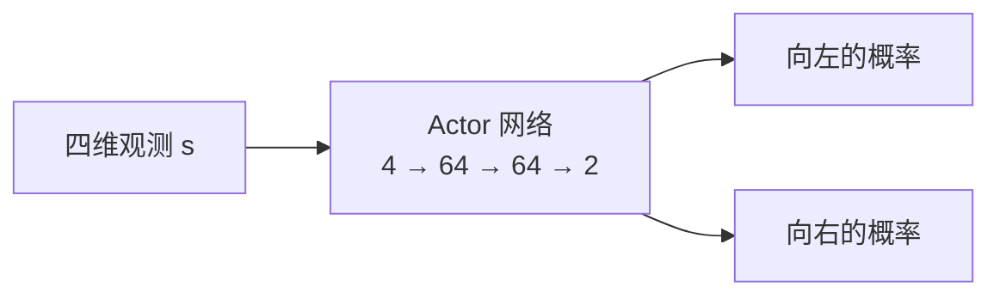
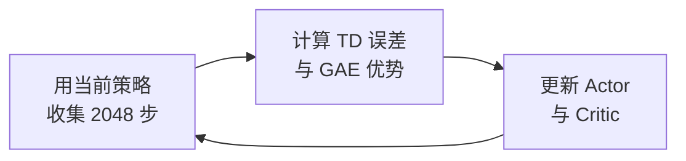

# 1.1 CartPole 控制原理

> **本节目标**：先跑通一次 CartPole 训练，建立对学习过程的直观感受；再看懂 CartPole 的观测、动作和奖励，理解 PPO 怎样利用一段交互数据改进策略。

> **学习路径**：**1.1 CartPole 控制原理** → [1.2 奖励与训练指标](./metrics) → [1.3 PPO 训练可视化](./training)

> **本节代码**：[SB3 版本](https://github.com/walkinglabs/hands-on-modern-rl/blob/main/code/chapter01_cartpole/1-ppo_cartpole.py) · [纯 PyTorch 版本](https://github.com/walkinglabs/hands-on-modern-rl/blob/main/code/chapter01_cartpole/2-pytorch_ppo.py)

## 先训练一次 CartPole

在拆解原理之前，先跑一次训练，亲眼看到智能体从乱晃到立杆的过程。CartPole 是强化学习入门的经典任务：一根杆子通过关节连在小车上，控制器只能选择向左或向右推小车，目标是让杆子尽可能长时间保持竖直。该任务对计算资源要求极低，普通笔记本 CPU 即可在约 30 秒内完成训练，无需 GPU。


<div class="figure-caption">图：CartPole-v1 环境。智能体控制小车左右移动，使杆子保持竖直。图源：<a href="https://gymnasium.farama.org/environments/classic_control/cart_pole/" target="_blank" rel="noopener noreferrer">Gymnasium</a></div>

你有三种方式完成第一次训练，按门槛从低到高排列：

- **[ModelScope 创空间：浏览器一键训练](https://modelscope.cn/studios/walkinglab/hands-on-modern-rl-experiment01-cartpole)**：无需安装环境，点击"开始训练"即可在浏览器中直接观察奖励曲线和策略动画。
- **[魔搭 Notebook：在线开发环境](https://modelscope.cn/my/mynotebook)**：启动 CPU 环境，拉取课程仓库后打开 `notebooks/cartpole-ppo.ipynb`，逐单元运行即可。
- **[训练脚本：本地或云端终端](https://modelscope.cn/studios/walkinglab/hands-on-modern-rl-experiment01-cartpole/file/view/master/train.py)**：在 ModelScope Notebook 或本地终端执行 `python train.py --timesteps 30000`。本地环境安装和运行的完整流程见 [1.3 节](./training)。

训练初期，奖励在 20 分附近震荡——杆子很快倒下，小车还没学会怎么推。随着训练推进，奖励会逐步攀升至接近 500 分，意味着小车可持续平衡到回合上限。当你能看到"小车左右移动、杆子稳稳竖直"的行为时，就完成了这一步的目标：跑通训练，观察学习现象。

本节余下部分将逐步拆解这个过程背后的机制：环境给智能体什么信息、智能体怎么做决策、PPO 怎样用一段交互数据改进策略。

## 1.1.1 先看控制任务

CartPole 由一辆可以左右移动的小车和一根可以转动的杆子组成。每隔一个很短的时间，控制器只能做一次选择：向左推，或者向右推。

杆子会受到重力影响。如果小车移动得不合适，杆子的倾斜会越来越大，最后倒下。控制器需要连续调整小车的位置，让杆子尽量长时间保持直立。


<div class="figure-caption">图 1-1：纯 PyTorch PPO 以 seed=42 训练后，在 Gymnasium CartPole-v1 中完成的一次确定性评估。五幅图分别来自同一回合的第 0、125、250、375 和 500 步。</div>

这组图来自环境的实际渲染结果。该回合运行到 500 步上限，说明训练后的策略能够持续控制小车，而不只是在某一帧碰巧保持直立。

## 1.1.2 环境提供四个数字

一张画面可以让人看出杆子是否倾斜，程序需要数值形式的观测。CartPole 每一步返回四个数字：

$$
s_t=[x_t,\ \dot{x}_t,\ \theta_t,\ \dot{\theta}_t].
$$

下标 $t$ 表示当前时刻。四个量依次是小车位置、小车速度、杆子角度和杆子角速度。

| 编号 | 观测量       | 含义                   | `observation_space` 中的边界 |
| ---- | ------------ | ---------------------- | ---------------------------- |
| 0    | $x$          | 小车位于轨道上的位置   | $[-4.8,\ 4.8]$               |
| 1    | $\dot{x}$    | 小车移动的方向和快慢   | $(-\infty,\ +\infty)$        |
| 2    | $\theta$     | 杆子偏离竖直方向的角度 | 约 $[-24^\circ,\ 24^\circ]$  |
| 3    | $\dot\theta$ | 杆子转动的方向和快慢   | $(-\infty,\ +\infty)$        |

角度和角速度需要同时出现。只知道杆子向右倾，还不能判断它正在快速倒向右侧，还是正在回到中间。这两种情况可能需要不同的动作。

下面的代码可以直接读取环境声明的观测范围和终止阈值：

```python
import gymnasium as gym
import numpy as np

env = gym.make("CartPole-v1")
print("观测上限:", env.observation_space.high)
print("观测下限:", env.observation_space.low)
print("小车位置阈值:", env.unwrapped.x_threshold)
print(
    "杆子角度阈值:",
    np.degrees(env.unwrapped.theta_threshold_radians),
    "度",
)
```

这里的无穷大表示 Gymnasium 没有给速度声明有限的观测边界。它不表示一次实际运行会产生无穷大的速度。

## 1.1.3 控制器只有两个动作

CartPole 的动作集合为

$$
\mathcal{A}=\{0,1\}.
$$

| 动作 | 环境中的含义 |
| ---- | ------------ |
| 0    | 向左推小车   |
| 1    | 向右推小车   |

环境没有“不推”这个动作，也不能选择推力大小。程序每一步都要在左和右之间做出选择。

从控制角度看，动作会先改变小车的运动，再通过小车和杆子的连接影响杆子。一次动作通常不能立即消除倾斜，因此策略需要根据下一步的新观测继续调整。

## 1.1.4 奖励把目标写成分数

环境每运行一步就给出 $+1$ 奖励。一个回合在以下任一情况发生时结束：

- 小车位置超出 $\pm 2.4$；
- 杆子角度超出约 $\pm 12^\circ$；
- 回合达到 500 步时间上限。

因此，CartPole-v1 的回合奖励与存活步数相等。坚持 37 步得到 37 分，坚持到上限得到 500 分。

这个奖励没有告诉程序“当前应该向左推”。它只记录一次动作之后任务是否还在继续。程序需要比较许多次交互，逐渐找出哪些状态和动作更容易带来较长的回合。

## 1.1.5 策略把观测变成动作概率

有了观测和动作，还需要一条选择动作的规则。这条规则称为**策略**，记作 $\pi$。

对 CartPole 来说，策略接收四维观测，并输出两个动作的概率：

$$
\pi(a\mid s)=P(A_t=a\mid S_t=s).
$$

例如，某个状态下的输出可以是

$$
\pi(0\mid s)=0.3,\qquad \pi(1\mid s)=0.7.
$$

这表示训练时有 30% 的概率向左推，70% 的概率向右推。策略根据完整的四维观测计算概率，不能只用杆子向哪边倾来决定动作。

配套实现使用一个小型神经网络表示策略。输入层接收四个数，输出层产生两个动作的分数，再通过概率分布进行采样。



Actor 的输出层使用较小的初始权重。因此训练刚开始时，两个动作的概率通常都接近 0.5，策略会尝试左右两种动作。

## 1.1.6 Critic 估计当前局面

只看某一步的 $+1$ 奖励，很难判断这个动作是否改善了长期结果。PPO 为此增加了第二个网络，称为 **Critic**。

Critic 接收状态 $s_t$，输出状态价值 $V(s_t)$。这个数表示：从当前状态继续按照现有策略行动，预计还能获得多少折扣回报。

配套代码把两个网络放在同一个 `ActorCritic` 类中：

```python
class ActorCritic(nn.Module):
    def __init__(self, obs_dim=4, act_dim=2, hidden=64):
        super().__init__()
        self.actor = nn.Sequential(
            nn.Linear(obs_dim, hidden),
            nn.Tanh(),
            nn.Linear(hidden, hidden),
            nn.Tanh(),
            nn.Linear(hidden, act_dim),
        )
        self.critic = nn.Sequential(
            nn.Linear(obs_dim, hidden),
            nn.Tanh(),
            nn.Linear(hidden, hidden),
            nn.Tanh(),
            nn.Linear(hidden, 1),
        )
```

Actor 决定怎样行动，Critic 估计当前局面的长期价值。训练时，两个网络都根据采集到的轨迹更新。

## 1.1.7 一轮 PPO 训练怎样进行

一次 PPO 迭代先使用当前策略收集 2048 步。每一步保存状态、动作、奖励、动作的对数概率和 Critic 给出的价值。

```python
for _ in range(num_steps):
    action, log_prob, value = model.get_action(obs_tensor)
    next_obs, reward, terminated, truncated, _ = env.step(action.item())
```

这段数据称为一段 **rollout**。它可以包含多个完整回合，也可能在某个回合中间结束。

### 先判断动作比预期好多少

采样结束后，程序先计算每一步的 TD 误差：

$$
\delta_t=r_t+\gamma V(s_{t+1})-V(s_t).
$$

$V(s_t)$ 是动作执行前的预期，$r_t+\gamma V(s_{t+1})$ 是执行动作后得到的新估计。若 $\delta_t>0$，这一步的结果高于 Critic 原来的预期。

只使用一步的误差容易受到 Critic 估计偏差的影响。配套代码使用 GAE，把当前和后续若干步的 TD 误差合成优势 $A_t$：

$$
A_t=\delta_t+\gamma\lambda\delta_{t+1}
+(\gamma\lambda)^2\delta_{t+2}+\cdots.
$$

优势为正时，PPO 会提高这次动作在相同状态下出现的概率；优势为负时，则会降低这个概率。

### 再限制策略的变化幅度

同一批数据来自更新前的旧策略。为了比较新旧策略，PPO 计算已采样动作的概率比：

$$
r_t(\theta)=
\frac{\pi_\theta(a_t\mid s_t)}
{\pi_{\theta_{\mathrm{old}}}(a_t\mid s_t)}.
$$

配套代码取裁剪范围 $[0.8,1.2]$。当概率比超出这个范围时，裁剪目标会限制这条样本继续推动策略大幅变化。

```python
ratio = torch.exp(new_log_probs - batch_old_log_probs)
surr1 = ratio * batch_advantages
surr2 = torch.clamp(ratio, 0.8, 1.2) * batch_advantages
policy_loss = -torch.min(surr1, surr2).mean()
```

裁剪不能保证每次更新都更好。它提供了一个简单的限制，使新策略不会因为同一批数据发生过大的单次变化。

## 1.1.8 回合结束与采样结束

Gymnasium 返回两个结束标记：`terminated` 和 `truncated`。它们都会让环境执行 `reset`，但在价值计算中含义不同。

`terminated=True` 表示杆子倒下或小车越界。这个回合已经自然结束，后续价值为 0。

`truncated=True` 表示回合达到 500 步时间上限。杆子此时可能仍然保持平衡，因此程序仍使用 $V(s_{t+1})$ 估计截断位置之后的价值。

无论是哪一种结束，GAE 都必须在 `reset` 处切断。新回合的优势不能传回上一个回合。

rollout 的 2048 步边界也不等于回合结束。如果采样在一个回合中间停止，下一轮应从当前状态继续，并继续累计这一回合的奖励。

## 1.1.9 把过程连起来

现在可以把一次训练写成三步：收集轨迹，计算优势，更新 Actor 和 Critic。



配套脚本重复这个过程 40 次：

```python
for iteration in range(40):
    transitions, obs = collect_rollout(model, env, obs, 2048)
    advantages, returns = compute_gae(transitions)
    metrics = ppo_update(
        model,
        optimizer,
        transitions,
        advantages,
        returns,
    )
```

第 1 轮使用接近随机的策略收集数据。更新后的策略会改变下一轮的数据分布，新的数据又会带来下一次更新。这就是 CartPole 中“通过交互学习”的具体过程。

## 本节小结

- CartPole 用小车位置、速度、杆子角度和角速度描述当前状态。
- 策略根据四维状态输出向左和向右的动作概率。
- 每存活一步得到 $+1$ 奖励，回合奖励等于存活步数。
- PPO 先收集轨迹，再用 Critic 和 GAE 估计每一步的优势，最后通过裁剪目标更新策略。
- 自然终止、时间截断和 rollout 边界需要分别处理。

下一节 [奖励与训练指标](./metrics) 将使用一次真实训练保存的 CSV，检查奖励曲线和四个辅助指标分别说明什么。

## 参考文献

- Schulman, J., et al. (2016). High-Dimensional Continuous Control Using Generalized Advantage Estimation. _ICLR 2016_.
- Schulman, J., et al. (2017). Proximal Policy Optimization Algorithms. _arXiv preprint_. [arXiv:1707.06347](https://arxiv.org/abs/1707.06347)
- Sutton, R. S., & Barto, A. G. (2018). _Reinforcement Learning: An Introduction_ (2nd ed.). MIT Press.
