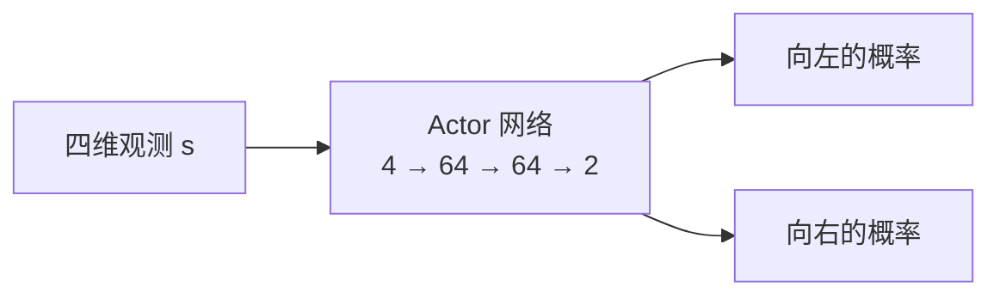
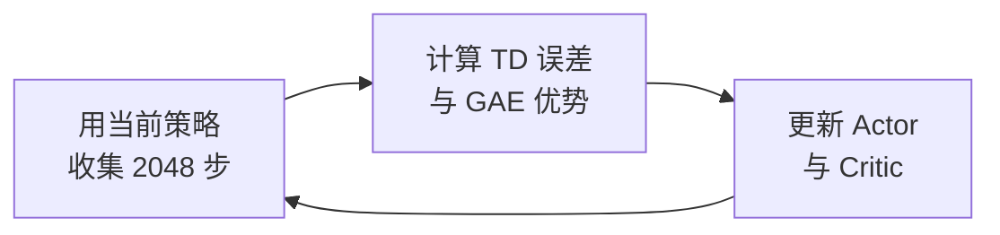

# 1.1 CartPole 控制原理

> **本节代码**：[SB3 版本](https://github.com/walkinglabs/hands-on-modern-rl/blob/main/code/chapter01_cartpole/1-ppo_cartpole.py) · [纯 PyTorch 版本](https://github.com/walkinglabs/hands-on-modern-rl/blob/main/code/chapter01_cartpole/2-pytorch_ppo.py)

本节用 CartPole 完成第一个实验：先跑通一次 PPO 训练，再逐个解释观测、动作、奖励和训练流程。

## 第一次训练

CartPole 是强化学习入门的经典任务：一根杆子通过关节连在小车上，控制器每步只能选择向左或向右推小车，目标是让杆子尽可能长时间保持竖直。

训练它不需要任何特殊设备：普通笔记本 CPU 约 30 秒就能完成，全程可以看到智能体从乱晃到立杆的变化。


<div class="figure-caption">图 1-1：CartPole-v1 环境。智能体控制小车左右移动，使杆子保持竖直。图源：<a href="https://gymnasium.farama.org/environments/classic_control/cart_pole/" target="_blank" rel="noopener noreferrer">Gymnasium</a></div>

完成第一次训练有三种方式，按门槛从低到高排列：

- **[ModelScope 创空间：浏览器一键训练](https://modelscope.cn/studios/walkinglab/hands-on-modern-rl-experiment01-cartpole)**：无需安装环境，点击"开始训练"即可在浏览器中直接观察奖励曲线和策略动画。
- **[魔搭 Notebook：在线开发环境](https://modelscope.cn/my/mynotebook)**：启动 CPU 环境，拉取课程仓库后打开 `notebooks/cartpole-ppo.ipynb`，逐单元运行即可。
- **[训练脚本：本地或云端终端](https://modelscope.cn/studios/walkinglab/hands-on-modern-rl-experiment01-cartpole/file/view/master/train.py)**：在 ModelScope Notebook 或本地终端执行 `python train.py --timesteps 30000`。本地环境安装和运行的完整流程见 [1.3 节](./training)。

训练初期，奖励在 20 分附近震荡——杆子很快倒下，小车还没学会怎么推。随着训练推进，奖励逐步攀升至接近 500 分，小车可以持续平衡到回合上限。

到这里，训练已经跑通，学习现象可以观察到；本节余下的任务，是拆解这个过程背后的机制：环境给智能体什么信息、智能体怎么做决策、PPO 怎样用一段交互数据改进策略。

## 环境规则：观测、动作与奖励

跑通训练之后，自然会问：奖励从 20 涨到 500，中间到底发生了什么？要回答这个问题，得先看清环境本身的规则。

CartPole 每隔一个很短的时间步，要求控制器做一次选择：向左推，或者向右推。杆子受重力影响，小车移动得不合适，杆子的倾斜会越来越大，最终倒下；控制器要连续调整推的方向，让杆子尽量长时间保持直立。


<div class="figure-caption">图 1-2：纯 PyTorch PPO 以 seed=42 训练后，在 Gymnasium CartPole-v1 中完成的一次确定性评估。五幅图分别来自同一回合的第 0、125、250、375 和 500 步。</div>

图 1-2 来自环境的实际渲染。该回合撑满 500 步上限，说明训练后的策略能够持续控制小车，而不只是在某一帧碰巧保持直立。

要看懂这个环境，需要回答三个问题：智能体能看到什么（观测）、能做什么（动作）、怎样判断好坏（奖励）。下面依次来看。

### 观测：环境每步返回四个数

人看一张画面就能判断杆子是否倾斜，程序需要数值形式的观测。CartPole 每一步返回四个数字：

$$
s_t=[x_t,\ \dot{x}_t,\ \theta_t,\ \dot{\theta}_t].
$$

下标 $t$ 表示当前时刻。四个量依次是小车位置、小车速度、杆子角度和杆子角速度。

| 编号 | 观测量       | 含义                   | `observation_space` 中的边界 |
| ---- | ------------ | ---------------------- | ---------------------------- |
| 0    | $x$          | 小车位于轨道上的位置   | $[-4.8,\ 4.8]$               |
| 1    | $\dot{x}$    | 小车移动的方向和快慢   | $(-\infty,\ +\infty)$        |
| 2    | $\theta$     | 杆子偏离竖直方向的角度 | 约 $[-24^\circ,\ 24^\circ]$  |
| 3    | $\dot\theta$ | 杆子转动的方向和快慢   | $(-\infty,\ +\infty)$        |

值得注意的是，角度和角速度必须同时出现。只知道杆子向右倾，还无法判断它正在快速倒向右侧，还是正在回到中间——这两种情况需要的动作可能完全相反。

下面的代码可以直接读取环境声明的观测范围和终止阈值：

```python
import gymnasium as gym
import numpy as np

env = gym.make("CartPole-v1")
print("观测上限:", env.observation_space.high)
print("观测下限:", env.observation_space.low)
print("小车位置阈值:", env.unwrapped.x_threshold)
print(
    "杆子角度阈值:",
    np.degrees(env.unwrapped.theta_threshold_radians),
    "度",
)
```

这里的无穷大表示 Gymnasium 没有给速度声明有限的观测边界，并不表示一次实际运行会产生无穷大的速度。

### 动作：向左或向右

有了观测，下一步就是动作。CartPole 的动作集合为

$$
\mathcal{A}=\{0,1\}.
$$

| 动作 | 环境中的含义 |
| ---- | ------------ |
| 0    | 向左推小车   |
| 1    | 向右推小车   |

注意，动作集合里没有"不推"，也不能选择推力大小。程序每一步都必须在左和右之间做出选择，没有暂停观察的余地。

从控制的角度看，动作先改变小车的运动，再通过小车和杆子的连接影响杆子。

一次动作通常不能立即消除倾斜，策略需要根据下一步的新观测继续调整——控制杆子需要连续决策，每一步的选择都会改变下一步的处境。

### 奖励：每存活一步得一分

观测和动作都清楚了，还差一个信号告诉程序哪些行为更好。这个信号就是奖励。环境每运行一步就给出 $+1$ 奖励。一个回合在以下任一情况发生时结束：

- 小车位置超出 $\pm 2.4$；
- 杆子角度超出约 $\pm 12^\circ$；
- 回合达到 500 步时间上限。

因此，CartPole-v1 的回合奖励与存活步数相等。坚持 37 步得到 37 分，撑满上限得到 500 分。

细看这个奖励，会发现它没有告诉程序"当前应该向左推"。它只记录一次动作之后任务是否还在继续。程序需要比较许多次交互，逐渐找出哪些状态和动作更容易带来较长的回合——这就是后面策略和价值网络要做的事。

## 策略与 Actor 网络

有了观测、动作和奖励，还差一条选择动作的规则。这条规则称为**策略**，记作 $\pi$。

对 CartPole 来说，策略接收四维观测，输出两个动作的概率：

$$
\pi(a\mid s)=P(A_t=a\mid S_t=s).
$$

先看一个具体状态。假设杆子正在向右倾，策略可能给出

$$
\pi(0\mid s)=0.3,\qquad \pi(1\mid s)=0.7.
$$

这表示训练时有 30% 的概率向左推，70% 的概率向右推。策略根据完整的四维观测计算概率，不能只用杆子向哪边倾来决定动作——小车速度、杆子角速度等信息同样影响最优选择。

配套实现用一个小型神经网络表示策略。输入层接收四个数，输出层产生两个动作的分数，再通过概率分布采样：



Actor 的输出层使用较小的初始权重，因此训练刚开始时，两个动作的概率通常都接近 0.5，策略会尝试左右两种动作。随着训练推进，策略逐渐学会在不同状态下给出不同的概率分布。

## Critic 与状态价值

策略能输出动作概率，但仅凭某一步的 $+1$ 奖励，很难判断这个动作是否改善了长期结果。在 CartPole 里，同一个"向右推"的动作，有时能让杆子多撑几十步，有时只是推迟了倒下的时间。

PPO 为此增加了第二个网络，称为 **Critic**。

Critic 接收状态 $s_t$，输出状态价值 $V(s_t)$。这个数表示：从当前状态继续按照现有策略行动，预计还能获得多少折扣回报。

配套代码把两个网络放在同一个 `ActorCritic` 类中：

```python
class ActorCritic(nn.Module):
    def __init__(self, obs_dim=4, act_dim=2, hidden=64):
        super().__init__()
        self.actor = nn.Sequential(
            nn.Linear(obs_dim, hidden),
            nn.Tanh(),
            nn.Linear(hidden, hidden),
            nn.Tanh(),
            nn.Linear(hidden, act_dim),
        )
        self.critic = nn.Sequential(
            nn.Linear(obs_dim, hidden),
            nn.Tanh(),
            nn.Linear(hidden, hidden),
            nn.Tanh(),
            nn.Linear(hidden, 1),
        )
```

Actor 决定怎样行动，Critic 估计当前局面的长期价值。训练时，两个网络都根据采集到的轨迹更新。后面的 PPO 训练流程会用到 Critic 的输出来计算优势——也就是判断某一步的动作到底比预期好多少。

## PPO 训练流程

前面分别介绍了 Actor 和 Critic，但还没有说它们怎样配合。现在把两个网络连起来，看一次 PPO 迭代怎样进行。

一次迭代先使用当前策略收集 2048 步。每一步保存状态、动作、奖励、动作的对数概率和 Critic 给出的价值：

```python
for _ in range(num_steps):
    action, log_prob, value = model.get_action(obs_tensor)
    next_obs, reward, terminated, truncated, _ = env.step(action.item())
```

这段数据称为一段 **rollout**。它可以包含多个完整回合，也可能在某个回合中间结束。收集完之后，程序要做两件事：先判断每一步的动作比预期好多少（优势），再据此更新策略——但更新的幅度要有限制。

### TD 误差与 GAE 优势

采样结束后，程序先计算每一步的 TD 误差：

$$
\delta_t=r_t+\gamma V(s_{t+1})-V(s_t).
$$

$V(s_t)$ 是 Critic 在动作执行前给出的预期，$r_t+\gamma V(s_{t+1})$ 是执行动作后得到的新估计。若 $\delta_t>0$，说明这一步的结果高于 Critic 原来的预期。

只使用一步的误差容易受到 Critic 估计偏差的影响。配套代码使用 GAE，把当前和后续若干步的 TD 误差合成优势 $A_t$：

$$
A_t=\delta_t+\gamma\lambda\delta_{t+1}
+(\gamma\lambda)^2\delta_{t+2}+\cdots.
$$

优势为正时，PPO 会提高这次动作在相同状态下出现的概率；优势为负时，则会降低这个概率。这正是 Critic 存在的意义：它给每一步的动作提供一个比较基准。

### 概率比与裁剪目标

有了优势，还需要一个更新规则来调整策略。这里有一个微妙的问题：同一批数据来自更新前的旧策略。如果新策略可以随意偏离旧策略，一次更新就可能把策略推到一个很差的区域。

为了比较新旧策略，PPO 计算已采样动作的概率比：

$$
r_t(\theta)=
\frac{\pi_\theta(a_t\mid s_t)}
{\pi_{\theta_{\mathrm{old}}}(a_t\mid s_t)}.
$$

配套代码取裁剪范围 $[0.8,1.2]$。当概率比超出这个范围时，裁剪目标会限制这条样本继续推动策略大幅变化：

```python
ratio = torch.exp(new_log_probs - batch_old_log_probs)
surr1 = ratio * batch_advantages
surr2 = torch.clamp(ratio, 0.8, 1.2) * batch_advantages
policy_loss = -torch.min(surr1, surr2).mean()
```

裁剪不保证每次更新都更好，但它限制了同一批数据能带来的策略变化幅度，使新策略不会因为一批样本发生过大的单次偏移。

## 终止、截断与 rollout 边界

前面提到回合会在三种情况下结束。Gymnasium 用两个标记区分它们：`terminated` 和 `truncated`。它们都会让环境执行 `reset`，但在价值计算中含义不同。

`terminated=True` 表示杆子倒下或小车越界——回合已经自然结束，后续不可能再获得奖励，因此后续价值为 0。

`truncated=True` 表示回合达到 500 步时间上限——杆子此时可能仍然保持平衡，因此程序仍使用 $V(s_{t+1})$ 估计截断位置之后的价值。

无论是哪一种结束，GAE 都必须在 `reset` 处切断。新回合的优势不能传回上一个回合，否则相当于让上一局的结果去影响下一局的判断。

rollout 的 2048 步边界也不等于回合结束。如果采样在一个回合中间停止，下一轮应从当前状态继续，并继续累计这一回合的奖励。

## 训练主循环

现在可以把一次完整训练连起来。核心是三步：收集轨迹，计算优势，更新 Actor 和 Critic。



配套脚本重复这个过程 40 次：

```python
for iteration in range(40):
    transitions, obs = collect_rollout(model, env, obs, 2048)
    advantages, returns = compute_gae(transitions)
    metrics = ppo_update(
        model,
        optimizer,
        transitions,
        advantages,
        returns,
    )
```

第 1 轮使用接近随机的策略收集数据。更新后的策略会改变下一轮的数据分布，新的数据又会带来下一次更新。

策略在迭代中逐步修正，奖励曲线也就从 20 分一步步爬向 500。

## 本书内容概览

CartPole 是 1990 年代起的经典控制任务，代表了强化学习的过去；本书的主角是 LLM 时代的现代强化学习。下列四项工作分别对应书中各章节的核心议题。

- **DPO 与大模型对齐**：用户要求模型协助编写恶意代码时，对齐前的模型照单全收，对齐后的模型能够识别风险并拒绝。[第 14 章 DPO 家族](../chapter17_dpo/dpo-theory-and-family)用约 200 行代码复现这一微调。
- **GRPO 与推理涌现**：未经推理数据训练的基座模型，仅靠强化学习即可自发产生反思、验证、纠错的长思维链，对应 DeepSeek-R1 的核心范式。[第 15 章 GRPO 家族](../chapter18_grpo/grpo-practice-and-mechanism)讨论其实现机制，[第 16 章 Reasoning Models](../chapter19_reasoning/r1-zero-pure-rl-reasoning)展开 Test-time Scaling 的全景。
- **Computer Use 与 GUI 智能体**：模型读取屏幕像素、点击按钮、填写表单，完成多步图形界面任务。[第 22 章 Computer Use 与 GUI Agent](../chapter25_computer_use/training)分析 UI-TARS-2、AutoGLM 等代表性工作的训练原理。
- **SWE-Agent 与自主 Bug 修复**：智能体读取代码仓库、定位缺陷、修改代码、运行测试，通过 SWE-bench 评测。[第 20 章代码智能体强化学习](../chapter23_rl_based_swe/swe-bench-and-rlvr)基于 Meta 的 SWE-RL 算法、Code World Model 与 Self-play SSR 训练开源版本。

## 本节总结

这一节从环境到算法走了一遍完整流程，主线只有一条：

1. CartPole 用小车位置、速度、杆子角度和角速度四个数描述当前状态。
2. 策略根据四维状态输出向左和向右的动作概率。
3. 每存活一步得到 $+1$ 奖励，回合奖励等于存活步数。
4. Critic 估计当前局面的长期价值，GAE 把多步 TD 误差合成优势。
5. PPO 用裁剪目标限制策略更新幅度，使同一批数据不会造成过大的单次变化。
6. 自然终止、时间截断和 rollout 边界需要分别处理。

到这里，我们看懂了 CartPole 的环境规则和 PPO 的训练流程，但还没有检查训练过程中实际发生了什么。

下一节 [奖励与训练指标](./metrics) 将使用一次真实训练保存的 CSV，检查奖励曲线和四个辅助指标分别说明什么。

## 参考文献

[^1]: Schulman, J., Moritz, P., Levine, S., Jordan, M., & Abbeel, P. (2016). High-Dimensional Continuous Control Using Generalized Advantage Estimation. _ICLR 2016_.

[^2]: Schulman, J., Wolski, F., Dhariwal, P., Radford, A., & Klimov, O. (2017). Proximal Policy Optimization Algorithms. _arXiv preprint_ arXiv:1707.06347. <https://arxiv.org/abs/1707.06347>

[^3]: Sutton, R. S., & Barto, A. G. (2018). _Reinforcement Learning: An Introduction_ (2nd ed.). MIT Press.
