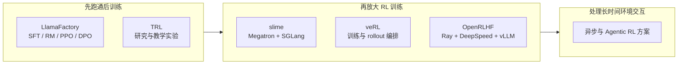

# 18.1 从单机实验到工业训练

从 **RLHF** 到 **DPO**，再到 **GRPO**、推理模型训练和过程奖励，我们已经学会了一套套后训练算法：怎么让模型对齐人类偏好，怎么省掉 Critic 做组内比较，怎么让模型学会长程推理，怎么在推理时搜索更好的答案。

这些算法在**小模型**上做实验时看起来很简单：一个脚本就能把生成、打分、更新串起来。但真要训练一个 7B、70B 甚至更大的**生产模型**时，你会立刻遇到新问题：Actor、Reference、Reward Model 加起来几十上百亿参数，**单张卡根本装不下**；生成一条回答要几秒钟，但参数更新只要几百毫秒，**训练 GPU 大部分时间在空等**；刚更新完的权重怎么**及时同步**到生成端，也是个麻烦事。

第 18 章就解决这些"算法跑起来"的问题：本节先看单机实验为什么需要扩展；[18.2](./industrial-post-training) 把数据、训练、评测和数据回流接成完整流程；[18.3](./modern-industrial-practice) 解释训练为什么会失稳；[18.4](./distributed-sync) 说明多张 GPU 如何协同执行这条流程；[18.5](./data-engineering) 再把任务、环境、轨迹和验证结果整理成可持续使用的数据资产。

先用一个最简单的例子看一次训练在做什么。假设训练数据里有个问题："为什么天空看起来是蓝色的？"不管用 PPO 还是 GRPO，一轮训练都会经过这几步：

1. **Actor 生成回答。** 它就是正在训练的语言模型。
2. **Reward Model 给回答打分。** 分数越高，说明回答越符合人类偏好；可验证任务（如数学题）也可以直接用规则验证器打分。
3. **Reference Model 提供参照。** 它是训练前冻结的模型副本，用来计算 KL 惩罚，避免 Actor 一次更新得太远。
4. **Critic 估计优势。** PPO 需要它来估计"这个回答比预期好多少"；GRPO 省掉了 Critic，改用同组回答的相对分数。
5. **训练进程更新 Actor。** 算出梯度、更新参数后，新权重交给下一轮生成使用。

模型只有几亿参数时，这五个角色可以在同一台机器上依次运行——生成完了打分，打完分更新，更新完再生成，慢是慢点，但能跑通。一旦模型和数据规模增大，问题首先出在执行方式上：多个模型无法同时装进有限显存；生成回答通常比一次参数更新慢得多；训练得到的新参数还要及时同步回生成进程。这三个环节只要有一步等待过久，其他 GPU 就会闲置。

**训练框架的作用，就是安排这些角色在什么设备上运行、何时交换数据、何时同步新参数。** 它没有改变 PPO、GRPO 或奖励模型的数学定义，只是让同一条训练流程能够稳定地跑在多张卡和多台机器上。

## 1. 从单机训练认识系统规模

### 1.1 训练规模与框架选择

选择工具之前，先看模型能不能在现有机器上完成训练：

| 你遇到的情况                 | 可以先用     | 具体要做什么                                                       |
| ---------------------------- | ------------ | ------------------------------------------------------------------ |
| 第一次训练自己的模型         | LlamaFactory | 准备数据和配置，依次运行 SFT、奖励模型、PPO 或 DPO                 |
| 模型太大，单机放不下或跑得慢 | slime        | 把模型训练和回答生成分配到多张 GPU，并在每轮更新后同步最新模型参数 |

先用 LlamaFactory 看清数据怎样进入训练、每个阶段会产出什么模型。等到单机显存不足，或者生成回答占用大量时间，再学习 slime 如何安排多张 GPU。这样可以先解决训练方法的问题，再处理多机系统的问题。

本课程后面仍会使用 veRL 完成代码生成 RL 实验。veRL 与 slime 都能承担规模化 RL 训练，二者采用的训练与生成后端不同。OpenRLHF 则是基于 Ray、DeepSpeed 和 vLLM 的另一套方案，放在进阶对比中了解即可。

### 1.2 同步训练与异步训练

假设一批任务里有九道短数学题和一道需要反复调用工具的任务。前九道题很快结束，最后一道却要运行几分钟。

- **同步训练**会等整批任务全部完成，再统一计算奖励和更新模型。数据较新，流程也容易理解，但所有进程都要等待最慢的任务。
- **异步训练**让已经完成的结果先进入队列，训练进程可以持续取数据更新。设备等待更少，但数据可能来自稍早的模型，因此还要控制经验陈旧的问题。

数学和代码题的生成时长较接近，通常先用同步方案。工具调用、浏览器操作和长时间环境交互的耗时差别很大，更容易从异步方案中受益。

::: tip 第一次阅读到这里即可
先记住一条线：**生成回答 → 计算奖励 → 更新模型 → 同步新参数**。后面的框架、奖励、成本和系统设计，都在解释这四步怎样扩展到更大的模型与集群。
:::

### 1.3 从训练脚本到分布式框架

先从一台机器上的数学题训练开始。程序取出一批题目，让模型生成回答，用答案验证器计算奖励，再根据奖励更新模型。模型较小、回答较短时，这几步可以写在同一个训练脚本里。此时最重要的是确认三件事：数据格式是否正确，奖励是否真的反映答案质量，参数更新后正确率是否提高。

LlamaFactory 和 TRL 适合完成这个阶段。[LlamaFactory](https://arxiv.org/abs/2403.13372)用统一配置组织 SFT、奖励模型、DPO 和 PPO；[TRL](https://huggingface.co/docs/trl/index)用 Trainer 接口提供 SFT、DPO、GRPO 和 PPO 等实现。第一次实验时，框架的价值是把数据、算法和模型接起来，让学习者能够看清一次训练怎样完成。

模型增大后，同一个脚本会遇到新的问题。Actor 负责生成和更新，Reference Model 负责计算 KL，PPO 还需要 Critic；生成阶段又要为每道题采样多条回答。这些模型和中间结果可能无法同时装入一组 GPU，回答生成也会让训练 GPU 长时间等待。框架这时需要决定：每个模型放在哪些 GPU 上，生成结果交给哪个进程，Actor 更新后怎样把新权重同步回生成端。

[veRL](https://arxiv.org/abs/2409.19256)把 Actor、Critic、Reference Model、Reward Model 和 rollout 引擎表示为可以调度的角色，Driver 再按照 PPO 或 GRPO 的顺序调用它们。OpenRLHF、NeMo-Aligner 和 slime 也解决这类问题，只是采用的底层组件不同：OpenRLHF 使用 Ray、DeepSpeed 和 vLLM，NeMo-Aligner 使用 NeMo 与 Megatron，slime 使用 Megatron 与 SGLang。它们之间的区别主要在资源调度和训练、生成后端，算法仍然是前面学过的 PPO、DPO 或 GRPO。



#### 1.3.1 长任务为什么需要异步训练

数学题的回答长度通常比较接近。一批题目开始生成后，往往能在相近时间结束。代码仓库和浏览器任务则不同：有的任务第一次测试就通过，有的任务需要反复读取文件、调用工具和等待外部环境。同一批任务可能相差几分钟甚至更久。

同步训练必须等最慢的任务结束，才能把整批轨迹交给训练进程。异步训练会把已经完成的轨迹先放进队列，生成进程继续处理新任务，训练进程则持续从队列取数据。这样可以减少 GPU 等待，但会带来一个新问题：某条轨迹生成时使用的是旧版 Actor，等它进入训练时，Actor 可能已经更新了几轮。

[AReaL](https://arxiv.org/abs/2505.24298)和 [LlamaRL](https://arxiv.org/abs/2505.24034)都在处理生成与训练异步推进的问题。AReaL 为每条轨迹记录生成它的策略版本，并用重要性采样比较生成策略与当前策略。设生成轨迹时的策略为 $\pi_{\theta_{\text{gen}}}$，训练时的策略为 $\pi_\theta$，某一步动作的修正比率为：

$$\rho_t^{\text{stale}} = \frac{\pi_\theta(a_t \mid s_t)}{\pi_{\theta_{\text{gen}}}(a_t \mid s_t)}$$

分子表示当前模型选择动作 $a_t$ 的概率，分母表示生成这条轨迹的旧模型当时选择该动作的概率。若两者都是 0.2，比率就是 1，这条经验与当前策略一致；若分别是 0.1 和 0.2，比率就是 0.5，说明当前模型已经不太会产生这个动作。比率偏离 1 越远，轨迹越陈旧。系统可以降低它的训练权重；版本相差过大时，也可以直接丢弃。

#### 1.3.2 Agent 训练还要管理环境

普通问答的环境很简单：程序给出问题，验证器检查答案。代码 Agent 的一次轨迹却可能包含读取文件、修改代码、运行测试和处理报错；浏览器 Agent 还要保存网页状态、工具返回和终止原因。训练框架因此要管理两条线：模型怎样更新，以及外部环境怎样创建、交互、复位和回收。

[AgentRL](https://github.com/THUDM/AgentRL)使用 Controller 和 Task Worker 管理多轮、多任务环境，并用 rollout、Actor 和 Reference worker 完成异步 GRPO。[slime](https://github.com/THUDM/slime)把工具调用、沙箱交互和验证器反馈接入数据生成流程，再写入 rollout 缓冲区。阿里的 [ROLL](https://alibaba.github.io/ROLL/)同样提供环境与 rollout 接口，并把训练和 Agent 部署放在一套生命周期中。它们增加环境管理，是因为 Agent 轨迹已经包含外部状态，无法只保存一段模型回答。

#### 1.3.3 按当前问题选择框架

现在可以把框架放回它所解决的问题：

| 系统阶段         | 代表工具                            | 首先要解决的问题                 |
| ---------------- | ----------------------------------- | -------------------------------- |
| 跑通后训练       | LlamaFactory、TRL                   | 数据、奖励与算法配置能否正确运行 |
| 扩展到分布式 RL  | veRL、OpenRLHF、NeMo-Aligner、slime | 多模型放置、生成吞吐与权重同步   |
| 训练长轨迹 Agent | AReaL、LlamaRL、AgentRL、ROLL       | 异步经验、环境生命周期与策略版本 |

先判断实验停在哪一层，再看团队已经使用的训练和推理后端：

```text
你现在要解决什么问题？
├── 第一次跑后训练
│   └── LlamaFactory / TRL
├── 需要灵活编排多模型和多种后端
│   └── veRL
├── 使用 Megatron + SGLang 放大 RL
│   └── slime
├── 使用 Ray + DeepSpeed + vLLM
│   └── OpenRLHF
├── 已经使用 NVIDIA NeMo / Megatron 训练栈
│   └── NeMo-Aligner
└── 长时间工具或环境交互造成大量等待
    └── 比较 AReaL / LlamaRL / AgentRL / ROLL
```

学习时不必同时掌握所有框架。先用 LlamaFactory 或 TRL 跑通一轮训练，确认数据、奖励和算法正确；模型放不下或生成太慢时，再学习 veRL、slime 或 OpenRLHF；任务开始调用工具并出现长短不一的轨迹后，最后进入 AReaL、LlamaRL、AgentRL 或 ROLL。这个顺序对应问题出现的顺序。

## 2. 设计训练奖励

后训练常用两类奖励：可验证任务由程序或规则判断结果，开放任务则依赖人类偏好或奖励模型。两类信号的来源不同，混合训练前需要先理解各自的误差和适用范围。

### 2.1 两类奖励的定义与适用范围

**Verifiable Reward（VR）** 来自一个**确定性的验证函数**：给定 prompt $q$ 和 response $o$，验证器输出二值（或连续）分数：

$$r_{\text{VR}}(q, o) = \mathbb{1}[\text{extract}(o) == \text{answer}(q)]$$

$q$ 是题目，$o$ 是模型回答，$\text{extract}(o)$ 从回答中抽取最终结果。指示函数 $\mathbb 1[\cdot]$ 在等式成立时取 1，否则取 0。例如标准答案是 42，抽取结果也是 42，奖励就是 1；抽取失败或答案不同，奖励就是 0。

数学题可以对比最终答案，代码题可以运行测试，逻辑题可以使用规则验证器。验证过程可以重复，但仍要防止答案解析错误、测试覆盖不足和环境故障。

**Pairwise Preference Reward（PPR）** 来自一个学到的 Reward Model $R_\phi$，它从人类偏好数据 $(o_w, o_l)$（chosen 和 rejected）中训练：

$$\mathcal{L}_{\text{RM}} = -\mathbb{E}\left[\log \sigma\left(R_\phi(q, o_w) - R_\phi(q, o_l)\right)\right]$$

$o_w$ 是偏好数据中较好的回答，$o_l$ 是较差的回答。奖励差 $R_\phi(q,o_w)-R_\phi(q,o_l)$ 越大，$\sigma$ 输出的偏好概率越接近 1，损失越小。训练完成后，$R_\phi(q,o)$ 给出标量奖励。它学习的是标注数据中的偏好分布，因此会受到标注一致性、样本覆盖和泛化能力影响。

| 维度     | Verifiable Reward      | Pairwise Preference Reward |
| -------- | ---------------------- | -------------------------- |
| 奖励来源 | 规则验证器 / 执行环境  | 学到的 Reward Model        |
| 噪声来源 | 解析器、测试与执行环境 | 标注分歧与 RM 泛化误差     |
| 标注成本 | 接近零（自动验证）     | 高（需 pairwise 比较）     |
| 适用任务 | 数学、代码、逻辑、工具 | 开放对话、写作、安全、风格 |
| 奖励漏洞 | 测试覆盖不足、规则绕过 | 利用 RM 偏差               |
| 训练约束 | 校验验证器与执行环境   | 监控 KL 与独立评测         |

### 2.2 训练 Prompt 的难度筛选

VR 训练的成功率高度依赖 prompt 质量。一个关键观察来自字节 Seed-Thinking 论文 [arXiv:2504.13914](https://arxiv.org/abs/2504.13914)：**并非所有可验证 prompt 都有训练价值**。如果一道题对当前策略来说太简单（全部 rollout 都对）或太难（全部都错），组内 reward 方差为零，advantage 也为零，这批数据**对梯度没有贡献**。

Seed-Thinking 给出 prompt 选择的三条标准：

1. **可学性（Learnability）**：当前策略的通过率 $\in [0.1, 0.9]$。全对或全错的题过滤掉。
2. **多样性（Diversity）**：题目覆盖不同推理模式（代数、几何、组合、数论），避免策略坍缩到单一解题模板。
3. **难度分级（Difficulty Stratification）**：按 base model 的 pass rate 分桶（easy/medium/hard），curriculum learning 时按桶调度。

具体实现是 rejection sampling：先用 base model 对每道题采样 $N=16$ 个 rollout，统计通过率 $p_i$。然后按以下规则筛选：

```python
def filter_prompts(prompts, base_model, num_rollouts=16):
    learnable = []
    for prompt in prompts:
        rollouts = [base_model.generate(prompt) for _ in range(num_rollouts)]
        rewards = [verifier(prompt, r) for r in rollouts]
        pass_rate = sum(rewards) / num_rollouts
        # 只保留通过率在 [0.1, 0.9] 的 prompt
        if 0.1 <= pass_rate <= 0.9:
            learnable.append((prompt, pass_rate))
    # 按通过率分桶（curriculum）
    easy = [p for p, r in learnable if r >= 0.5]
    hard = [p for p, r in learnable if r < 0.5]
    return {"easy": easy, "hard": hard}
```

这条策略把算力集中到当前模型有时成功、有时失败的题目上。DAPO 的 Dynamic Sampling 也会持续监控每个提示的组内奖励方差，并降低低方差提示的采样比例。

### 2.3 可验证奖励与生成式奖励的组合

产品模型通常同时面对可验证任务和开放任务，可以按任务类型组合奖励：

$$R_{\text{total}}(q, o) = \alpha \cdot R_{\text{VR}}(q, o) + (1 - \alpha) \cdot R_{\text{GenRM}}(q, o)$$

其中 $\alpha\in[0,1]$ 决定两种奖励的占比。数学或代码任务可以令 $\alpha$ 接近 1，开放写作任务可以令它接近 0。若 $R_{\text{VR}}=1$、$R_{\text{GenRM}}=0.6$、$\alpha=0.75$，总奖励就是 $0.75\times1+0.25\times0.6=0.9$。混合以前还要先对齐两种奖励的尺度。

#### 2.3.1 生成式奖励模型与判别式奖励模型

**判别式 RM**（Discriminative RM）是传统做法：训练一个分类头预测"哪个回答更好"，输出标量分数 $R_\phi(q, o) \in \mathbb{R}$。

**Generative RM（GenRM）** 是 2024 年的新趋势：把 RM 重新表述为生成任务。给定 prompt $q$ 和两个 response $o_1, o_2$，让 LLM 生成一个 token "A" 或 "B" 表示哪个更好：

$$P_{\text{GenRM}}(o_1 \succ o_2 \mid q) = \frac{\pi_\theta(\text{"A"} \mid q, o_1, o_2)}{\pi_\theta(\text{"A"} \mid q, o_1, o_2) + \pi_\theta(\text{"B"} \mid q, o_1, o_2)}$$

生成式奖励模型有三项特点：

- **复用预训练能力**：不需要从头训分类头，直接用强 LLM 的 in-context 推理能力。
- **支持 chain-of-thought 判断**：让 RM 先生成推理再给判断，准确率比直接打分高 10-20%。
- **可解释**：判断过程是文本，可审计、可调试。

它的代价是每次判断都要生成额外 token。工程上可以先离线生成偏好和解释，再训练较小的判别式奖励模型供在线 RL 使用。

#### 2.3.2 代码任务的多层验证

代码任务只使用公开单元测试时，模型可能通过硬编码绕过检查。RTV（Rule-Test-Verifier）把格式规则、公开测试和隐藏验证分成三层：

```python
def rtv_reward(prompt, code, test_cases):
    # Layer 1: Rule reward - 检查代码格式、长度、是否包含 forbidden pattern
    rule_score = check_format(code) + check_no_hardcode(code)

    # Layer 2: Test reward - 运行公开测试用例
    test_score = run_tests(code, test_cases["public"])

    # Layer 3: Verifier reward - 运行隐藏测试 + LLM judge 评分
    hidden_score = run_tests(code, test_cases["hidden"])
    judge_score = llm_judge(prompt, code, rubric="correctness, style, efficiency")

    return 0.1 * rule_score + 0.5 * test_score + 0.3 * hidden_score + 0.1 * judge_score
```

每一层检查不同的失败：规则层过滤格式与明显硬编码，测试层验证已知行为，隐藏测试和模型裁判检查泛化、风格与效率。分项结果也应单独记录，便于发现奖励漏洞来自哪一层。

### 2.4 奖励尺度对齐

混合多种 reward 时最大的工程问题是**尺度不一致**。数学题 reward 是 $\{0, 1\}$，代码题通过率是 $[0, 1]$，GenRM 分数可能是 $[-3, 3]$，length penalty 是 $[-0.5, 0.5]$。直接相加会让大尺度 reward 主导梯度。

ERNIE 4.5 的 **Unified Rewarding System** 给出标准做法——按任务域做 z-score 归一化：

$$\tilde{r}_{\text{domain}} = \frac{r - \mu_{\text{domain}}}{\sigma_{\text{domain}}}$$

其中 $\mu_{\text{domain}}, \sigma_{\text{domain}}$ 是当前 batch 内同域 reward 的均值和标准差。归一化后所有 reward 都在 $[-3, 3]$ 量级，可以安全相加。

另一种做法是对同一提示的 $G$ 条 rollout 进行组内标准化。GRPO 使用这项统计量构造相对优势，使不同提示的原始奖励尺度不会直接进入同一次组内比较。

## 3. 估算训练成本

训练成本影响模型、算法和数据规模的选择。下面先估算单次训练的计算量，再拆解后训练各阶段的成本。

### 3.1 成本模型的基本公式

先估算训练总 FLOPs，再除以单卡每秒实际完成的 FLOPs，最后把秒换算成小时：

$$\text{GPU-hours} \approx \frac{6 \cdot N_{\text{active}} \cdot N_{\text{tokens}}}{\text{GPU\_FLOPS} \cdot \text{MFU} \cdot 3600}$$

其中：

- $N_{\text{active}}$ 是每个 token 实际参与计算的参数量；Dense 模型等于总参数量，MoE 模型只计算被路由到的专家
- $N_{\text{tokens}}$ 是训练 token 数
- 系数 6 来自前向 + 反向的 FLOPs 估算（2 倍前向 + 4 倍反向，每 token 每参数约 6 FLOPs）
- $\text{GPU\_FLOPS}$ 是单卡每秒理论峰值
- $\text{MFU}$（Model FLOPs Utilization）是实际利用率，典型值 30%-50%
- 3600 把计算时间从秒换成小时

先用一个容易复算的例子：7B Dense 模型训练 10 亿 token，假设单卡峰值为 989 TFLOPS、MFU 为 40%，则

$$\text{GPU-hours} \approx \frac{6\times7\times10^9\times10^9}{989\times10^{12}\times0.4\times3600}\approx29.5$$

这表示总工作量约为 29.5 GPU-hours：一张卡理想情况下约 29.5 小时，8 张卡约 3.7 小时。真实训练还会增加通信、数据加载、检查点和流水线空闲时间。MoE 模型不能直接把总参数量代入该式，[DeepSeek-V3 技术报告](https://arxiv.org/abs/2412.19437)公开的集群用时应作为系统实测值，而不能由这个简化公式精确反推。

### 3.2 各训练阶段的成本分布

下表汇总了几个公开模型的训练成本（来自技术报告或可信估算）：

| 模型             | 参数量     | 预训练 tokens | 预训练 GPU-hours | 后训练 GPU-hours | 总成本（H100 等价，$2/小时） |
| ---------------- | ---------- | ------------- | ---------------- | ---------------- | ---------------------------- |
| Llama 3 8B       | 8B         | 15T           | 1.3M             | 0.13M（10%）     | $2.86M                       |
| Llama 3 70B      | 70B        | 15T           | 6.4M             | 0.64M（10%）     | $14.1M                       |
| Llama 3 405B     | 405B       | 15T           | 30.8M            | 3.1M（10%）      | $67.8M                       |
| Qwen2.5 72B      | 72B        | 18T           | 7.7M             | 1.5M（~20%）     | $18.4M                       |
| DeepSeek-V3      | 671B (MoE) | 14.8T         | 2.664M (H800)    | ~0.3M            | ~$5.9M                       |
| DeepSeek-R1-Zero | 671B (MoE) | -             | -                | ~128K GPU-hours  | ~$0.26M                      |
| GPT-4（推测）    | ~1.8T      | ~13T          | ~80M             | ~10M             | ~$180M                       |

表中的数值可以用来理解三个成本来源：

1. **预训练处理的 token 更多。** 典型模型的预训练成本高于单次后训练，但后训练通常要经历多轮数据生成、实验和回归评测。
2. **MoE 按激活参数计算。** DeepSeek-V3 共有 671B 参数，每次前向只激活其中一部分，计算成本不能直接按总参数与 Dense 模型比较。
3. **RL 成本取决于 rollout。** 每个提示的采样数量、回答长度和验证器类型都会改变最终 GPU 小时数。

### 3.3 RL 训练的成本构成

RL 训练成本比 SFT 复杂，因为它包含多个模型的计算开销。以 veRL 跑 GRPO 为例，单步成本可拆解为：

$$C_{\text{RL-step}} = C_{\text{rollout}} + C_{\text{actor-update}} + C_{\text{ref-forward}} + C_{\text{reward}}$$

四项分别是生成回答、更新 Actor、运行参考模型和计算奖励的成本。这个等式用于拆账：先测量每项耗时，再决定优化哪一项。它不是固定比例公式，不同回答长度、组大小和验证器会得到不同占比。

典型配比（7B 模型，每步 batch=512 prompts × 8 rollouts）：

| 组件               | 计算量占比 | 说明                                |
| ------------------ | ---------- | ----------------------------------- |
| Rollout generation | 50%-60%    | 4096 个 2K-token rollout，vLLM 推理 |
| Actor update       | 20%-25%    | FSDP 反向传播                       |
| Reference forward  | 10%-15%    | 计算 KL 散度（no_grad）             |
| Reward computation | 5%-10%     | VR 是 CPU 计算；GenRM 需要额外推理  |

在这组配置中，rollout 占总计算量的一半以上。因此 veRL 和 AReaL 都会单独优化生成吞吐、异步调度和参数同步。

### 3.4 成本估算方法

下面给出几个实用的经验公式：

**1. SFT 成本估算**

$$C_{\text{SFT}} \approx \frac{6 \cdot N_{\text{active}} \cdot N_{\text{tokens}}}{\text{GPU\_FLOPS} \cdot \text{MFU}_{\text{SFT}} \cdot 3600}$$

这里仍用每 token 每参数约 6 FLOPs 表示前向与反向训练，结果单位是 GPU-hours。SFT 没有 RL 的多轮 rollout，因此总 token 数通常更容易确定。

**2. RLHF 成本估算（PPO）**

RLHF 每步需要 rollout、Actor/Critic 更新、参考模型和奖励模型前向，可以先写成相对同等 token SFT 的倍数：

$$C_{\text{RLHF}} \approx k_{\text{PPO}} \cdot C_{\text{SFT}}^{\text{equiv}}$$

$k_{\text{PPO}}$ 把这些额外计算统一折算进去。它需要根据组大小、回答长度、训练 epoch 和模型放置实测，常见估算会落在数倍到十倍量级，不能作为固定常数。

**3. RLVR 成本估算（GRPO）**

GRPO 省掉 Critic，使用规则奖励时也不需要运行大奖励模型。它的成本可以按组件相加：

$$C_{\text{RLVR}} \approx C_{\text{rollout}}+C_{\text{actor-update}}+C_{\text{ref-forward}}+C_{\text{verifier}}$$

省去 Critic 可以减少一套大模型的前向、反向和优化器状态；实际节省比例仍由 rollout 长度、组大小与验证成本决定。

**4. 推理成本估算（部署阶段）**

部署后的推理成本常常被忽略，但对长期 TCO 影响巨大：

$$C_{\text{inference}} \approx \text{requests} \cdot \text{avg\_tokens} \cdot \frac{2 \cdot N_{\text{active}}}{\text{GPU\_FLOPS} \cdot \text{MFU}_{\text{infer}} \cdot 3600}$$

这里使用 $N_{\text{active}}$ 而非总参数，因为 MoE 模型每次推理只执行部分专家。结果是粗略 GPU-hours；部署估算还要加入 KV cache、批处理效率、专家路由和跨卡通信成本。

### 3.5 成本控制策略

1. **数据筛选优先于算力堆叠**：用高质量 10K 样本胜过低质量 100K 样本，但筛选本身需要算力（rejection sampling）。
2. **小模型先验证**：7B 模型验证算法和超参，再放大到 70B/400B，避免大模型上的失败重训。
3. **混合精度训练**：BF16 训练比 FP32 快 2 倍；FP8（H100 支持）再快 1.5-2 倍。但低精度训练对稳定性要求更高，需要 QK-clip 等技巧。
4. **Checkpoint 复用**：pretraining → SFT → RL 各阶段保留 checkpoint，避免从零重训。DeepSeek 的多阶段训练流水线就是基于 checkpoint 复用设计的。

## 4. 连接算法与系统

前面的框架、奖励和成本最终都建立在三组基础上：策略优化决定模型怎样更新，并行策略决定模型怎样放入集群，资源估算决定一次实验需要多少设备和时间。下面按这三组关系整理公式与工程约束。

### 4.1 从策略梯度到 GRPO

从策略梯度到 GRPO，每一步都在修正前一种方法的方差、更新幅度或显存成本。先从期望回报的梯度开始。

#### 策略梯度定理

从期望回报出发：

$$J(\theta) = \mathbb{E}_{\tau \sim \pi_\theta}\left[\sum_t \gamma^t r_t\right]$$

对 $\theta$ 求梯度，利用 log-derivative trick：

$$\nabla_\theta J(\theta) = \mathbb{E}_{\tau \sim \pi_\theta}\left[\nabla_\theta \log \pi_\theta(\tau) \cdot R(\tau)\right] = \mathbb{E}\left[\sum_t \nabla_\theta \log \pi_\theta(a_t \mid s_t) \cdot G_t\right]$$

其中 $G_t = \sum_{t' \geq t} \gamma^{t'-t} r_{t'}$ 是 return。详细推导见 [第 6 章 REINFORCE](../chapter08_policy_gradient/reinforce)。

#### REINFORCE 的方差与价值基线

直接用 $G_t$ 作为权重方差极大——单次 rollout 的 return 波动剧烈。**引入 baseline** 降低方差：

$$\nabla_\theta J(\theta) = \mathbb{E}\left[\nabla_\theta \log \pi_\theta(a_t \mid s_t) \cdot (G_t - b(s_t))\right]$$

理论分析表明最优 baseline 是 $b(s_t) = V^\pi(s_t)$（状态价值函数），此时 $(G_t - V^\pi(s_t))$ 就是**优势函数** $A_t$。这就是 Actor-Critic 的雏形——需要一个 Critic 网络估计 $V^\pi$。

#### TRPO 的信任域约束

REINFORCE 和 vanilla PG 有个工程问题：步长太大策略就崩溃。TRPO（Schulman et al. 2015）用 KL 散度约束更新幅度：

$$\max_\theta \; \mathbb{E}\left[\frac{\pi_\theta(a_t \mid s_t)}{\pi_{\theta_{\text{old}}}(a_t \mid s_t)} A_t\right] \quad \text{s.t.} \quad \bar{D}_{\text{KL}}(\pi_{\theta_{\text{old}}} \| \pi_\theta) \leq \delta$$

TRPO 用共轭梯度法 + line search 求解这个约束优化，工程复杂。详细推导见 [第 8 章 PPO](../chapter10_ppo/intro)。

#### PPO 的裁剪目标

PPO（Schulman et al. 2017）发现 TRPO 的约束优化可以用简单 clip 近似：

$$\mathcal{L}_{\text{PPO}} = \mathbb{E}\left[\min\left(\rho_t A_t, \; \text{clip}(\rho_t, 1-\epsilon, 1+\epsilon) A_t\right)\right]$$

其中 $\rho_t = \pi_\theta(a_t \mid s_t) / \pi_{\theta_{\text{old}}}(a_t \mid s_t)$ 是重要性采样比。clip 防止 $\rho_t$ 偏离 1 太远，等价于软约束的 TRPO。

#### GRPO 的组内优势

PPO 要训练 Critic 估计 $A_t$，但在 LLM 场景下 Critic 是和 Actor 同等大小的网络，显存翻倍。GRPO（DeepSeek, 2024）的关键洞察：**同一 prompt 采样一组 rollout，用组内均值替代 Critic**：

$$A_i = \frac{r_i - \text{mean}(r_1, \ldots, r_G)}{\text{std}(r_1, \ldots, r_G)}$$

其中 $r_i$ 是第 $i$ 个 rollout 的 reward，$G$ 是组大小。这样省掉了 Critic 网络，advantage 直接从组内 reward 统计得到。详细推导见 [15.1 GRPO 训练机制](../chapter18_grpo/grpo-practice-and-mechanism)。

#### 算法演进对照

把上述变化放在同一张表中，可以看到每一步解决的问题和新增代价：

| 演进           | 解决的问题           | 代价                          |
| -------------- | -------------------- | ----------------------------- |
| PG → REINFORCE | 形式化策略梯度       | 方差大                        |
| REINFORCE → AC | 引入 baseline 降方差 | 需要 Critic 网络              |
| AC → TRPO      | 限制策略更新幅度     | 约束优化复杂                  |
| TRPO → PPO     | 简化约束为 clip      | 超参 $\epsilon$ 敏感          |
| PPO → GRPO     | 省掉 Critic          | 组大小敏感、丢失 token 级信号 |

GRPO 的组内均值相当于由当前采样数据构造的基线。组内奖励没有差异时，标准化优势也无法提供有效更新信号。

### 4.2 DPO 家族与正则化

DPO 把带 KL 约束的奖励优化转写为偏好数据上的分类目标。理解这一步以后，IPO、SimPO、KTO 等变体的差别会更清楚。

#### DPO 的核心推导

从 RLHF 的 KL 约束优化目标出发：

$$\max_\pi \; \mathbb{E}_{(q, o) \sim \pi}[r(q, o)] - \beta \cdot \text{KL}(\pi \| \pi_{\text{ref}})$$

第一项希望策略 $\pi$ 生成高奖励回答，第二项惩罚它偏离参考策略 $\pi_{\text{ref}}$。$q$ 是提示，$o$ 是回答，$\beta$ 越大，策略越保守。

DPO 的关键观察：这个优化问题有**闭式解**。对每个 $q$，最优策略满足：

$$\pi^*(o \mid q) = \frac{1}{Z(q)} \pi_{\text{ref}}(o \mid q) \exp\left(\frac{r(q, o)}{\beta}\right)$$

把等式两边除以参考策略、取对数，就能反解出奖励：

$$r(q, o) = \beta \log \frac{\pi^*(o \mid q)}{\pi_{\text{ref}}(o \mid q)} + \beta \log Z(q)$$

偏好数据只比较同一提示下的两个回答 $o_w$ 与 $o_l$。把两个奖励代入 Bradley-Terry 偏好模型 $P(o_w\succ o_l)=\sigma(r(o_w)-r(o_l))$ 时，两者都含有的 $\beta\log Z(q)$ 会相消：

$$P(o_w \succ o_l \mid q) = \sigma\left(\beta \log \frac{\pi^*(o_w \mid q)}{\pi_{\text{ref}}(o_w \mid q)} - \beta \log \frac{\pi^*(o_l \mid q)}{\pi_{\text{ref}}(o_l \mid q)}\right)$$

最后用当前策略 $\pi_\theta$ 代替未知的最优策略，并最大化偏好数据的似然，就得到 DPO 损失：

$$\mathcal{L}_{\text{DPO}} = -\mathbb{E}\left[\log \sigma\left(\beta \log \frac{\pi_\theta(o_w \mid q)}{\pi_{\text{ref}}(o_w \mid q)} - \beta \log \frac{\pi_\theta(o_l \mid q)}{\pi_{\text{ref}}(o_l \mid q)}\right)\right]$$

括号内比较“当前模型相对参考模型提高较好回答的幅度”和“提高较差回答的幅度”。前者越大、后者越小，偏好概率越接近 1，损失越低。

详细推导见 [第 14 章 DPO 推导](../chapter17_dpo/dpo-objective-derivation)。

#### DPO 家族对比

| 方法      | 核心改动                           | 解决的问题                   |
| --------- | ---------------------------------- | ---------------------------- |
| **DPO**   | BT 模型 + KL 约束闭式解            | 免去 RM 训练和 RL 循环       |
| **IPO**   | 用 squared loss 替代 log-sigmoid   | DPO 在偏好强时过拟合         |
| **KTO**   | 用 Kahneman-Tversky 效用函数       | 不需要成对数据，只需好坏标签 |
| **SimPO** | 移除 reference model，用长度归一化 | 省掉 ref 模型，部署简单      |
| **ORPO**  | SFT 和偏好优化合二为一             | 不需要单独 SFT 阶段          |

#### DPO 的正则化

DPO 训练中常见的失败模式：

1. **Reward Hacking**：模型让 $\pi_\theta(o_w)$ 远大于 $\pi_{\text{ref}}(o_w)$，但泛化差。
2. **Length Bias**：DPO 倾向让 chosen 比 rejected 长。
3. **Distribution Shift**：DPO 是离线算法，训练数据分布和当前策略脱节。

工业级的正则化包括：

- **KL 正则**：$\mathcal{L}_{\text{DPO+KL}} = \mathcal{L}_{\text{DPO}} + \lambda \cdot \text{KL}(\pi_\theta \| \pi_{\text{ref}})$
- **Length normalization**：在 log-ratio 中除以 $|o|$，消除长度偏差
- **Conservative DPO (cDPO)**：在标签上做 label smoothing，避免过度自信
- **Iterative DPO**：用当前策略生成新偏好数据，再训练，缓解分布偏移

### 4.3 DeepSpeed 与 Megatron 的并行策略

模型无法装入单张 GPU 后，需要同时切分训练状态、权重矩阵或网络层。DeepSpeed ZeRO 和 Megatron 3D Parallelism 分别从这两类切分方式出发。

#### DeepSpeed 与 ZeRO 系列的显存优化

[DeepSpeed](https://github.com/microsoft/DeepSpeed)（Microsoft）的核心创新是 **ZeRO（Zero Redundancy Optimizer）**，把训练状态分片到多卡：

- **ZeRO-1**：分片 optimizer states（约 16 bytes/param，对应 Adam 的 m, v）
- **ZeRO-2**：分片 optimizer states + gradients
- **ZeRO-3**：分片 optimizer states + gradients + parameters（最激进）

ZeRO-3 让单卡显存从 $O(N)$ 降到 $O(N / \text{GPUs})$，代价是通信开销增大。DeepSpeed 还集成了 MoE、Pipeline Parallelism、Long Sequence Attention 等。

#### Megatron-LM 与 3D 并行

[Megatron-LM](https://github.com/NVIDIA/Megatron-LM)（NVIDIA）走的是 **3D Parallelism** 路线：

- **Data Parallelism (DP)**：不同 GPU 处理不同 batch
- **Tensor Parallelism (TP)**：单层权重矩阵按列切分到多卡（如 Q/K/V 矩阵按 head 分）
- **Pipeline Parallelism (PP)**：把模型按层切成多段，每段放一组 GPU，做流水线

3D 并行的优势是显存效率高、通信模式清晰，特别适合超大模型。Megatron 的 TP 实现对 NVLink/RoCE 互联带宽要求高。

#### 并行方案对比

| 维度     | DeepSpeed ZeRO              | Megatron 3D Parallel          |
| -------- | --------------------------- | ----------------------------- |
| 核心思想 | 状态分片（数据并行扩展）    | 维度正交（DP + TP + PP）      |
| 通信模式 | All-gather / Reduce-scatter | All-reduce / All-to-all / P2P |
| 互联要求 | 中（InfiniBand 即可）       | 高（NVLink 全互联最佳）       |
| 显存效率 | ZeRO-3 最高                 | 中（TP 切权重）               |
| 易用性   | 配置简单                    | 配置复杂（需手调 TP/PP 维度） |
| 典型用户 | 开源社区、HuggingFace       | NVIDIA、Llama、Qwen           |
| MoE 支持 | 有（DeepSpeed-MoE）         | 有（Megatron-Core MoE）       |
| 长上下文 | 有（DeepSpeed-Ulysses）     | 有（Megatron-Context）        |

#### 并行方案选型

模型规模和集群互联决定并行方式：

- **小模型（<10B）**：DeepSpeed ZeRO-2，简单够用
- **中等模型（10B-100B）**：DeepSpeed ZeRO-3 + Megatron TP（混合并行）
- **超大模型（100B+）**：Megatron 3D 并行 + Megatron-Core MoE
- **国产芯片（昇腾、寒武纪）**：DeepSpeed 兼容性更好，Megatron 依赖 NVIDIA 栈

veRL 同时支持 FSDP（DeepSpeed 风格）和 Megatron 后端，用户可以按规模选择。

### 4.4 训练资源估算

资源估算从模型规模、训练 token、单卡算力和实际利用率出发。下面用一个 GRPO 任务走完计算过程。

#### 计算示例

> "用 Qwen2.5-7B 做 GRPO，10 万道数学题，每题采样 8 个 rollout，每个 rollout 平均 1024 token，训练 3 个 epoch。需要多少 GPU？训多久？"

**推算步骤**：

**Step 1：估算总 token 数**

$$N_{\text{tokens}} = 10^5 \times 8 \times 1024 \times 3 = 2.46 \times 10^9 \text{ tokens}$$

注意这是 rollout 的 token 数，加上 actor update 的反向传播 token 数（相同量级），总计算量翻倍。

**Step 2：估算总 FLOPs**

GRPO 每步需要：rollout generation（推理）+ actor update（训练）+ ref forward（KL）。粗略估计总 FLOPs：

$$\text{FLOPs} = 6 \cdot N_{\text{params}} \cdot N_{\text{tokens}} \cdot k$$

其中 $k$ 是 RL 系数（GRPO 约 3-4，包含 rollout + update + ref）。7B 模型：

$$\text{FLOPs} = 6 \times 7 \times 10^9 \times 2.46 \times 10^9 \times 3.5 \approx 3.6 \times 10^{20}$$

**Step 3：估算 GPU 小时**

假设用 A100 80GB（BF16 312 TFLOPS，MFU 35%）：

$$\text{GPU-hours} = \frac{3.6 \times 10^{20}}{312 \times 10^{12} \times 0.35 \times 3600} \approx 916 \text{ GPU-hours}$$

分母先算单卡每秒的有效吞吐 $312\times10^{12}\times0.35$，再乘 3600 换成每小时吞吐。总 FLOPs 除以它，得到约 916 个物理 GPU-hours。

**Step 4：换算到实际资源**

若使用 8 张 A100，并为调度、保存检查点和故障预留 20% 时间，可用吞吐约为 $8\times24\times0.8=153.6$ GPU-hours/天：

$$\text{天数} = \frac{916}{153.6} \approx 6.0 \text{ 天}$$

如果用 4 个同配置节点（32 卡），在并行效率保持不变的理想情况下约 1.5 天；跨节点通信可能继续拉长时间。

**Step 5：成本估算**

按 A100 云端价格 $2/小时：

$$\text{成本} = 916 \times 2 = \$1,832$$

这里还没有加入存储、网络、验证器 CPU 和失败重训费用。

#### 估算中的工程修正

公式得到的是理想估算，落到真实集群时还要修正以下因素：

1. **显存检查**：7B 模型 + GRPO，单卡需要约 60GB（Actor 14GB + Ref 14GB + Rollout 14GB + Activations + KV cache）。A100 80GB 单卡能放下；如果是 40GB A100，需要 2 卡 TP。
2. **MFU 校准**：小 batch 时 MFU 只有 20%；大 batch 才能达到 40%。给出 MFU 估计范围，不要拍脑袋。
3. **失败重训预算**：若预留 30%，资源预算应从 916 提高到约 1190 GPU-hours。
4. **硬件对比**：更换 H100 时要重新代入峰值 FLOPs 和实测 MFU，再比较 GPU-hours 乘单价；不能只按理论峰值倍数换算。

### 4.5 完整 RLHF 系统设计

最后把前面的组件放进一个完整系统。假设目标是支持 70B 模型、1000 万条偏好数据，并在两周内完成训练：

**"设计一个 RLHF 训练系统，支持 70B 模型，1000 万条偏好数据，要求训练时间 < 2 周。"**

系统至少包含六个部分：

1. **数据层**：偏好数据存储、采样、去重、质量过滤
2. **训练层**：RM 训练（70B RM）+ Actor PPO 训练
3. **推理层**：vLLM rollout engine，权重同步策略
4. **监控层**：reward 曲线、KL 散度、response length、reward hacking 检测
5. **资源分配**：RM 训练用多少卡，Actor 用多少卡，rollout 用多少卡
6. **失败恢复**：checkpoint 策略、断点续训、预热启动

这六部分必须共同满足时间和显存约束。只选择 PPO 还无法决定 rollout 吞吐、模型放置、故障恢复和评测是否能够完成。

## 本节小结

- 从单机实验放大到工业训练时，PPO、GRPO 和奖励模型的基本定义没有改变，执行它们需要更多设备与进程。
- 训练框架负责生成、奖励计算、参数更新和权重同步之间的资源安排与数据流动。
- LlamaFactory 适合先跑通后训练；slime、veRL 和 OpenRLHF 用不同技术栈处理规模化 RL 的数据流与资源编排。
- 同步训练等待整批生成结束；异步训练持续消费已完成的数据，更适合耗时差别较大的长任务。

[18.2 工业后训练流水线](./industrial-post-training) 会继续说明这些步骤如何组成完整的后训练过程；[18.4 分布式 RL 训练](./distributed-sync) 展开多机系统的实现细节；[18.5 大规模 RL 数据工程](./data-engineering) 则说明训练所需的任务、环境和轨迹怎样进入同一条数据生产线。

## 延伸阅读

### 训练框架

- [HybridFlow: A Flexible and Efficient RLHF Framework (veRL, arXiv:2409.19256)](https://arxiv.org/abs/2409.19256)
- [OpenRLHF: An Easy-to-use, Scalable and High-performance RLHF Framework](https://arxiv.org/abs/2405.11143)
- [AReaL: A Large-Scale Asynchronous Reinforcement Learning System for Language Reasoning (arXiv:2505.24298)](https://arxiv.org/abs/2505.24298)
- [LlamaRL: A Distributed Asynchronous Reinforcement Learning Framework for LLMs (arXiv:2505.24034)](https://arxiv.org/abs/2505.24034)
- [NeMo-Aligner: Scalable Toolkit for Efficient Model Alignment](https://arxiv.org/abs/2405.01481)

### 奖励设计与数据策略

- [Seed1.5-Thinking: Advancing Superb Reasoning Models with Reinforcement Learning (arXiv:2504.13914)](https://arxiv.org/abs/2504.13914)
- [Generative Reward Models](https://arxiv.org/abs/2410.12832)
- [Skywork-OR1: Mitigating Premature Entropy Collapse in RL (arXiv:2505.22312)](https://arxiv.org/abs/2505.22312)
- [DAPO: An Open-Source LLM RL System at Scale](https://arxiv.org/abs/2503.14476)

### 训练成本与基础设施

- [DeepSeek-V3 Technical Report (arXiv:2412.19437)](https://arxiv.org/abs/2412.19437)
- [DeepSeek-R1: Incentivizing Reasoning Capability via RL (arXiv:2501.12948)](https://arxiv.org/abs/2501.12948)
- [Llama 3 Herd of Models](https://arxiv.org/abs/2407.21783)
- [Qwen2.5 Technical Report (arXiv:2412.15115)](https://arxiv.org/abs/2412.15115)

### 分布式训练系统

- [Megatron-LM: Training Multi-Billion Parameter Language Models Using Model Parallelism](https://arxiv.org/abs/1909.08053)
- [DeepSpeed: System Optimizations Enable Training Deep Learning Models with Over 100 Billion Parameters](https://dl.acm.org/doi/10.1145/3394486.3406703)
- [ZeRO: Memory Optimizations Toward Training Trillion Parameter Models](https://arxiv.org/abs/1910.02054)
