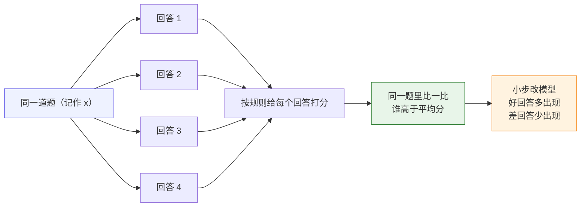
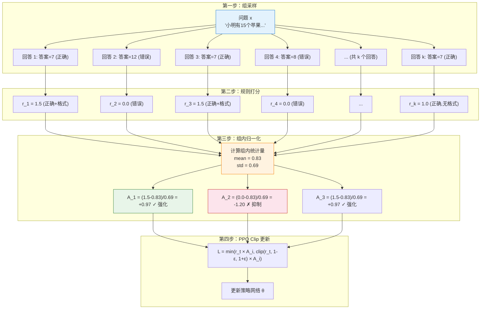
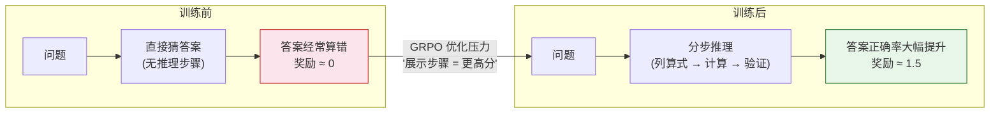

# 15.1 GRPO 训练机制

上一章我们深入了 DPO 的理论与实践，看到它可以直接从固定的偏好数据里学习：同一个 prompt 下，chosen 应该比 rejected 更可能出现。现在我们回到**在线训练**：模型不再只读别人已经标好的偏好对，而是在训练过程中自己生成回答、自己得到反馈、再用反馈更新自己。

GRPO 的入口是**同题多答**。给定同一道题，模型一次生成多个回答；奖励函数分别给这些回答打分；然后只在这一组回答内部比较谁更好。它表面上像"让模型多试几次"，真正解决的问题是：

> **没有 Critic 的时候，模型怎么判断某个回答是比预期好，还是比预期差？**

一个直观答案是：拿它和同一道题的其他回答比。GRPO 就是沿着这个思路，把同题多答变成可以训练的策略优化方法。

本节沿着一次完整的 GRPO 训练轨迹来讲：先看同题多答怎样产生组内比较，再解释为什么"和同题其他回答比"可以替代 Critic，接着写出优势、概率比值和裁剪目标，最后回到手写代码和 GSM8K 训练实验。



这张图先表达一个最基本的训练信号：**同一道题多答几次，每个回答都有分数；高于同组平均分的回答以后更容易出现，低于同组平均分的回答以后更少出现**。

## GRPO 的入口

### 一个带数字的微缩例子

用一个具体例子走一遍。假设题目是：

> 小明有 3 个苹果，又买了 2 个，现在一共有几个？

模型对同一道题一次写出 4 个回答，规则打分如下：

| 回答 | 模型写了什么                | 分数 |
| ---- | --------------------------- | ---- |
| 1    | "3 + 2 = 5，所以答案是 5。" | 1.5  |
| 2    | "答案是 5。"                | 1.0  |
| 3    | "应该是 6。"                | 0.0  |
| 4    | "不确定，可能是 4。"        | 0.0  |

这 4 个分数的平均分是：

$$
\frac{1.5 + 1.0 + 0.0 + 0.0}{4} = 0.625
$$

于是模型会这样理解这组回答：

| 回答 | 和平均分比较           | 之后怎么学                     |
| ---- | ---------------------- | ------------------------------ |
| 1    | $1.5 - 0.625 = +0.875$ | 明显比平均好，**以后多生成它** |
| 2    | $1.0 - 0.625 = +0.375$ | 也比平均好，稍微多生成它       |
| 3    | $0.0 - 0.625 = -0.625$ | 比平均差，**以后少生成它**     |
| 4    | $0.0 - 0.625 = -0.625$ | 比平均差，以后少生成它         |

这里的"比平均分高多少、低多少"，后面会被正式叫做**优势**。在这个例子里，优势就是"这份回答在同题四个回答里表现得比平均好还是差"。

### 把语言模型放进强化学习框架

为了用 RL 语言讲清楚 GRPO，先把对应关系列出来：

| 强化学习概念 | 在数学推理模型里是什么                                   |
| ------------ | -------------------------------------------------------- |
| 状态 $s_t$   | 题目 prompt 加上已经写出的推理步骤，也就是 $(x, y_{<t})$ |
| 动作 $a_t$   | 下一步生成的 token，也就是 $y_t$                         |
| 轨迹 $\tau$  | 一整段推理过程和最终答案                                 |
| 奖励 $R$     | 答案是否正确、格式是否符合要求                           |
| 策略 $\pi$   | 当前正在训练的语言模型                                   |

对一道题 $x$ 来说，模型生成完整回答 $y$ 就相当于走完一条轨迹。被训练的对象仍然是语言模型策略 $\pi_\theta(y \mid x)$。

需要澄清一个常见误会：**GRPO 不是一个新的模型，也不只是"组内归一化"这个公式。GRPO 是一种在线训练策略模型的方法。** 训练方式是：对同一个 prompt 一次生成多个回答，把这些回答放在同一组里打分，并比较：**这个回答在同组里是否高于平均水平？** 最后更新策略时仍然使用 PPO-style 的 `ratio + clip`，避免新策略离旧策略太远。

用一句话概括：

> **GRPO = 在线组采样 + 规则/奖励打分 + 组内相对优势 + PPO-style 裁剪更新。**

把开头的苹果题翻译成这句话：同一道题一次生成 4 个回答，这是**在线组采样**；用答案正确性和格式给分，这是**规则/奖励打分**；用 $1.5-0.625$、$1.0-0.625$ 这样的差值判断好坏，这是**组内相对优势**；最后让好回答概率上升、差回答概率下降，但每次只小步调整，这就是 **PPO-style 裁剪更新**。

## PPO Critic 的痛点

要理解 GRPO 为什么这样设计，先看它要替代的 Critic 有什么问题。

### Critic 是什么

在 PPO 这类 Actor-Critic 方法里，**Actor** 是负责生成回答的策略模型，**Critic** 则像一个"价值评估器"：它不直接生成回答，而是估计"当前已经写到这里，后面大概能拿到多少总奖励"。用公式写就是价值函数：

$$
V_\phi(s_t)
$$

其中 $s_t$ 是当前状态——对语言模型来说可以粗略理解为"prompt 加上已经生成的前几个 token"；$\phi$ 是 Critic 自己的参数。Critic 的作用是给策略更新提供一个基线：如果某个回答的真实奖励比 Critic 预估的更高，就说明这个回答比预期好，应该提高概率；如果比预期低，就应该降低概率。

如果照 PPO 的路线走，优势大致写成：

$$
A_t \approx R - V_\phi(s_t)
$$

这句话的意思是：**不要只看奖励高不高，要看它有没有比 Critic 的预期更好**。这在传统强化学习里很自然，但在 LLM 数学推理里就很重。

### Critic 在 LLM 训练中的三大问题

**1. 吃显存**：Critic 与 Actor 同等规模，PPO 需要同时装下 Actor + Critic + Reference + RM 四个模型。

**2. 训练不稳定**：价值函数 $V(s)$ 需要从"部分生成的文本"预测"最终得分"，但 LLM 序列很长（500+ tokens），监督信号只在末尾才有，方差极大。

**3. 工程复杂**：四个模型各有一套优化器、学习率、梯度裁剪配置，调参难度指数级增长。

回顾[第 6 章基线分析](../chapter08_policy_gradient/pg-improvements)和[第 7 章优势函数](../chapter09_actor_critic/advantage-function)，Critic 的核心作用是**提供基线来降低方差**。如果不需要单独训练网络就能得到基线，Critic 就可以退休了——这就是 GRPO 的出发点。

## GRPO 的核心 与 组内归一化替代 Critic

GRPO 的想法出奇地简单：**不再单独训练 Critic，而是用同一个 prompt 下多个回答的平均分临时充当基线**。DeepSeekMath 论文提出 GRPO 时，明确说它 **"foregoes the critic model"**，并用组内分数来估计基线。


因此，GRPO 与 PPO 的关系可以概括为：

- PPO 问：这个回答比 Critic 预估的平均水平好吗？
- GRPO 问：这个回答比同一道题的其他回答好吗？
- PPO 和 GRPO 都还会用概率比值和裁剪，避免一次更新过大。

> 论文脉络：GRPO 来自 DeepSeekMath 论文 [DeepSeekMath: Pushing the Limits of Mathematical Reasoning in Open Language Models](https://arxiv.org/abs/2402.03300)。它不是完全抛弃 PPO，而是在 PPO 框架里去掉 Critic，用组内相对奖励构造优势。

GRPO 把 PPO 里的 Critic 基线换成"同一道题的一组回答的平均分"：原来问"这个回答比 Critic 预期好吗"，现在问"这个回答比同题其他回答好吗"。这就是"组内相对优势"的直觉：**同一道题里，谁比平均好，就多学谁；谁比平均差，就少生成谁**。

### 代码地图

下面是一份最小手写 GRPO 代码地图。它不是 `trl` 的工程源码，而是把 GRPO 的数学结构摊开给你看：每个公式后面都能回到这份代码里的某几行。

<GrpoCodeFocus focus="overview" />

这份代码可以分成八块：

| 标记    | 代码部分                          | 后文会解释什么                                |
| ------- | --------------------------------- | --------------------------------------------- |
| **[A]** | `sample_groups`                   | 为什么每个 prompt 要生成多个回答              |
| **[B]** | `rule_reward` / `score_responses` | 奖励从哪里来，为什么数学题不需要 RM           |
| **[C]** | `group_advantages`                | 组内均值如何替代 Critic 基线                  |
| **[D]** | `per_token_logprobs`              | 如何保留回答中每个 token 的 $\log \pi_\theta$ |
| **[E]** | `grpo_objective_from_logprobs`    | 逐 token 的 `ratio`、`clip` 和策略更新        |
| **[F]** | `per_token_kl`                    | 为什么 KL 也必须在逐 token 层面计算           |
| **[G]** | `train_step`                      | 采样、打分、优势、loss、反向传播如何接起来    |
| **[H]** | `train_grpo`                      | 为什么 GRPO 是在线训练，每轮都生成新回答      |

## 从 PPO 改到 GRPO：到底替换了哪几行

如果不改成 GRPO，而是继续按 PPO / RLHF 的方式训练，代码直觉通常是这样：

```python
# PPO / RLHF：在线生成，然后让 Critic 估计逐 token 优势
responses, completion_mask = policy_old.generate(prompts)
old_per_token_logps = per_token_logprobs(policy_old, prompts, responses).detach()

rewards = reward_model(prompts, responses)
advantages = critic_based_advantages(prompts, responses, rewards)

new_per_token_logps = per_token_logprobs(policy, prompts, responses)
token_ratio = torch.exp(new_per_token_logps - old_per_token_logps)
per_token_objective = torch.min(
    token_ratio * advantages,
    torch.clamp(token_ratio, 1 - clip_eps, 1 + clip_eps) * advantages,
)
ppo_loss = -masked_sequence_mean(per_token_objective, completion_mask).mean()
```

这里的 `critic` 就是前面说的价值模型。它的工作不是生成答案，而是估计一个基线：**这个 prompt 和当前回答前缀，大概应该拿多少分**。然后 PPO 用 `rewards - values` 得到优势，判断某个回答是"比预期好"还是"比预期差"。

GRPO 的改法很集中：**保留在线生成、概率比值和裁剪，但不再训练 Critic；优势改成从同一个 prompt 的一组回答里算出来**。

```python
# 同一个 prompt 生成 G 个回答，然后做组内比较
responses, completion_mask = generate_many(policy_old, prompts, num_generations=G)
old_per_token_logps = per_token_logprobs(policy_old, prompts, responses).detach()

rewards = reward_fn(prompts, responses)
rewards_by_group = rewards.view(batch_size, G)

group_mean = rewards_by_group.mean(dim=1, keepdim=True)
group_std = rewards_by_group.std(dim=1, keepdim=True)
response_advantages = (
    (rewards_by_group - group_mean) / (group_std + 1e-4)
).view(-1)

new_per_token_logps = per_token_logprobs(policy, prompts, responses)
token_ratio = torch.exp(new_per_token_logps - old_per_token_logps)
per_token_objective = torch.min(
    token_ratio * response_advantages[:, None],
    torch.clamp(token_ratio, 1 - clip_eps, 1 + clip_eps)
    * response_advantages[:, None],
)
grpo_loss = -masked_sequence_mean(per_token_objective, completion_mask).mean()
```

这里有一个容易漏掉的层次：结果监督只给每段回答一个奖励，所以同一回答里的 token 共享一个 $\hat A_i$；新旧策略的概率比值、裁剪和 KL 仍然分别作用于每个 token。最后先对每段回答的有效 token 求平均，再对组内回答求平均。

把真正变化的几行单独拎出来，就是：

```diff
  responses = policy_old.generate(prompts)
  rewards = reward_model_or_rule(prompts, responses)
- values = critic(prompts, responses)
- advantages = rewards - values

+ rewards_by_group = rewards.view(batch_size, G)
+ group_mean = rewards_by_group.mean(dim=1, keepdim=True)
+ group_std = rewards_by_group.std(dim=1, keepdim=True)
+ advantages = ((rewards_by_group - group_mean) / (group_std + 1e-4)).view(-1)

  loss = ppo_style_clipped_loss(logps_new, logps_old, advantages)
```

所以 GRPO 保留了 PPO 的逐 token 概率比值和裁剪，改变的是优势的来源：它用同题回答的组内相对奖励代替单独训练的 Critic。

### 先以原论文为验收标准

DeepSeekMath 原文的式（3）写成三层平均：先对一段回答的 $|o_i|$ 个 token 求平均，再对同一问题的 $G$ 个回答求平均，最后对问题分布取期望。式中的比值也带有 token 下标 $t$：

$$
r_{i,t}(\theta)
=
\frac{\pi_\theta(o_{i,t}\mid q,o_{i,<t})}
{\pi_{\theta_{\mathrm{old}}}(o_{i,t}\mid q,o_{i,<t})}
$$

因此，下面两种写法含义不同：

$$
\underbrace{\exp(\ell^{\mathrm{new}}_{i,t}-\ell^{\mathrm{old}}_{i,t})}_{\text{原始 GRPO：第 }t\text{ 个 token 的比值}}
\qquad
\underbrace{\exp\!\left(\sum_t(\ell^{\mathrm{new}}_{i,t}-\ell^{\mathrm{old}}_{i,t})\right)}_{\text{整段回答的 token 比值连乘}}
$$

第二种写法等于 $\prod_t r_{i,t}$。它会把回答长度带进比值，而且整段回答只裁剪一次，不是 DeepSeekMath 式（3）。原论文的式（4）同样以 token 为单位计算 KL 估计。本文后面的公式和代码都以这两条原始定义为准。[DeepSeekMath 原文公式](https://arxiv.org/html/2402.03300#S3.SS1)

### 再对照 TRL 的工程实现

当前 Hugging Face TRL 的真实源码也保留了这个 token 维度。2026-08-28 查看 [`GRPOTrainer`](https://github.com/huggingface/trl/blob/main/trl/trainer/grpo_trainer.py) 时，可以看到这些对应关系：

1. `GRPOTrainer` 的初始化参数里有 `reward_funcs`，它可以是奖励模型，也可以是普通 Python 函数。也就是说，数学题这类任务可以直接用规则函数打分，不一定要先训练 RM。
2. `self.num_generations = args.num_generations` 对应公式里的 $G$，也就是**每个 prompt 生成几个回答**。
3. 源码会把 rewards reshape 成 `(-1, num_generations)`，计算 `mean_grouped_rewards` 和组内 `std_rewards`，再得到 `advantages = rewards - mean_grouped_rewards`，必要时除以标准差。
4. `_get_per_token_logps_and_entropies` 返回每个回答 token 的 log probability；损失部分计算逐 token 的 `coef_1 = exp(log_ratio)`，再用 `torch.clamp` 得到 `coef_2`，最后逐 token 取 `min`。
5. `loss_type="grpo"` 先用回答掩码对每段回答求 token 平均，再对 batch 求平均。这对应原论文的 $\frac{1}{|o_i|}\sum_t$。`loss_type="bnpo"` 则把整个 batch 的有效 token 一起平均，回答长度权重不同。[当前 TRL 的损失实现](https://github.com/huggingface/trl/blob/main/trl/trainer/grpo_trainer.py)

TRL 现在还支持 sequence-level importance sampling、DAPO/BNPO/DR-GRPO 等扩展，而且 `GRPOConfig` 的默认值会随版本演进。复现原始 DeepSeekMath 公式时，需要显式选择 `importance_sampling_level="token"`、`loss_type="grpo"`、`num_iterations=1`、`beta=0.04`，并关闭后来加入的 KL 偏差修正。后文的配置会把这些选项全部写出来。对照 [TRL 0.24 的 `GRPOConfig`](https://github.com/huggingface/trl/blob/v0.24.0/trl/trainer/grpo_config.py)与[当前 main 分支的 `GRPOConfig`](https://github.com/huggingface/trl/blob/main/trl/trainer/grpo_config.py)，可以看到 `loss_type` 等默认值的变化，以及新版新增且默认开启的 `use_bias_correction_kl`。

对照 [`PPOTrainer`](https://github.com/huggingface/trl/blob/main/trl/experimental/ppo/ppo_trainer.py)，差别就更清楚：PPOTrainer 需要 `reward_model` 和 `value_model`，并用 `value_model` 产生优势估计；GRPOTrainer 不需要单独的 `value_model`，它把**同题多答的组内相对分数**直接变成优势。

## GRPO 的完整公式

前面用直觉和代码 diff 看过 GRPO 怎么工作。这一节严格按 DeepSeekMath 的式（3）和式（4）展开。需要同时保留两个层次：一段回答只有一个结果奖励，因此它的 token 共享同一个优势；策略比值、裁剪和 KL 则都在 token 层面计算。

下面四小节依次给出样本结构、组内优势、逐 token 的 PPO Clip 和逐 token 的 KL 惩罚，最后用一张数据流图收尾。

### 样本结构与组采样

GRPO 的训练样本不是"一个 prompt 配一个回答"，而是**一个 prompt 配一组回答**。假设一个 batch 里有多个题目，用 $j$ 表示第几个题目，用 $i$ 表示这个题目下第几个回答：

$$
x_j \quad \longrightarrow \quad \{y_{j,1}, y_{j,2}, \ldots, y_{j,G}\}
$$

每个字母的意思是：

- $x_j$：第 $j$ 个 prompt，也就是一道题或一个问题。
- $G$：group size，每个 prompt 生成几个回答。代码里的 `num_generations=8` 就是 $G=8$。
- $y_{j,i}$：第 $j$ 个 prompt 下生成的第 $i$ 个回答。
- $\pi_{\text{old}}$：生成这批回答时使用的旧策略。它负责采样数据。
- $\pi_\theta$：正在被更新的新策略。它负责学习，让好回答更可能出现。

采样过程可以写成：

$$
y_{j,i} \sim \pi_{\text{old}}(\cdot \mid x_j), \qquad i = 1, \ldots, G
$$

符号 $\sim$ 表示"从某个分布中采样"。每个回答生成后，都要得到一个奖励：

$$
r_{j,i} = R(x_j, y_{j,i})
$$

这里 $R$ 是奖励函数，$r_{j,i}$ 是一个标量。数学题里，$R$ 可以很简单：答案对就加分，格式规范也加分。GRPO 的关键不是"奖励函数一定很复杂"，而是：**同一道题下的多个回答会放在一起比较**。

代码里对应的是 **[A] 组采样**：

<GrpoCodeFocus focus="sampling" />

### 替代 Critic 的基线

GRPO 的核心思路在这里兑现：对同一个问题 $x_j$，先采样 $G$ 个回答得到 $G$ 个奖励 $\{r_{j,1}, \ldots, r_{j,G}\}$，再做两步处理——**减均值替代 Critic，除标准差归一化尺度**。两步合起来得到组内优势：

$$
\hat A_{j,i} = \frac{r_{j,i} - \bar r_j}{s_j + \epsilon}
$$

其中 $\bar r_j = \frac{1}{G}\sum_i r_{j,i}$ 是组内均值，$s_j=\operatorname{std}(r_{j,1},\ldots,r_{j,G})$ 是组内标准差，$\epsilon$ 是一个很小的数，防止标准差为 0 时除以 0。DeepSeekMath 原文只写 `std`，没有规定分母使用 $G$ 还是 $G-1$。示例跟随 [PyTorch `torch.std` 的默认定义](https://pytorch.org/docs/stable/generated/torch.std.html)使用 Bessel 校正；这只会改变优势的整体缩放，不改变同组回答的正负顺序。

**第一步：减均值替代 Critic**。回顾 PPO 优势 $A_t = R - V_\phi(s_t)$，本质是"奖励减基线"。Critic 学的 $V_\phi(s_t)$ 就是对"在这个 prompt 下平均能拿多少分"的估计。**而组内均值 $\bar r_j$ 是这个估计的直接样本版本**——同一道题的 $G$ 个回答就是 $V(s_j)$ 的 $G$ 次蒙特卡洛采样，平均起来就是无偏估计。代换：

$$
\underbrace{R - V_\phi(s_t)}_{\text{PPO 优势}} \quad \longrightarrow \quad \underbrace{r_{j,i} - \bar r_j}_{\text{GRPO 优势（未归一化）}}
$$

这一步保证了：$\hat A$ 的正负和"是否好于组平均"完全对齐；组内期望 $\mathbb{E}_i[r_{j,i} - \bar r_j] = 0$，与 Critic 基线的性质一致。

**第二步：除标准差归一化尺度**。不同题目的奖励尺度差异巨大——简单题组内奖励可能在 $[1.0, 1.5]$ 之间波动（$\bar r = 1.2$, $s = 0.2$），难题组内可能在 $[0.0, 0.5]$ 之间波动（$\bar r = 0.2$, $s = 0.2$）。如果只减均值不除标准差，简单题和难题的梯度尺度相同——但简单题已经掌握了，不应该再主导梯度。除以 $s_j$ 把所有题目的优势尺度拉到接近 1：

$$
\text{Var}_i\left[\frac{r_{j,i} - \bar r_j}{s_j}\right] = \frac{\text{Var}_i[r_{j,i}]}{s_j^2} = \frac{s_j^2}{s_j^2} = 1
$$

在统计学里这个变换叫 **z-score 标准化**，几何含义是把每组奖励平移到原点、缩放到单位方差，让不同分布可以在同一坐标轴上比较。

两步合起来读：$\hat A_{j,i} > 0$ 表示这个回答比同组平均好，应该提高概率；$\hat A_{j,i} < 0$ 表示比平均差，应该降低概率；$\hat A_{j,i} \approx 0$ 表示和平均差不多，不需要太强更新。这种"控制变量"式的组内比较也比跨样本的绝对评分更稳定——同一组内的回答共享相同的 prompt，唯一差异是模型生成的随机性。它也和人类偏好的本质对齐：判断本来就是"A 比 B 好"这种比较式的，不是"A 得 87 分"这种绝对的。

### 边界情形与代码对应

如果同一组回答奖励全都一样，$s_j$ 会接近 0，代码会把优势设成 0。这表示这道题暂时没有可学习的差异：大家都对，或者大家都错，模型不知道该更偏向哪一个回答。$\epsilon$ 的作用是避免 $0/0$ 的数值问题。

代码里对应的是 **[C] 组内优势**：

<GrpoCodeFocus focus="advantages" />

代码对应关系：

- `grouped_rewards = rewards.view(-1, group_size)`：把一维奖励列表重新排成"每行一个 prompt、每行 $G$ 个回答"的形状。
- `group_mean = grouped_rewards.mean(dim=1, keepdim=True)`：计算每个 prompt 的 $\bar r_j$。
- `group_std = grouped_rewards.std(dim=1, keepdim=True)`：计算每个 prompt 的 $s_j$。
- `advantages = (grouped_rewards - group_mean) / (group_std + eps)`：实现 $\hat A_{j,i}$。
- `torch.where(group_std < eps, 0, advantages)`：如果一组回答没有差异，就不给这组样本训练信号。

一句话总结：**GRPO = PPO 的裁剪机制 + 用组内排名替代 Critic**。下面两小节就把"PPO 的裁剪机制"完整展开。

### 策略比值与 PPO Clip：先保留 token，再计算 ratio

语言模型生成第 $t$ 个 token 时，会根据问题和已经生成的前缀给它一个条件概率：

$$
p_{j,i,t}^{\theta}
=
\pi_\theta(y_{j,i,t}\mid x_j,y_{j,i,<t})
$$

这些概率通常很小。一段回答的联合概率要把它们全部相乘，几十个小数连乘后很容易小到计算机无法稳定表示。代码因此先计算对数概率：

$$
\ell_{j,i,t}^{\theta}=\log p_{j,i,t}^{\theta}
$$

对数把乘法变成加法，所以整段回答的对数概率确实等于 $\sum_t\ell_{j,i,t}^{\theta}$。这条性质适合计算整段回答的概率，却不表示所有算法都应该立刻把 token 维度求和。**原始 GRPO 要在每个 token 上分别计算比值和裁剪，因此代码必须保留形状为 $[B,T]$ 的逐 token 对数概率。**

第 $t$ 个 token 的新旧策略比值是：

$$
\rho_{j,i,t}(\theta)
=
\frac{p_{j,i,t}^{\theta}}{p_{j,i,t}^{\mathrm{old}}}
=
\exp\!\left(\ell_{j,i,t}^{\theta}-\ell_{j,i,t}^{\mathrm{old}}\right)
$$

如果 $\rho_{j,i,t}=1.2$，新策略把这个 token 的条件概率提高了 20%；如果 $\rho_{j,i,t}=0.8$，新策略把它降低了 20%。回答级优势 $\hat A_{j,i}$ 会广播给这段回答中的每个有效 token。原论文的裁剪目标是：

$$
\mathcal{J}_{\text{clip}}(\theta)
=
\mathbb{E}_{x_j}
\left[
\frac{1}{G}\sum_{i=1}^{G}
\frac{1}{T_{j,i}}\sum_{t=1}^{T_{j,i}}
\min\!\left(
\rho_{j,i,t}(\theta)\hat A_{j,i},
\operatorname{clip}(\rho_{j,i,t}(\theta),1-\epsilon,1+\epsilon)\hat A_{j,i}
\right)
\right]
$$

这里的顺序很重要：先对每个 token 算 $\rho_{j,i,t}$，再分别裁剪，最后对一段回答的有效 token 求平均。假设一段三 token 回答的比值是 $[1.1,0.9,1.5]$，$\epsilon=0.2$。原始 GRPO 会得到三个比值并分别裁剪成 $[1.1,0.9,1.2]$。如果先把对数概率求和，得到的回答级比值会变成

$$
\exp\!\left(\sum_t\log\rho_t\right)
=
\prod_t\rho_t
=
1.1\times0.9\times1.5
=
1.485
$$

此时整段回答只剩一个比值，再把它裁剪成 $1.2$。三个 token 原本不同的变化被压成一个数，回答越长，连乘带来的长度效应也越强。这正是旧示例出错的地方。

为什么要裁剪？这批回答由 $\pi_{\text{old}}$ 生成。新策略训练得越久，这批数据越不能代表它当前会生成什么。逐 token 裁剪限制每个生成决策能利用旧数据改变多少。详细推导见[策略更新的约束机制](../chapter10_ppo/trust-region-clipping)。

<GrpoCodeFocus focus="clip" />

代码中的对应关系是：

- `new_logprobs`、`old_logprobs` 的形状都是 $[B,T]$，每个位置保存一个回答 token 的对数概率。
- `token_ratio = exp(new_logprobs - old_logprobs)` 逐位置实现 $\rho_{j,i,t}$。
- `advantages.unsqueeze(-1)` 把每段回答的一个优势广播到它的所有 token。
- `minimum(unclipped, clipped)` 在每个 token 上选择更保守的目标。
- `masked_sequence_mean(..., completion_mask)` 先对每段回答的有效 token 求平均；外层 `.mean()` 再让每段回答拥有相同权重。

直接写 `(loss * mask).sum() / mask.sum()` 会把整个 batch 的 token 一起平均，长回答拥有更多权重。TRL 把这种归约命名为 `bnpo`；原始 GRPO 对应的是每段回答先除以自己的长度。优化器执行最小化，所以代码最后对要最大化的目标加负号。

### KL 惩罚：每个 token 都要和 Reference 比较

DeepSeekMath 还在每个回答 token 上加入 KL 惩罚，让 Policy 不要离 Reference 太远。对第 $t$ 个 token，原文式（4）使用：

$$
\widehat D_{j,i,t}
=
\exp(\Delta_{j,i,t})-\Delta_{j,i,t}-1,
\qquad
\Delta_{j,i,t}
=
\ell_{j,i,t}^{\text{ref}}-\ell_{j,i,t}^{\theta}
$$

这个形式不是凭空选的，它满足三个关键性质。

**性质一：每个 token 的估计值非负**。令 $u = \exp(\Delta)$，则 $\widehat D = u - \log u - 1 \circeq g(u)$。求导 $g'(u) = 1 - 1/u$、$g''(u) = 1/u^2 > 0$，所以 $g$ 是凸函数，在 $u = 1$（即 $\Delta = 0$）处取最小值 $g(1) = 0$。任何 $\Delta \neq 0$ 都给出正值，这避免了朴素估计 $-\Delta$ 在单次采样上可能为负的问题。

**性质二：是 $D_{\text{KL}}(\pi_\theta \| \pi_{\text{ref}})$ 的无偏估计**。注意 $\exp(\Delta) = \pi_{\text{ref}}/\pi_\theta$，所以 $\mathbb{E}_{y \sim \pi_\theta}[\exp(\Delta)] = \sum_y \pi_\theta(y) \cdot \pi_{\text{ref}}(y)/\pi_\theta(y) = 1$；而 $\mathbb{E}_{\pi_\theta}[\Delta] = -D_{\text{KL}}(\pi_\theta \| \pi_{\text{ref}})$。代回去：

$$
\mathbb{E}_{\pi_\theta}[\widehat D_{\text{KL}}] = 1 - (-D_{\text{KL}}) - 1 = D_{\text{KL}}(\pi_\theta \| \pi_{\text{ref}})
$$

**性质三：在小偏差处退化为二次型**。把 $\exp(\Delta)$ 在 $\Delta = 0$ 处 Taylor 展开：$\exp(\Delta) = 1 + \Delta + \Delta^2/2 + O(\Delta^3)$，所以

$$
\widehat D_{\text{KL}} = \exp(\Delta) - \Delta - 1 = \frac{\Delta^2}{2} + O(\Delta^3)
$$

**几何含义**：$\widehat D_{\text{KL}}$ 作为 $\Delta$ 的函数是一条 $U$ 形曲线，最低点在 $\Delta = 0$（Policy = Reference），开口由 $\Delta^2/2$ 主导。这正是"越偏离惩罚越大"在数学上的写照——而二次型主导意味着梯度在偏离小时温和、偏离大时变陡，避免一次性把策略推得太远。

把逐 token 裁剪和逐 token KL 合在一起，DeepSeekMath 式（3）的单个问题目标是：

$$
\mathcal{J}_{\text{GRPO}}(\theta)
=
\frac{1}{G}\sum_{i=1}^{G}
\frac{1}{T_{j,i}}\sum_{t=1}^{T_{j,i}}
\left[
\min\!\left(
\rho_{j,i,t}\hat A_{j,i},
\operatorname{clip}(\rho_{j,i,t},1-\epsilon,1+\epsilon)\hat A_{j,i}
\right)
-\beta\widehat D_{j,i,t}
\right]
$$

训练损失是 $\mathcal L_{\text{GRPO}}=-\mathbb E_{x_j}[\mathcal J_{\text{GRPO}}]$。这里 $\beta$ 是 KL 惩罚权重，对应代码里的 `kl_coef`。DeepSeekMath 实验使用 $\beta=0.04$。[DeepSeekMath 式（3）、式（4）与实验设置](https://arxiv.org/html/2402.03300#S3.SS1)

<GrpoCodeFocus focus="kl" />

代码对应关系：

- `log_ratio_ref = ref_logprobs - new_logprobs`：逐 token 实现 $\Delta_{j,i,t}$。
- `per_token_kl = exp(log_ratio_ref) - log_ratio_ref - 1`：逐 token 实现 $\widehat D_{j,i,t}$。
- `per_token_objective = minimum(...) - kl_coef * per_token_kl`：先在同一个 token 上合并裁剪目标和 KL。
- `masked_sequence_mean`：用回答掩码排除 prompt 和 EOS 后的 padding，再执行原论文的 $\frac{1}{T_{j,i}}\sum_t$。

### 一次完整训练的七步

把所有步骤连起来，GRPO 的一次训练就是：

1. 对每个 prompt 采样 $G$ 个回答。
2. 用规则或奖励函数给每个回答打分。
3. 在同一个 prompt 的组内计算 $\bar r_j$、$s_j$ 和 $\hat A_{j,i}$。
4. 保留回答 token 的 log probability，逐 token 算 $\rho_{j,i,t}(\theta)$。
5. 对每个 token 分别执行 PPO-style clip，并计算 Reference KL。
6. 每段回答先按有效 token 求平均，再对组内回答求平均。
7. 反向传播，只更新 Policy。

完整的 GRPO 数据流如下图：



## GRPO 训练实验 与 GSM8K + 规则奖励

公式讲完后，看一次真实的 GRPO 训练。本节用一个最小可跑的实验：在 GSM8K 上用规则奖励训练 Qwen2.5-1.5B。

### 为什么不需要 RM

GSM8K 是一个包含 8500 道小学数学应用题的数据集，每道题都有明确的数值答案。这恰好是一个有"客观正确答案"的场景——不需要 RM，直接用规则判断答案是否正确：

- 答案正确：$+1.0$ 分
- 格式规范（有清晰的推理步骤）：$+0.5$ 分
- 答案错误：$0$ 分

```python
# 1. 规则奖励函数（不需要 RM！）
import re

def rule_based_reward(prompt: str, response: str, ground_truth: str) -> float:
    reward = 0.0
    # 格式分：检查 \boxed{...}
    if re.search(r'\\boxed\{[^}]+\}', response):
        reward += 0.5
    # 答案分：提取最终答案并比较
    answer_match = re.search(r'\\boxed\{([^}]+)\}', response)
    if answer_match:
        model_answer = answer_match.group(1).strip()
        try:
            if abs(float(model_answer) - float(ground_truth)) < 0.01:
                reward += 1.0
        except ValueError:
            if model_answer == ground_truth:
                reward += 1.0
    return reward

# 测试
prompt = "Janet 的鸡蛋盒子每天能装 16 个鸡蛋。她每天早上吃 3 个，下午用 4 个烤松饼。她每周能卖多少个鸡蛋？"
good = "首先计算每天剩余的鸡蛋数：16 - 3 - 4 = 9 个\n每周有 7 天，所以每周能卖：9 × 7 = 63 个\n\\boxed{63}"
bad = "我觉得大概能卖 50 个左右吧。\\boxed{50}"
print(rule_based_reward(prompt, good, '63'))  # 1.5
print(rule_based_reward(prompt, bad, '63'))   # 0.5
```

注意这里的关键区别：**不需要训练任何 RM，规则就是裁判**。数学题有标准答案，直接比较就行。这种"可验证奖励"正是 RLVR 的核心思想。

在手写代码地图中，奖励函数对应的是 **[B]**。它只接收回答和标准答案，返回一个标量奖励：

<GrpoCodeFocus focus="reward" />

### 运行 GRPO 训练

我们使用 `trl` 库提供的 GRPO 实现。和 PPO 相比，GRPO 不需要 Critic 模型：

```python
# 2. GRPO 训练代码（简化示意）
from trl import GRPOTrainer, GRPOConfig
from transformers import AutoModelForCausalLM, AutoTokenizer
from datasets import load_dataset

model = AutoModelForCausalLM.from_pretrained("Qwen/Qwen2.5-1.5B-Instruct")
tokenizer = AutoTokenizer.from_pretrained("Qwen/Qwen2.5-1.5B-Instruct")
if tokenizer.pad_token is None:
    tokenizer.pad_token = tokenizer.eos_token
tokenizer.padding_side = "left"

paper_grpo_options = dict(
    beta=0.04,                         # 原论文的 KL 系数
    epsilon=0.2,
    num_iterations=1,                  # 每批采样后只更新一次
    scale_rewards="group",             # 同一问题的组内标准化
    importance_sampling_level="token", # 逐 token ratio
    loss_type="grpo",                  # 每段回答先除以自身长度
)
# 仓库固定的 TRL 0.24 尚无此选项；新版 TRL 才需要显式关闭它。
if "use_bias_correction_kl" in GRPOConfig.__dataclass_fields__:
    paper_grpo_options["use_bias_correction_kl"] = False

config = GRPOConfig(
    output_dir="./grpo_gsm8k",
    num_generations=8,                 # 教学规模；原论文为 64
    per_device_train_batch_size=8,     # 全局 batch 必须能被组大小整除
    max_completion_length=1024,
    learning_rate=1e-6,                # 原论文实验设置
    num_train_epochs=1,
    **paper_grpo_options,
)

gsm8k = load_dataset("openai/gsm8k", "main")
trainer = GRPOTrainer(
    model=model,
    args=config,
    train_dataset=gsm8k["train"],
    reward_funcs=[rule_based_reward],  # 直接传入规则奖励函数
    processing_class=tokenizer,
)

trainer.train()  # 开始训练——不需要 Critic，不需要 RM
trainer.save_model("./grpo_gsm8k/final_model")
```

这里把算法口径和实验规模分开处理。`num_generations=8` 是为了降低教学实验的显存需求；[DeepSeekMath 的正式实验设置](https://arxiv.org/html/2402.03300#S3.SS2)为每个问题采样 64 个回答、batch size 1024、学习率 $10^{-6}$、KL 系数 0.04，并在每次探索后只更新一次。其余显式参数用于防止 TRL 的新版默认值把训练切换到 DAPO、BNPO、sequence-level importance sampling 或带偏差修正的 KL。[仓库固定的 TRL 0.24 配置源码](https://github.com/huggingface/trl/blob/v0.24.0/trl/trainer/grpo_config.py)还没有 `use_bias_correction_kl`；[当前 main 分支配置](https://github.com/huggingface/trl/blob/main/trl/trainer/grpo_config.py)新增了该字段且默认开启，所以示例只在检测到字段时将它关闭。TRL 的配置说明也提示原始 `loss_type="grpo"` 可能带来长度偏差，并推荐后续变体；这不改变本节复现原论文式（3）的选择。

如果把 `GRPOTrainer` 内部最关键的训练步骤摊开，就是"先组采样，再打分，再算优势，再更新策略"：

<GrpoCodeFocus focus="train" />

### 推理步骤的变化

GRPO 训练最令人兴奋的观察是模型推理方式的变化：

**训练前**（直接猜答案）：

```
题目：小明有 15 个苹果，给了小红 3 个，又给了小刚 5 个，还剩多少个？
回答：我觉得还剩 7 个。\boxed{7}
```

**训练后**（展示推理过程）：

```
题目：小明有 15 个苹果，给了小红 3 个，又给了小刚 5 个，还剩多少个？
回答：
让我一步一步算：
- 小明一开始有 15 个苹果
- 给了小红 3 个：15 - 3 = 12
- 又给了小刚 5 个：12 - 5 = 7
- 所以还剩 7 个
\boxed{7}
```

模型从"直接猜答案"变成了"先列算式再计算"——这不是我们教它的，而是模型在 GRPO 训练过程中自己"领悟"出来的。因为展示推理步骤能提高答案正确率（拿到更高的规则奖励），所以 GRPO 的优化压力自然地选择了这条路径。



## 实验对比与参数调优

### 显存占用对比

| 模型大小 | PPO 显存（4 模型） | GRPO 显存（2 模型） | 节省比例 |
| -------- | ------------------ | ------------------- | -------- |
| 1.5B     | ~24 GB             | ~14 GB              | ~42%     |
| 7B       | ~80 GB             | ~48 GB              | ~40%     |
| 14B      | ~160 GB            | ~96 GB              | ~40%     |
| 70B      | ~640 GB            | ~384 GB             | ~40%     |

GRPO 省掉了 Critic（和 Actor 同等规模）和 RM 两个模型，通常能减少 30-40% 的显存占用。在实际工程中，这意味着原本需要 8 张 A100 的训练任务，现在 5 张就够了。

### 组内方差的演化

GRPO 的核心创新是用组内归一化替代 Critic。在训练初期，同一个问题的 8 个回答质量差异很大（方差高）。随着训练推进，组内回答质量趋于一致（方差降低），大部分回答都能答对。

```
训练初期（Episode 10）：
  问题 "15 - 3 - 5 = ?" 的 8 个回答：[3, 7, 12, 7, 15, 7, 8, 10]
  组内方差：高（答案五花八门）
  归一化优势：[−1.2, +0.1, +0.8, +0.1, +1.5, +0.1, −0.3, +0.6]

训练中期（Episode 100）：
  同一问题的 8 个回答：[7, 7, 7, 8, 7, 7, 7, 7]
  组内方差：低（大部分答对了）
  归一化优势：[0, 0, 0, −0.5, 0, 0, 0, 0]

训练后期（Episode 300）：
  同一问题的 8 个回答：[7, 7, 7, 7, 7, 7, 7, 7]
  组内方差：接近零（全部答对）
  归一化优势：全部接近零 → 无梯度信号
```

当组内方差降为零时，优势全部为零，没有梯度信号了——模型在这个问题上"毕业"了。这正是我们想要的行为：训练信号自然地转移到还没掌握的题目上。

### k 值的选择

k（组大小）是 GRPO 最关键的超参数，它直接影响组内归一化的质量：

| k 值 | 采样成本                | 归一化质量               | 适用场景     |
| ---- | ----------------------- | ------------------------ | ------------ |
| 2    | 低（每个问题只采 2 次） | 差（均值和标准差不稳定） | 快速验证     |
| 4    | 中等                    | 一般                     | 资源有限时   |
| 8    | 较高                    | 良好                     | **默认推荐** |
| 16   | 高                      | 很好（统计量更稳定）     | 追求上限     |
| 64   | 很高                    | 极好                     | 大规模训练   |

```python
# GRPO 组内归一化的简单实现
import numpy as np

def grpo_group_normalize(rewards: list[float]) -> list[float]:
    rewards = np.array(rewards, dtype=float)
    mean, std = rewards.mean(), rewards.std()
    if std < 1e-8:
        return np.zeros_like(rewards)
    return (rewards - mean) / std

# 8 个回答的奖励
rewards = [1.5, 0.0, 1.5, 0.0, 1.0, 1.5, 0.5, 1.5]
advantages = grpo_group_normalize(rewards)
# 归一化优势: [ 0.89 -1.48  0.89 -1.48  0.10  0.89 -0.69  0.89]
# 均值: 0.9375, 标准差: 0.634
```

<details>
<summary>思考题：GRPO 的组内归一化在什么情况下会失效？</summary>

1. **k 太小**：$k=2$ 时均值和标准差极不稳定，统计量不可靠。
2. **奖励分布偏斜**：大部分回答得零分时，少数高分回答主导梯度信号。
3. **所有回答质量相同**：方差为零，优势全部为零，无梯度信号——即训练后期"毕业"现象。
4. **奖励信号不连续**：只有 0/1 两个值时，归一化后的优势分布是离散的，梯度信号不够精细。

GRPO 通过 DAPO 的"动态采样"改进来缓解这些问题——过滤掉模型已经答对的题目，只保留有梯度信号的样本。

</details>

### GRPO 与 PPO 全面对比

| 组件           | PPO                               | GRPO                               |
| -------------- | --------------------------------- | ---------------------------------- |
| 基线（Critic） | 独立的 $V(s)$ 网络                | 组内均值 $\bar{r}$                 |
| 优势计算       | $A = R - V(s)$ 或 GAE             | $A_i = (r_i - \bar{r}) / \sigma_r$ |
| 模型数量       | 4 个（Actor + Critic + Ref + RM） | 2 个（Actor + Ref）                |
| 裁剪机制       | PPO Clip                          | 同样的 PPO Clip                    |
| 采样方式       | 在线交互                          | 组采样（每个 prompt 采 k 个）      |
| 显存           | 高                                | 低 30-40%                          |
| 基线质量       | 依赖 Critic 训练质量              | 依赖组大小 $k$                     |
| 基线更新速度   | 需要重新训练 Critic               | 自动随 batch 更新                  |

值得注意的是，GRPO 继承了 PPO 的裁剪机制，但没有继承 GAE。原因是 GRPO 的奖励通常只在序列末尾给出一个信号（答对/答错），而不是每个 token 都有奖励。在这种情况下，GAE 的多步 TD 退化为单步，和直接用最终奖励减去均值没有本质区别。

GRPO 通过组内归一化优雅地解决了 Critic 的问题。但这只是第一步——在策略端，DeepSeek-R1-Zero 证明了不需要 SFT 也能做纯 RL 训练，DAPO 进一步优化了 GRPO 的工程效率。让我们看看这些前沿进展——[DeepSeek-R1 与 DAPO](./deepseek-dapo)。
