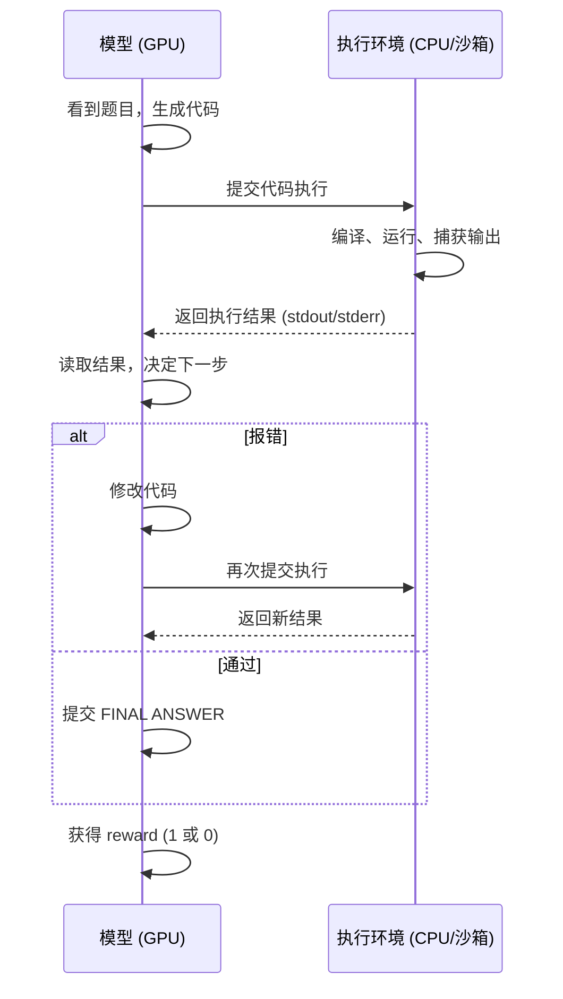
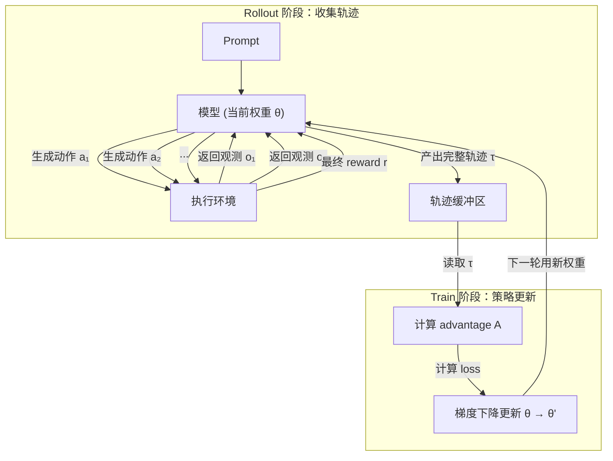
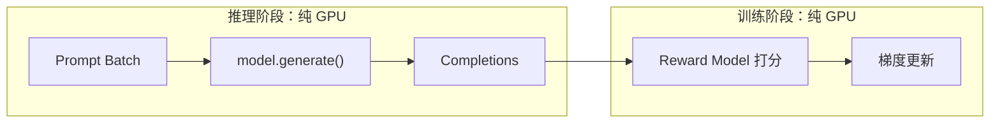
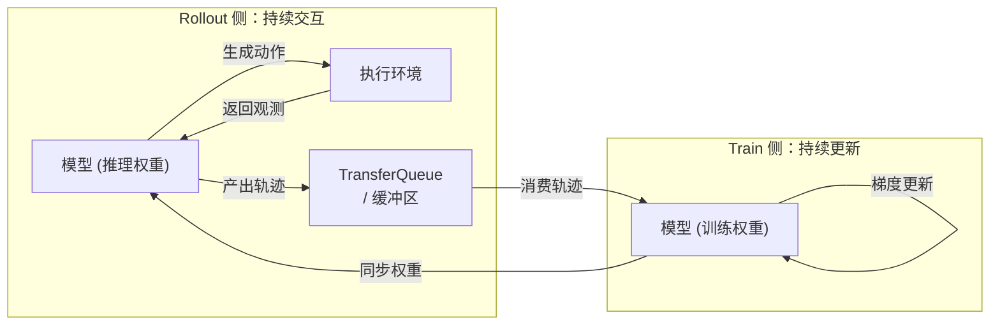
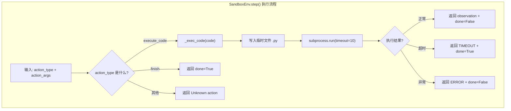
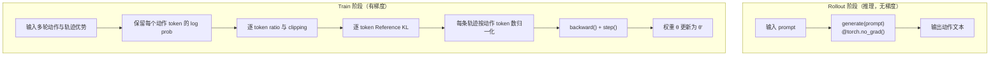
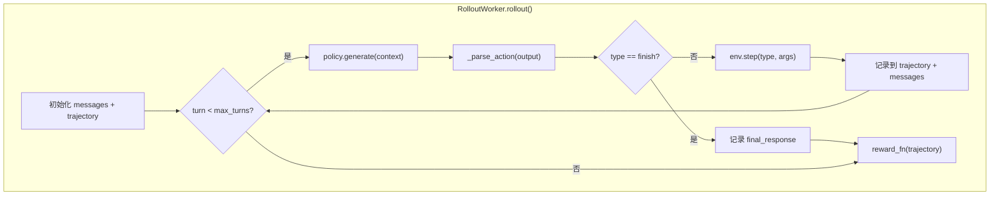
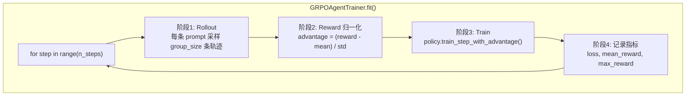
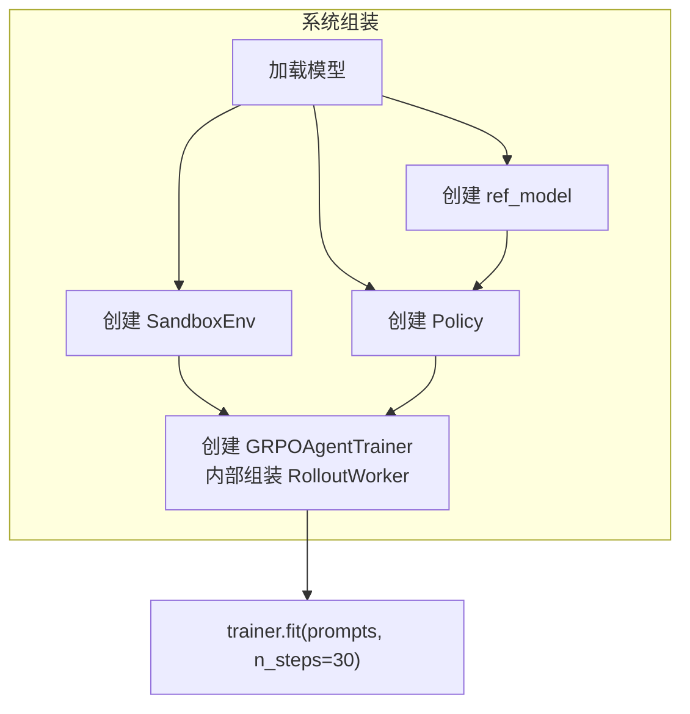

# 19.10 动手：从零实现 Agentic RL 训练系统

> **本节目标**：用不超过 500 行的代码实现一个 Agentic RL 训练系统，让语言模型能够编写代码、执行、读取错误并继续修改。

> **学习路径**：[19.1 Agentic RL 基础](./overview) → [19.8 DeepCoder Agent](./rllm-deepcoder-lab) → [19.9 金融分析 Agent](./rllm-finqa-lab) → **19.10 从零实现训练系统**

> **本节代码与资源**：[完整实现目录](https://github.com/walkinglabs/hands-on-modern-rl/tree/main/docs/chapter22_agentic/code) · [trainer.py](https://github.com/walkinglabs/hands-on-modern-rl/blob/main/docs/chapter22_agentic/code/trainer.py)

前面几节分别从框架和案例理解了 Agentic RL。现在从一个 episode 出发搭建最小系统：模型生成代码，执行环境返回标准输出或错误，模型根据新观测继续行动，最终奖励再用于更新策略。CPU 即可运行这个教学版本；验收时要检查多轮轨迹是否完整、执行结果是否回传、奖励是否对应测试结果、参数是否真正更新。

完整实现位于 `docs/chapter22_agentic/code/`。安装 PyTorch 和 Transformers 后，在该目录运行：

```bash
cd docs/chapter22_agentic/code
python run.py
```

脚本会下载 0.5B 参数模型并执行 30 个训练步骤。这里的 `SandboxEnv` 只是带超时限制的教学实现，不提供容器或虚拟机级隔离；不要用它执行不可信代码。

## 19.10.1 Agentic RL 训练系统的 Infra 基础

先从一个 episode 开始。模型读取编程题，生成代码，环境执行代码并返回结果；模型读取这个新观测后决定继续修改还是提交答案。

### 一个 episode 的流程

考虑 Agent 解决编程题的完整过程：



这个流程有两个关键特征：

1. **动作间依赖**：模型只有在拿到环境反馈后，才能决定下一步动作。第 $t$ 步的输出 $a_t$ 依赖于第 $t-1$ 步的观测 $o_{t-1}$，无法像文本生成那样一次性并行采样多个完整序列。
2. **跨设备延迟**：每轮交互都涉及 **GPU（模型推理）→ CPU（动作解析）→ 沙箱（代码执行）→ CPU（结果回传）→ GPU（下一步推理）** 的往返，其中沙箱执行的时间尺度是毫秒到秒级，远大于 GPU 内部的内存访问延迟。

### 训练循环的流程

单次 episode 的交互只是产生了一条轨迹。训练本身是一个反复循环的过程：



具体来说：

- **Rollout 阶段**：模型以当前策略 $π_θ$ 与环境交互，完成一个或多个 episode，产出完整的交互轨迹 $τ = (s_0, a_0, o_0, s_1, a_1, o_1, ..., r)$。这里的关键是**on-policy**：轨迹必须由当前策略生成，才能准确评估该策略的表现。
- **Reward 计算**：根据轨迹的最终结果（如答案是否正确）计算 reward。中间步骤没有即时反馈。
- **Advantage 估计**：使用 GRPO 等方法，对同一 prompt 的多个轨迹做组内归一化，计算每条轨迹的 advantage。
- **梯度更新**：基于 advantage 对策略参数 $θ$ 做梯度上升（提升高 advantage 轨迹的概率），得到更新后的权重 $θ'$。
- **循环**：下一轮 rollout 使用更新后的权重 $θ'$ 重新采样轨迹，如此反复。

这个循环就是经典的 **rollout → reward → train → repeat**。在传统 RLHF 中，rollout 和 train 可以在一个 batch 内紧凑完成；但在 Agentic RL 中，rollout 阶段被环境 I/O 频繁打断，如果串行执行，train 阶段会长时间等待。

### 与传统 RLHF 的对比

传统 RLHF（如摘要、对话场景的 PPO/GRPO）的训练流程完全不同：



在 RLHF 中：

- **推理**是对一个 batch 的 prompt **并行**生成 completion，过程完全在 GPU 内完成，不需要与外部环境交互。
- **训练**是对这一批 completion 统一计算 reward、advantage，然后做一次梯度更新。
- 两个阶段内部都是**连续的 GPU 运算**，中间没有 I/O 中断，可以高效地按 batch 对齐：一批推理 → 一批训练。

但在 Agentic RL 中，推理过程被环境交互频繁打断。如果我们把推理和训练**串行**执行——等一个 episode 全部交互完成后再做梯度更新——那么在整个 episode 期间，GPU 都处于**空闲等待**状态。

一个 episode 可能包含多轮交互，每轮都有环境延迟，累积的空闲时间会显著放大。在现代训练集群中，**GPU 是最稀缺的计算资源**，让 GPU 长时间等待 I/O 是不可接受的。

### 核心设计原则 与 推理与训练解耦

因此，Agentic RL 训练系统的核心设计原则是：**推理（rollout）和训练（train）必须解耦为两个独立的执行流**。



- **Rollout 侧**：持续与环境交互，不断产出完整的交互轨迹，推入缓冲区。
- **Train 侧**：持续从缓冲区中拉取轨迹数据，计算 advantage，执行梯度更新。
- 两者之间通过**缓冲区**（如 Relax 的 TransferQueue、veRL 的 ActorBuffer）解耦，各自以自己的节奏运行，而不是串行等待。

### 解耦带来的问题

解耦后还需要处理三个工程问题：

- **权重同步**：Train 侧更新后的权重，如何及时同步到 Rollout 侧？如果 Rollout 还在用旧权重生成轨迹，这些轨迹对当前策略的评估就不准确了。
- **队列管理**：Rollout 产出速度可能远快于 Train 消费速度，缓冲区会不会溢出？数据会不会堆积？
- **一致性**：Train 侧消费的轨迹，其生成时使用的模型权重与当前权重已经不同，如何处理这个**时间差**？

Relax、veRL 等生产框架使用 DCS 权重同步、心跳机制、PlacementGroup 调度和流式队列处理这些问题。

本节我们先不处理这些高级问题，而是写一个**同步版本**——rollout 完成后立即训练，训练完再做下一轮 rollout。这样做的目的是让四个核心组件各自的职责和交互方式在简单场景下清晰可见。理解同步版本后，再引入异步解耦、分布式、容错等扩展，方向会自然清晰。

## 19.10.2 从训练循环到组件设计

同步版本依次执行 rollout、reward 和 train。按照每一步的数据输入与输出，可以把系统拆成四个组件。

### Rollout 阶段需要什么

Rollout 阶段的核心任务是"模型与环境交互，产出轨迹"。把这个任务拆开：

- **Environment** 在隔离环境中执行 Agent 生成的代码，并把标准输出、错误和超时信息返回给模型。隔离可以避免死循环卡住训练进程。
- **RolloutWorker** 把多次“生成、执行、观察”串成一个 episode，并保存完整交互历史。
- **Policy** 提供推理接口生成动作，也提供训练接口接收优势并更新参数。

### Train 阶段需要什么

Train 阶段的核心任务是"从轨迹中计算 advantage，然后做梯度更新"。把这个任务拆开：

- 对同一个 prompt 采样多条轨迹，并在组内计算平均奖励、标准差和优势；
- 按批次调用 Policy 的训练接口；
- 记录 rollout、奖励和参数更新指标。

这就是 **Trainer** 的职责：编排整个"rollout → reward → train"循环，把其他三个组件组装成可运行的训练流程。

### 组件总览

| 组件              | 解决什么问题                                         | 对应训练阶段    |
| ----------------- | ---------------------------------------------------- | --------------- |
| **Environment**   | Agent 生成的代码在哪里安全执行？                     | Rollout         |
| **Policy**        | 谁生成动作？谁接受梯度更新？                         | Rollout + Train |
| **RolloutWorker** | 怎么把单步推理串成多轮交互循环？                     | Rollout         |
| **Trainer**       | 怎么组织"采样 → 算 advantage → 梯度更新"的训练循环？ | Train（编排）   |

下面我们先看一个完整的交互例子，然后逐个实现这四个组件。

## 19.10.3 一次完整交互长什么样

在动手写代码之前，我们先看一个具体例子。假设题目是"计算斐波那契数列第 10 项"。

理想情况下，Agent 一次写对：

| Turn | 角色  | 内容                               |
| ---- | ----- | ---------------------------------- |
| 0    | User  | "计算斐波那契数列第 10 项"         |
| 1    | Agent | 生成 Python 代码 `def fib(n): ...` |
| 1    | 环境  | 执行代码，返回 `55`                |
| 2    | Agent | FINAL ANSWER: 55                   |

但更多时候，Agent 会写出有 bug 的代码，在报错后修正：

| Turn | 角色  | 内容                        |
| ---- | ----- | --------------------------- |
| 0    | User  | "计算斐波那契数列第 10 项"  |
| 1    | Agent | 生成了有 bug 的代码         |
| 1    | 环境  | 返回 `ERROR: NameError`     |
| 2    | Agent | 看到 ERROR，修改代码        |
| 2    | 环境  | 执行修正后的代码，返回 `55` |
| 3    | Agent | FINAL ANSWER: 55            |

这个例子展示了 Agent 与环境交互的完整过程。在理想情况下 Agent 一次写对，但更多时候它需要多轮试错。无论哪种情况，交互模式都是固定的：Agent 生成动作 → 环境执行并返回观测 → Agent 根据观测决定下一步。

下面我们从 Rollout 阶段最基础的需求开始——**隔离执行**。

## 19.10.4 Environment — 沙箱和工具执行

Agent 生成的代码要在哪里执行？一个自然的想法是直接在训练进程中运行。但如果 Agent 写出 `while True: pass` 这样的死循环，整个训练进程就会被卡住。更严重的是，Agent 可能生成删除文件的恶意代码。因此，我们需要一种机制，在隔离的环境中执行 Agent 的动作，同时将执行结果安全地返回给 Agent。

这种隔离环境需要满足三个条件：接收 Agent 的动作（代码）、安全执行并限制资源、返回执行结果和终止状态。这就是 **Environment** 组件的职责，也是 19.2 节讨论的沙箱问题的最小实现。



```python
# environment.py
import os
import subprocess
import sys
import tempfile


class SandboxEnv:
    """最小代码执行环境：subprocess + timeout，不构成安全边界。

    它把代码放到独立进程并限制等待时间，但没有隔离文件系统和网络。
    不要用它执行不可信代码；生产环境需要容器或 MicroVM。
    """

    def __init__(self, timeout=10):
        self.timeout = timeout

    def step(self, action_type: str, action_args: dict) -> dict:
        """执行一步动作，返回观测和终止状态。

        对应 POMDP 的观测函数 O(s_t)：给定动作，返回 (observation, done)。
        支持两种动作类型：execute_code（执行代码）和 finish（结束 episode）。
        """
        if action_type == "execute_code":
            return self._exec_code(action_args["code"])
        elif action_type == "finish":
            return {"observation": "", "done": True}
        else:
            return {"observation": f"Unknown action: {action_type}", "done": False}

    def _exec_code(self, code: str) -> dict:
        """在当前 Python 的子进程中执行代码，并限制等待时间。

        1. 创建临时文件写入代码
        2. subprocess.run() 在独立进程中执行
        3. timeout 限制等待时间
        4. 只返回 stdout/stderr 的最后 500 个字符
        """
        temp_path = None
        try:
            with tempfile.NamedTemporaryFile(mode="w", suffix=".py", delete=False) as f:
                f.write(code)
                f.flush()
                temp_path = f.name
                result = subprocess.run(
                    [sys.executable, temp_path],
                    timeout=self.timeout,
                    capture_output=True,
                    text=True,
                )
                return {
                    "observation": (result.stdout + result.stderr)[-500:],  # 截断长输出
                    "done": False,
                }
        except subprocess.TimeoutExpired:
            # 超时：Agent 写了死循环，episode 应终止
            return {"observation": "TIMEOUT", "done": True}
        except Exception as e:
            # 其他异常：编译错误、语法错误等
            return {"observation": f"ERROR: {e}", "done": False}
        finally:
            if temp_path and os.path.exists(temp_path):
                os.unlink(temp_path)

    def reset(self):
        """重置环境状态（新 episode 开始时调用）。

        本最小实现中沙箱是无状态的，不需要清理。
        生产环境中可能需要清空文件系统、重置网络等。
        """
        pass
```

设计要点：

- `step()` 接受结构化的 action（`action_type` + `action_args`），不是纯文本。这对应 19.2 节的动作空间 $A = A_{\text{text}} \cup A_{\text{action}}$
- `_exec_code()` 用当前 Python 解释器启动子进程，并用 timeout 终止长时间执行；它没有文件系统或网络隔离，因此只适合受信任的教学代码
- 返回值包含 `observation`（环境反馈）和 `done`（是否终止），对应 POMDP 的观测函数 $O(s_t)$

## 19.10.5 Policy — 模型推理与训练

环境可以执行代码了，但谁来决定写什么代码？我们需要一个策略（Policy）来生成动作。这里使用一个 0.5B 参数的 Qwen2.5 作为策略模型。

但这里出现了一个关键问题：这个模型既要用于 rollout 阶段生成代码（推理），又要用于训练阶段接受梯度更新。同一份权重如何同时支持这两种截然不同的用法？这正是 B.1 节讨论的核心问题——我们需要对同一份权重提供两套接口：一套用于推理生成，一套用于梯度更新。



```python
# policy.py
import torch
import torch.nn.functional as F


class Policy:
    def __init__(self, model, tokenizer, lr=1e-5,
                 clip_eps=0.2, kl_coef=0.04):
        self.model = model
        self.tokenizer = tokenizer
        self.optimizer = torch.optim.AdamW(model.parameters(), lr=lr)
        self.clip_eps = clip_eps
        self.kl_coef = kl_coef
        self.ref_model = None

    def set_ref_model(self, ref_model):
        self.ref_model = ref_model.to(self.model.device).eval()
        for parameter in self.ref_model.parameters():
            parameter.requires_grad_(False)

    @torch.no_grad()
    def generate(self, prompt: str, max_new_tokens=128) -> str:
        self.model.eval()
        inputs = self.tokenizer(prompt, return_tensors="pt").to(self.model.device)
        pad_token_id = self.tokenizer.pad_token_id
        if pad_token_id is None:
            pad_token_id = self.tokenizer.eos_token_id
        outputs = self.model.generate(
            **inputs,
            do_sample=True,
            temperature=1.0,
            max_new_tokens=max_new_tokens,
            pad_token_id=pad_token_id,
        )
        prompt_width = inputs["input_ids"].shape[1]
        return self.tokenizer.decode(
            outputs[0, prompt_width:], skip_special_tokens=True
        )

    def _token_logprobs(self, model, prompt, response):
        prompt_inputs = self.tokenizer(prompt, return_tensors="pt")
        response_inputs = self.tokenizer(
            response, return_tensors="pt", add_special_tokens=False
        )
        prompt_ids = prompt_inputs["input_ids"].to(model.device)
        response_ids = response_inputs["input_ids"].to(model.device)
        input_ids = torch.cat([prompt_ids, response_ids], dim=1)
        attention_mask = torch.ones_like(input_ids)

        logits = model(input_ids=input_ids, attention_mask=attention_mask).logits
        prompt_width = prompt_ids.shape[1]
        response_logits = logits[:, prompt_width - 1 : -1, :]
        logprobs = F.log_softmax(response_logits, dim=-1)
        return logprobs.gather(2, response_ids.unsqueeze(-1)).squeeze(-1)

    @torch.no_grad()
    def _get_ref_logprobs(self, prompt, response):
        return self._token_logprobs(self.ref_model, prompt, response)

    def train_step_with_advantage(self, trajectories: list):
        """trajectories: [([(turn_prompt, turn_response), ...], advantage)]"""
        self.model.train()
        self.optimizer.zero_grad()
        trajectory_losses = []

        for turns, advantage in trajectories:
            turn_token_losses = []
            for prompt, response in turns:
                new_logprobs = self._token_logprobs(self.model, prompt, response)
                if new_logprobs.numel() == 0:
                    continue

                # 本示例每批轨迹只更新一次，old policy 是当前前向的 detach 版本。
                old_logprobs = new_logprobs.detach()
                ratio = torch.exp(new_logprobs - old_logprobs)
                advantage_tensor = new_logprobs.new_tensor(advantage)
                unclipped = ratio * advantage_tensor
                clipped = torch.clamp(
                    ratio, 1 - self.clip_eps, 1 + self.clip_eps
                ) * advantage_tensor

                if self.ref_model is not None:
                    ref_logprobs = self._get_ref_logprobs(prompt, response)
                    delta = ref_logprobs - new_logprobs
                    per_token_kl = torch.exp(delta) - delta - 1
                else:
                    per_token_kl = torch.zeros_like(new_logprobs)

                per_token_loss = (
                    -torch.minimum(unclipped, clipped)
                    + self.kl_coef * per_token_kl
                )
                turn_token_losses.append(per_token_loss.reshape(-1))

            if turn_token_losses:
                trajectory_losses.append(torch.cat(turn_token_losses).mean())

        if not trajectory_losses:
            return 0.0
        total_loss = torch.stack(trajectory_losses).mean()
        total_loss.backward()
        self.optimizer.step()
        return total_loss.item()
```

设计要点：

- `generate()` 开启随机采样，让同一 prompt 的组内轨迹有机会不同；它只解码新增 token，避免把输入 prompt 再当成模型动作。
- `_token_logprobs()` 没有 `no_grad`，训练路径才能建立计算图；参考模型路径单独关闭梯度。
- 与 [DeepSeekMath 式（3）和式（4）](https://arxiv.org/html/2402.03300#S3.SS1)一致，ratio 和 clipping 逐 token 计算，KL 估计也逐 token 计算。
- 环境 observation 只作为下一轮条件，不参与动作 loss。最后先对每条轨迹的动作 token 求平均，再对轨迹求平均。

## 19.10.6 RolloutWorker — 驱动 Agent Loop

Policy 可以生成单步动作，Environment 可以执行单个动作并返回结果。但回想前面的例子，Agent 做一道编程题往往需要多轮交互：写代码、看报错、修改、再执行。单次 `generate()` 只输出一帧，如何把它们串成"生成→执行→观察→再生成"的循环？

我们还需要一个组件来驱动这个循环，并在循环过程中收集完整的交互轨迹。这就是 **RolloutWorker** 的职责。



````python
# rollout_worker.py


class RolloutWorker:
    """驱动 Agent Loop，收集多轮交互轨迹。

    核心职责：把 "生成→执行→观察→再生成" 的多轮循环串起来。
    每次 rollout 产出一条完整轨迹，包含 prompt、所有交互轮次、最终回答、reward。
    """

    def __init__(self, policy, env, max_turns=5):
        self.policy = policy    # 策略模型：用于生成动作
        self.env = env          # 执行环境：用于执行动作并返回观测
        self.max_turns = max_turns  # 最大交互轮数：防止无限循环

    def rollout(self, prompt: str, reward_fn) -> dict:
        """执行一次完整的 Agent Loop，返回轨迹和 reward。

        对应训练循环中的 Rollout 阶段：
        1. 初始化对话历史（只有 prompt）
        2. 循环（最多 max_turns 轮）：
           - 把历史消息拼成 prompt → policy.generate() 生成动作
           - _parse_action() 解析动作类型和参数
           - 如果动作是 finish：episode 结束，记录最终回答
           - 否则：env.step() 执行动作，返回观测
           - 把 (动作, 观测) 加入轨迹和对话历史
        3. 用 reward_fn 计算整条轨迹的 reward
        """
        # 对话历史：维护多轮交互的完整上下文
        messages = [{"role": "user", "content": prompt}]
        # 轨迹结构：包含 prompt、交互列表、最终回答、reward
        trajectory = {"prompt": prompt, "interactions": []}

        for turn in range(self.max_turns):
            # Step 1: 把对话历史拼成模型能理解的 prompt
            context = self._format_context(messages)
            # Step 2: 模型生成动作（推理，不计算梯度）
            model_output = self.policy.generate(context)
            # Step 3: 从自由文本输出中解析结构化动作
            action = self._parse_action(model_output)

            if action["type"] == "finish":
                # Agent 决定结束 episode，提交最终答案
                trajectory["interactions"].append({
                    "turn": turn,
                    "context": context,
                    "response": model_output,
                    "action": action,
                    "observation": None,
                })
                trajectory["final_response"] = action.get("answer", model_output)
                break

            # Step 4: 环境执行动作，返回观测和终止状态
            obs = self.env.step(action["type"], action["args"])

            # Step 5: 记录本轮交互到轨迹
            trajectory["interactions"].append({
                "turn": turn,
                "context": context,
                "response": model_output,      # Agent 生成的动作（原始文本）
                "action": action,              # 解析后的结构化动作
                "observation": obs["observation"],  # 环境返回的观测
            })

            # Step 6: 把本轮交互加入对话历史，供下一轮使用
            messages.append({"role": "assistant", "content": model_output})
            messages.append({"role": "user", "content": f"执行结果:\n{obs['observation']}"})

            if obs.get("done"):
                # 环境报告 episode 结束（如超时）
                break

        # Step 7: 计算整条轨迹的 reward（只有轨迹结束时才给）
        trajectory["reward"] = reward_fn(trajectory)
        return trajectory

    def _format_context(self, messages):
        """把多轮消息列表拼成模型能理解的 prompt。

        生产框架会用 tokenizer 的 chat_template，这里用最简单的字符串拼接。
        """
        parts = []
        for msg in messages:
            if msg["role"] == "user":
                parts.append(f"User: {msg['content']}")
            else:
                parts.append(f"Assistant: {msg['content']}")
        return "\n".join(parts)

    def _parse_action(self, model_output: str) -> dict:
        """从模型自由文本输出中解析结构化动作。

        支持两种动作格式：
        1. ```python ... ``` → execute_code（提取代码块内容）
        2. FINAL ANSWER: ... → finish（提取最终答案）
        3. 其他 → execute_code（把整个输出当作代码执行）

        生产框架会用特殊 token 做结构化解析，这里用字符串匹配足够理解概念。
        """
        if "```python" in model_output:
            code = model_output.split("```python")[1].split("```")[0]
            return {"type": "execute_code", "args": {"code": code}}
        elif "FINAL ANSWER:" in model_output:
            answer = model_output.split("FINAL ANSWER:")[1].strip()
            return {"type": "finish", "answer": answer}
        else:
            return {"type": "execute_code", "args": {"code": model_output}}
````

设计要点：

- `rollout()` 就是 Agent Loop 的代码版：每轮包含模型推理（`policy.generate()`）→ 动作解析（`_parse_action()`）→ 环境执行（`env.step()`）→ 观测回传
- 轨迹结构是 `{"prompt", "interactions": [...], "final_response", "reward"}`——比单轮 RL 的 `(prompt, completion, reward)` 复杂得多，但保留了完整的多轮交互信息
- `_parse_action()` 是简化版解析器。生产框架会用 tokenizer + 特殊 token 做结构化解析，这里用字符串匹配足够理解概念

## 19.10.7 Trainer — 编排训练循环

到这一步，我们已经能收集完整的交互轨迹了。但光有轨迹还不够——我们需要把它们变成梯度，更新模型参数。回顾第 15 章，GRPO 的核心思想是对同一个 prompt 采样多条轨迹，在组内做比较来计算 advantage。

那么，谁来负责"采样多条轨迹 → 计算 advantage → 执行梯度更新 → 重复"这个完整的训练循环？这就是 **Trainer** 的职责。



```python
# trainer.py

from rollout_worker import RolloutWorker


class GRPOAgentTrainer:
    """编排 Agentic RL 训练循环：rollout -> reward -> train -> repeat。

    核心职责：把 Policy、Environment、RolloutWorker 组装成完整的训练流水线。
    每一轮训练包含四个阶段（对应 fit() 中的四个代码块）：
    1. Rollout：对每个 prompt 采样 group_size 条轨迹
    2. Reward 归一化：GRPO 组内比较，计算 advantage
    3. Train：用 advantage 做策略梯度更新
    4. 记录：打印训练指标
    """

    def __init__(self, policy, env, reward_fn, group_size=4, max_turns=5):
        if group_size < 2:
            raise ValueError("GRPO group_size must be at least 2")
        self.policy = policy        # 策略模型：推理 + 训练
        self.env = env              # 执行环境：沙箱
        self.reward_fn = reward_fn  # 奖励函数：判断答案是否正确
        self.group_size = group_size  # GRPO 组大小：同一 prompt 采几条轨迹
        # 创建 RolloutWorker：把 policy 和 env 串成多轮循环
        self.worker = RolloutWorker(policy, env, max_turns=max_turns)
        self.history = []           # 训练历史：记录每步的 loss 和 reward

    def fit(self, prompts: list, n_steps: int = 50):
        """主训练循环：重复 n_steps 次 (rollout -> reward -> train)。

        参数：
            prompts: 训练用的编程题列表
            n_steps: 训练步数（每步 = 一轮完整的 rollout + train）
        """
        for step in range(n_steps):
            # ==================== 阶段 1: Rollout ====================
            # 对每个 prompt，采样 group_size 条独立轨迹
            # 这些轨迹组成一个 "group"，用于 GRPO 的组内比较
            batch_trajectories = []
            for prompt in prompts:
                group = []
                for _ in range(self.group_size):
                    # rollout 一条完整轨迹：多轮交互，直到 finish 或 max_turns
                    traj = self.worker.rollout(prompt, self.reward_fn)
                    group.append(traj)
                batch_trajectories.append(group)

            # ==================== 阶段 2: Reward 归一化 (GRPO) ====================
            # GRPO 核心：同一个 prompt 的多条轨迹做组内归一化
            # advantage = (reward - mean) / std
            # 这样每条轨迹的 advantage 表示它相对于"同组平均水平"的好坏
            all_rewards = []
            for group in batch_trajectories:
                group_rewards = [t["reward"] for t in group]
                mean_r = sum(group_rewards) / len(group_rewards)
                std_r = (
                    sum((r - mean_r) ** 2 for r in group_rewards)
                    / (len(group_rewards) - 1)
                ) ** 0.5
                for t, r in zip(group, group_rewards):
                    t["advantage"] = (
                        0.0 if std_r < 1e-8 else (r - mean_r) / std_r
                    )
                all_rewards.extend(group_rewards)

            # ==================== 阶段 3: Train ====================
            # 保存每轮生成时的 context 与 response；observation 不作为动作训练
            train_data = []
            for group in batch_trajectories:
                for traj in group:
                    generated_turns = [
                        (interaction["context"], interaction["response"])
                        for interaction in traj["interactions"]
                    ]
                    train_data.append((
                        generated_turns,
                        traj["advantage"],
                    ))

            # 策略梯度更新：advantage > 0 的轨迹概率提升，advantage < 0 的降低
            loss = self.policy.train_step_with_advantage(train_data)

            # ==================== 阶段 4: 记录指标 ====================
            mean_reward = sum(all_rewards) / len(all_rewards)
            self.history.append({
                "step": step,
                "loss": loss,
                "mean_reward": mean_reward,
                "max_reward": max(all_rewards),
            })
            if step % 5 == 0:
                print(f"Step {step:3d} | loss={loss:.4f} | "
                      f"reward_mean={mean_reward:.3f} | "
                      f"reward_max={max(all_rewards):.3f}")

        return self.history
```

设计要点：

- `fit()` 的主循环是 B.1 说的"生产者-消费者"模式：RolloutWorker 生产轨迹，Policy 消费轨迹做梯度更新
- GRPO 的组内比较在 Reward 归一化那段实现：同一 prompt 的多条轨迹计算 advantage = (reward - mean) / std
- 每轮保存当时的 `context` 和模型生成的 `response`。训练只覆盖 response token；环境 observation 只会通过下一轮 context 影响后续动作。

## 19.10.8 拼起来跑

到这一步，四个组件都已各自实现。Environment 提供隔离执行，Policy 提供推理和训练接口，RolloutWorker 驱动多轮交互循环，Trainer 编排 GRPO 训练流程。但它们目前还是独立的模块。如何把它们组装成一个可运行的系统？



我们写一段入口代码来初始化各个组件并启动训练：

```python
# run.py
from transformers import AutoModelForCausalLM, AutoTokenizer

from environment import SandboxEnv
from policy import Policy
from trainer import GRPOAgentTrainer

# ==================== Step 1: 加载模型 ====================
# 使用一个小模型（0.5B 参数），CPU 即可运行
model_name = "Qwen/Qwen2.5-0.5B-Instruct"
model = AutoModelForCausalLM.from_pretrained(model_name)
tokenizer = AutoTokenizer.from_pretrained(model_name)

# ==================== Step 2: 初始化四个组件 ====================
# 2.1 Environment 与 沙箱，用于隔离执行 Agent 生成的代码
env = SandboxEnv(timeout=10)

# 2.2 Policy 与 包装模型，提供推理和训练两套接口
policy = Policy(model, tokenizer, lr=5e-5)

# 2.3 ref_model 与 KL 惩罚的锚点，保存初始策略的拷贝
# 这里用同一个 checkpoint 重新加载一份权重
ref_model = AutoModelForCausalLM.from_pretrained(model_name)
policy.set_ref_model(ref_model)

# ==================== Step 3: 定义可验证 reward ====================
TASK_EXPECTED_OUTPUTS = {
    "写 Python 代码计算 F(10)，规定 F(0)=0、F(1)=1，并且只输出结果。": "55",
    "写 Python 代码判断字符串 'racecar' 是否为回文，并且只输出 True 或 False。": "True",
    "写 Python 代码把 [5, 1, 4, 2, 8] 从小到大排序，并且只输出排序后的列表。": "[1, 2, 4, 5, 8]",
}


def code_reward(trajectory):
    """某次执行的最后一行必须等于该题的期望输出。"""
    expected = TASK_EXPECTED_OUTPUTS[trajectory["prompt"]]
    for interaction in trajectory["interactions"]:
        obs = interaction.get("observation", "")
        output_lines = [line.strip() for line in obs.splitlines() if line.strip()]
        if output_lines and output_lines[-1] == expected:
            return 1.0
    return 0.0


# ==================== Step 4: 训练数据 ====================
prompts = list(TASK_EXPECTED_OUTPUTS)

# ==================== Step 5: 组装 Trainer 并启动训练 ====================
# Trainer 负责编排整个训练循环：
# rollout（每条 prompt 采样 4 条轨迹）-> reward（GRPO 归一化）-> train（梯度更新）
trainer = GRPOAgentTrainer(
    policy=policy,        # 策略模型
    env=env,              # 执行环境
    reward_fn=code_reward,  # 奖励函数
    group_size=4,         # GRPO 组大小：每条 prompt 采 4 条轨迹做比较
    max_turns=3,          # 每条轨迹最多 3 轮交互
)

# 在 3 个 prompts 上训练 30 步
history = trainer.fit(prompts, n_steps=30)
```

## 19.10.9 与生产框架的差距

上面的代码实现了同步训练骨架。它与 Relax、veRL 等生产框架仍有以下差距：

| 方面      | 本节最小实现                | 生产框架（Relax / veRL）                               |
| --------- | --------------------------- | ------------------------------------------------------ |
| 推理引擎  | `model.generate()` 逐条生成 | vLLM / SGLang，continuous batching，KV cache           |
| 训练引擎  | 单卡 AdamW                  | FSDP / Megatron，3D parallelism，gradient accumulation |
| 分布式    | 单进程                      | Ray 集群，多机多卡，PlacementGroup                     |
| 异步训练  | rollout 和 train 串行       | TransferQueue 流式解耦，DCS 异步权重同步               |
| 沙箱      | subprocess + timeout        | Docker 容器池 / MicroVM，预热池，资源隔离              |
| Loss mask | 逐轮只训练 response token   | 张量级 action mask，支持 packing 与跨轮批处理          |
| Reward    | 简单规则                    | 规则 + RM + LLM-as-Judge + verifier 组合               |
| 轨迹存储  | 内存中的 dict               | 分布式存储（Redis / S3），按任务/步骤检索              |
| 容错      | 无                          | 心跳监控，自动重启，checkpoint 恢复                    |

这些差距分别对应推理吞吐、分布式训练、沙箱安全、数据一致性和故障恢复问题。

## 19.10.10 扩展练习

1. **增加多次更新**：当前每批 rollout 只更新一次；保存采样时的 `old_logprobs`，在同一批轨迹上做多轮更新，观察 clipping 何时开始生效
2. **改写动作掩码**：把多轮 context 与 response 拼成一个张量，再用 action mask 保证只有模型生成 token 进入 loss，并与当前逐轮计算结果对照
3. **加更多工具**：在 `SandboxEnv` 中加入搜索工具（mock 版本即可），让模型学会在代码执行和搜索之间做选择
4. **异步 rollout**：用 `multiprocessing` 把 rollout 和 train 拆到不同进程，用 `Queue` 传递轨迹数据，观察 GPU 利用率的变化

## 本节小结

- Agentic rollout 必须保存模型动作、工具返回、终止条件和最终奖励，才能还原完整决策轨迹。
- Environment、Policy、RolloutWorker 和 Trainer 分别负责执行、生成、交互和更新，组件边界来自训练循环本身。
- 生产框架在这个骨架上继续增加并行推理、分布式训练、沙箱隔离、容错和持久化。
