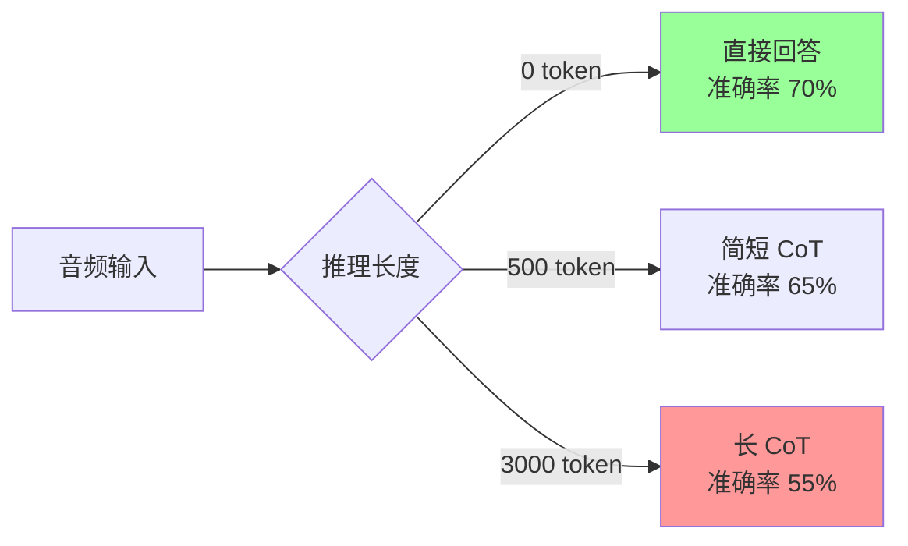
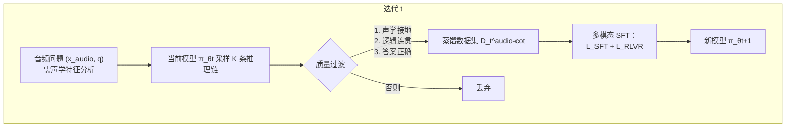
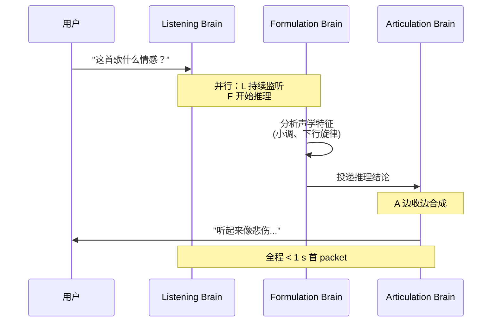
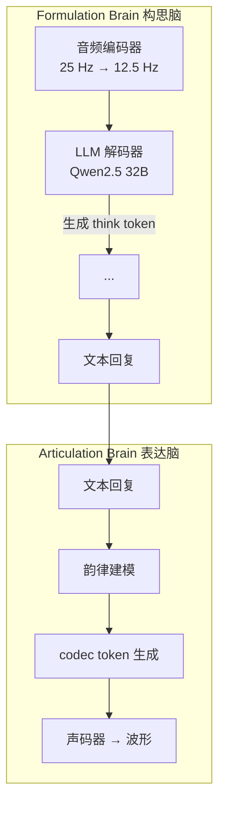

# 24.1 音频奖励设计

> [第 23 章 VLM RL](../chapter26_vlm/vlm-challenges) 把强化学习从文本扩展到视觉理解。第 24 章继续沿多模态路线向前推进：24.1～24.2 讨论音频推理、奖励与语音 Agent，24.3 把感知接到机器人动作，24.4～24.5 再转向图像和视频生成。这三条路线面对同一个问题：当输入、动作和输出不再只是文本 token，奖励怎样描述真实任务质量？我们先从语音开始，分析 Step-Audio-R1 的模态接地推理，以及 Step-Audio-R1.5 从 RLVR 转向 RLHF 的原因。

## 音频语言模型概览

文本语言模型处理的是离散 token 序列。但音频是 24 kHz 的连续波形——每秒 24000 个浮点采样。要让 Transformer 处理音频，必须先把它"token 化"。这就是**神经音频编解码器（Neural Audio Codec）**的任务。

### 三大音频 token 化方案

| 编解码器                       | 帧率     | 码本数                     | 单 token 信息量 | 典型用途          |
| ------------------------------ | -------- | -------------------------- | --------------- | ----------------- |
| **SoundStream**（Google 2021） | 50 Hz    | 8 RVQ 层                   | 中              | 语音合成、TTS     |
| **EnCodec**（Meta 2022）       | 75 Hz    | 8 RVQ 层                   | 中              | 通用音频、音乐    |
| **SpeechTokenizer**（2023）    | 50 Hz    | 8（前 1 语义 + 后 7 声学） | 高（语义层）    | 语义理解          |
| **WavTokenizer**（ICLR 2025）  | 40-75 Hz | 1（VQ）                    | 极高            | 极致压缩、AudioLM |
| **Mimi**（Kyutai 2024）        | 12.5 Hz  | 8（语义+声学联合）         | 高              | 实时对话（Moshi） |

RVQ（Residual Vector Quantization，残差向量量化）是 EnCodec/SoundStream 的核心。它把一帧音频编码成 $K$ 层码本索引 $c_1, c_2, \ldots, c_K$，每一层量化上一层的残差：

$$e^{(0)} = \text{Encoder}(x), \quad c_k = \arg\min_c \|e^{(k-1)} - \text{CB}_k[c]\|, \quad e^{(k)} = e^{(k-1)} - \text{CB}_k[c_k]$$

最终波形 $\hat{x} = \text{Decoder}(c_1, \ldots, c_K)$。$K$ 越大重建质量越高，但每多一层码本就多一份 token 序列，自回归生成长度翻倍。SpeechTokenizer 的关键洞察：**把第一层码本蒸馏成 HuBERT 语义特征**，使 $c_1$ 编码"说了什么"，$c_2 \ldots c_K$ 编码"怎么说的"（韵律、音色）。

### 语音生成与文本生成的差异

把音频 token 喂进 LLM 后，生成机制看似与文本一致（自回归 next-token），实则天差地别：

| 维度     | 文本生成                 | 语音生成                                        |
| -------- | ------------------------ | ----------------------------------------------- |
| 序列长度 | 1 token ≈ 0.5 词 ≈ 0.3 s | 1 token ≈ 0.013 s（75 Hz）→ 1 s 语音 = 75 token |
| 评价维度 | 内容正确性               | 内容 + 韵律 + 情感 + 音色 + 节奏                |
| 错误容忍 | 错 1 词可读              | 错 1 帧 → 爆音、电流声                          |
| 多码本   | 单流                     | 8 层 RVQ 需同步生成                             |
| 实时性   | 流式即可                 | 首 packet 延迟 < 1 s                            |

一秒语音要生成 75 × 8 = 600 个 token，10 秒对话就是 6000 个 token——比同等内容文本长 20 倍。这是音频 LLM 的**序列长度爆炸**问题。

### 实时推理的工程挑战

实时语音对话要求**全双工**：模型边听边想边说。三个工程难点：

1. **首 packet 延迟**：用户说完到模型开口的间隔，业界目标 < 500 ms
2. **流式解码**：不能等整句生成完再合成，必须 chunk-by-chunk 输出
3. **可打断**：用户随时插话，模型必须立刻停止生成并切到听模式

GPT-4o Realtime、Gemini Live、Moshi 用 **chunked autoregressive** + **streaming vocoder** 解决。本章后半部分会看到，Step-Audio-R1 Realtime 用"边听边想 + 边想边说"的**双脑架构**实现亚秒级延迟。

## Step-Audio 系列：中国团队的音频推理路线

StepFun（阶跃星辰）是国内音频 LLM 的代表厂商。Step-Audio 系列从 Step-Audio 2（基础对话模型）演进到 **Step-Audio-R1**（推理模型，2025.11）和 **Step-Audio-R1.5**（RLHF 对齐，2026.04），完整覆盖了"音频理解 + 推理 + 生成"的全链路。

### Step-Audio-R1：Test-Time Compute Scaling

[Step-Audio-R1](https://arxiv.org/abs/2511.15848) 的核心贡献：**首个在音频域成功解锁 test-time compute scaling 的模型**。

#### Inverted scaling 反常现象

文本和视觉推理模型普遍遵循 test-time compute scaling law——给模型更多推理 token，性能可预测地提升（见 [第 16 章推理模型](../chapter19_reasoning/r1-zero-pure-rl-reasoning)）。但音频域出现反常：



越想越差。Step-Audio-R1 团队通过系统案例分析找到了根因：**文本替代推理（Textual Surrogate Reasoning）**。

#### 文本替代推理的病根

大多数音频 LLM 用文本 CoT 数据做 SFT 初始化（继承文本模型的推理能力）。结果是模型"想"的不是音频，而是**对音频的文本描述**：

```text
❌ 文本替代推理：
"歌词提到悲伤 → 这首歌情感是悲伤的"

✅ 声学接地推理：
"小调和声进行 + 下行旋律轮廓 + 缓慢节奏 → 悲伤情感"
```

前者只看歌词文本（甚至幻觉出歌词），后者真正分析了音高、节奏、和声。当推理链变长时，文本替代模型只会越走越偏——这就是 inverted scaling 的根。

#### 模态接地推理蒸馏

**Modality-Grounded Reasoning Distillation（MGRD）** 是 Step-Audio-R1 的核心训练框架。它通过 $T$ 轮迭代，把推理基底从文本逐步迁移到声学：



每轮 MGRD 包含三个阶段，整体损失：

$$\mathcal{L}_{\text{MGRD}} = \sum_{t=1}^{T}\left(\mathcal{L}_{\text{SFT}}^{(t)} + \mathcal{L}_{\text{RLVR}}^{(t)}\right)$$

**阶段一：自蒸馏采样**。在需要声学分析的数据上（音色识别、节奏判断、情感分类），让 $\pi_{\theta_t}$ 采样 $K$ 条候选：

$$(r^{(i)}, a^{(i)}) \sim \pi_{\theta_t}(\cdot \mid x_{\text{audio}}, q), \quad i=1,\ldots,K$$

筛选用三条标准：(1) 推理必须显式提及感知特征（音高、节奏、音色）；(2) 推理步骤逻辑连贯；(3) 最终答案正确。

**阶段二：多模态监督精炼**。在蒸馏数据 + 原始文本推理数据上联合 SFT：

$$\mathcal{L}_{\text{SFT}}^{(t)} = \mathbb{E}_{\mathcal{D}_t^{\text{audio-cot}}}\left[\log \pi_\theta(r, a \mid x_{\text{audio}}, q)\right] + \mathbb{E}_{\mathcal{D}_{\text{task}}}\left[\log \pi_\theta(r, a \mid q)\right]$$

混合训练防止"灾难性遗忘"——声学接地的同时保留文本推理能力。

**阶段三：多模态 RL**。文本用标准二值奖励，音频用复合奖励：

$$R_{\text{audio}}(r, a) = 0.8 \cdot \mathbb{1}[a = a^*] + 0.2 \cdot \mathbb{1}[\text{reasoning present in } r]$$

权重 0.8 + 0.2 的设计有深意：**0.2 的格式奖励防止推理塌缩**。消融实验显示，去掉格式奖励后推理 token 数从 2800 跌到 1500，MMAU 准确率从 77.7 掉到 76.5。RL 优化器天然倾向"最 token 高效"策略——直接给答案——必须显式奖励"思考行为"才能保住推理链。

::: details MGRD 的数据筛选：pass@8 ∈ [3, 6]
RL 数据集只有 5000 条，但质量极严。用上一轮模型对每个问题采样 $k=8$ 次，**只保留 pass@8 ∈ [3, 6] 的题**——既不太简单（pass@8 > 6 学不到东西），也不太难（pass@8 < 3 多半是题目本身有歧义）。

实验对比三种数据策略：

| 数据策略                   | 最终 reward       | 推理长度稳定性       |
| -------------------------- | ----------------- | -------------------- |
| 全失败题（pass@8 = 0）     | 0.45-0.70，方差大 | 跌到 1800 token      |
| 中等难度（pass@8 ∈ [3,6]） | 0.75-0.80，稳定   | 维持 2300-2800 token |
| 200K 无筛选（10× 放量）    | 无提升            | —                    |

**数据质量 >> 数据数量**。盲目扩大音频 RL 数据反而引入歧义噪声。
:::

#### Acoustic-Grounded Reasoning

MGRD 的产物是**声学接地推理（Acoustic-Grounded Reasoning）**——推理链显式引用声学属性。Step-Audio-R1 在 MMAU（Massive Multi-Task Audio Understanding）上的表现：

| 模型              | 平均     | Big Bench Audio | Spoken MQA | MMSU | MMAU     | Wild Speech |
| ----------------- | -------- | --------------- | ---------- | ---- | -------- | ----------- |
| Step-Audio 2      | 68.3     | 59.1            | 88.8       | 64.3 | 78.0     | 51.1        |
| Gemini 2.5 Pro    | 81.5     | 96.1            | 94.8       | 79.3 | 77.4     | 60.0        |
| Gemini 3 Pro      | 85.1     | 92.1            | 95.3       | 82.9 | 78.9     | 76.4        |
| **Step-Audio-R1** | **83.6** | **98.7**        | 95.2       | 75.9 | **77.7** | 70.6        |

平均 83.6 超过 Gemini 2.5 Pro，逼近 Gemini 3 Pro。Big Bench Audio（多步逻辑推理）达 98.7，是所有模型最高。

### Mind-Paced Speaking：边想边说

实时语音对话的瓶颈是**推理与生成的串行依赖**：模型必须先想完，才能开口。Step-Audio-R1 Realtime 借鉴 **listen-while-thinking** 和 **think-while-speaking** 架构，实现**思维步调说话（Mind-Paced Speaking）**：



关键洞察：**人类说话是流式的**——我们边想边说，前半句还在思考后半句的内容。Mind-Paced Speaking 让模型也具备这种能力，不需要等整段推理完成才开始合成语音。

Step-Audio-R1 Realtime 在 Big Bench Audio speech-to-speech 上达到 **96.1 分**（推理性能）+ **0.92 s 首 packet 延迟**，全面超越 GPT Realtime 0825（83 分 / 0.98 s）和 Gemini 2.5 Flash Native Audio（92 分 / 0.63 s）。

### Dual-Brain Architecture：双脑架构

把"想"和"说"解耦的架构叫**双脑（Dual-Brain）**：



- **构思脑（Formulation Brain）**：音频编码器 + LLM，输出 `<think>...</think>` 推理 + 文本回复
- **表达脑（Articulation Brain）**：把文本回复转成带韵律、情感、音色的 codec token，再解码为波形

两脑解耦让"想得深"和"说得快"互不拖累——构思脑可以跑长 CoT，表达脑并行合成语音。这是 Step-Audio-R1 Realtime 能在亚秒延迟下保留推理能力的关键。

## 本节总结

Step-Audio-R1 是 StepWise 2026 年初发布的音频 reasoning 模型，核心创新是 **MGRD（模态接地推理蒸馏）**——把文本推理链蒸馏到音频模态，解决"想得越多越差"的 inverted scaling 问题。Step-Audio-R1.5 进一步把训练范式从 RLVR 转向 RLHF，让音频模型不再只是"机械答题机"，而是真正可对话的语音助手。

下面继续聚焦音频奖励设计：为什么文本奖励模型不能直接评价韵律、情感、口音和实时性，以及 RLVR 为什么需要与多维偏好奖励结合。

前文介绍了 Step-Audio 系列的发展。本节聚焦核心工程问题：**音频奖励如何设计？** 文本奖励模型可以直接使用偏好对训练，音频还包含韵律、情感和口音等维度，单一奖励信号无法覆盖。

## RLVR → RLHF 演进

Step-Audio-R1 用 MGRD + RLVR 在客观 benchmark 上达到 SOTA。但部署到真实对话后，团队发现了一个反直觉问题：**benchmark 分数越高，对话越难听**。

### 可验证奖励陷阱

[Step-Audio-R1.5](https://arxiv.org/abs/2604.25719) 把这个问题命名为**可验证奖励陷阱（Verifiable Reward Trap）**。

::: warning 可验证奖励陷阱
当音频 benchmark 的 ground truth 只是一个离散标签（情感类别、ASR 文本、场景标签）时，RLVR 只能奖励"猜对标签"，**结构性无视**韵律自然度、情感连贯性、对话流畅度。
:::

陷阱的机制：

```text
RLVR 目标 = 答案正确性 → 模型学到 "最 token 高效" → 回答变简短、机械、扁平
                ↓
         benchmark ↑  真实对话体验 ↓
```

RLVR 优化的是"what to say"（说什么），用户关心的是"how to say it"（怎么说）。两者解耦时，模型退化成**答题机**——技术上准确，体验上空洞。

### Step-Audio-R1.5：从 RLVR 到 RLHF

R1.5 的解法：**用 RLHF 补 RLHF**——训练一个 holistic 偏好奖励模型，把正确性、流畅度、情感共鸣蒸馏成统一监督信号。

#### Audio-Centric Mid-Training

RLHF 之前先做一轮中间训练，强化音频理解和推理基底：

$$\mathcal{L}_{\text{mid}} = \mathbb{E}_{(x,q,r,y) \sim \mathcal{D}_{\text{audio}}}\left[\log \pi_\theta(r, y \mid x, q)\right] + \mathbb{E}_{(q,r,y) \sim \mathcal{D}_{\text{text}}}\left[\log \pi_\theta(r, y \mid q)\right]$$

其中 $(x, q, r, y)$ 是音频输入 + 上下文 + 推理 + 回复。文本数据保留长 CoT 推理结构， facilitating transfer 到音频。

#### Cold-Start SFT

Cold-start SFT 不再扩领域知识，而是**对齐交互行为**：

1. **多轮对话连续性**：跨轮保持上下文和约束
2. **指令遵循**：按用户指定的内容、格式、风格响应
3. **回复自然度**：连贯、对话得当
4. **交互感知**：处理追问、澄清、打断、用户修正

这一步为后续 RLHF 提供更好的初始化——避免 preference optimization 浪费在纠正基本对话行为上。

#### RLHF with Rubric-based Reward Model

音频交互是多目标优化——内容正确、韵律自然、情感连贯、延迟可控。R1.5 用 **rubric-based 生成式奖励模型（Generated Reward Model, GRM）**替代标量 RM：

```python
def audio_rlhf_reward(response, context, rubric):
    """多维度打分而非标量"""
    scores = {}
    scores["correctness"] = grm.score(response, context, rubric="内容是否正确")
    scores["fluency"] = grm.score(response, context, rubric="表达是否流畅自然")
    scores["prosody"] = grm.score(response, context, rubric="韵律是否符合情感")
    scores["emotional_resonance"] = grm.score(response, context, rubric="情感共鸣")
    scores["latency"] = grm.score(response, context, rubric="响应延迟")
    # 加权聚合（权重由人类偏好回归学到）
    return sum(w[k] * scores[k] for k in scores)
```

GRM 的优势：**人类偏好多维度**，标量 RM 无法捕捉。用 LLM-as-judge 给每个维度打分（rubric prompting），再学一个权重聚合器，相当于把 [RLHF](../chapter15_rlhf/base-model-to-assistant) 的 RM 从"打总分"升级成"打分卡"。

#### 多目标 RL 训练目标

R1.5 的 RL 损失综合 RLVR 和 RLHF：

$$\mathcal{L}_{\text{RL}} = \underbrace{\mathbb{E}_{\mathcal{D}_{\text{verified}}}\left[R_{\text{verify}}(r, a)\right]}_{\text{客观正确性（RLVR）}} + \lambda \cdot \underbrace{\mathbb{E}_{\mathcal{D}_{\text{pref}}}\left[\log\sigma\left(\beta \log\frac{\pi_\theta(y_w \mid x)}{\pi_{\text{ref}}(y_w \mid x)} - \beta \log\frac{\pi_\theta(y_l \mid x)}{\pi_{\text{ref}}(y_l \mid x)}\right)\right]}_{\text{主观偏好（DPO 形式）}}$$

前项保住客观推理能力（不让 RLHF 把 RLVR 学到的东西遗忘），后项用 DPO 损失（见[第 14 章 DPO](../chapter17_dpo/dpo-theory-and-family)）对齐主观体验。$\lambda$ 平衡两者——这是音频 RL 的核心超参。

### 保留韵律自然度

RLVR 最大的破坏是**韵律扁平化**：模型为最大化答案正确性，把语音变成单调的"朗读"。R1.5 用三个机制保住韵律：

1. **偏好数据包含韵律维度**：标注者比较两个回复时，不仅看内容，还听"哪个更自然、情感更对、节奏更像人"
2. **Rubric 显式评分 prosody**：GRM 单独打韵律分，不与正确性混淆
3. **Codec token 层级监督**：RVQ 的 $c_2 \ldots c_K$（声学层）参与 preference，确保生成阶段就保留韵律信息

R1.5 在 AudioMultiChallenge（多轮对话基准，测 Inference Memory / Instruction Retention / Self Coherence / Voice Editing）上达到或超越 Gemini-2.5-Flash，**同时**在传统推理 benchmark 上不掉分。RLVR 的"陷阱"被 RLHF 解开。

## 音频奖励设计

音频 RL 的 reward 比文本复杂得多——文本主要看正确性，音频要看内容、韵律、实时性三层。本节系统讨论三类奖励的设计。

### 内容正确性奖励

最直接：最终答案与 ground truth 比对。

$$R_{\text{content}}(r, a) = \begin{cases}1, & \text{if } a = a^* \\ 0, & \text{else}\end{cases}$$

变体包括：

- **ASR 字错率**：WER 越低奖励越高，$R = 1 - \text{WER}$
- **语义匹配**：用 embedding cosine 相似度，$R = \cos(\text{emb}(a), \text{emb}(a^*))$
- **LLM-as-judge**：让大模型判答案是否等价，$R \in [0, 1]$

内容奖励适合客观任务（数学、知识问答、ASR），但对开放式对话失效——没有标准答案。

### 韵律自然度奖励

韵律（prosody）包括音高、节奏、强度、停顿。建模人类对自然度的偏好是音频 RL 的难点。

#### 标量 RM 的局限

传统做法：训练一个 RM $R_\phi(\text{audio}) \to \mathbb{R}$，用人类两两偏好数据：

$$\mathcal{L}_{\text{RM}} = -\log\sigma(R_\phi(y_w) - R_\phi(y_l))$$

问题：标量 RM 把多维偏好压成一维，丢失了"内容对但韵律怪"vs"内容错但韵律自然"的区别。

#### 多维偏好建模

R1.5 的 GRM 用 **rubric prompting** 让 LLM 分维度打分：

```text
请按以下 rubric 评估回复（0-10 分）：
1. 内容正确性：答案是否准确？
2. 流畅度：是否连贯无卡顿？
3. 韵律自然度：音高、节奏是否符合人类说话习惯？
4. 情感匹配：语气是否与上下文情感一致？
5. 沉浸感：是否像在与人对话？

回复：[音频]
```

每个维度独立打分，再学权重 $w_k$ 聚合：

$$R_{\text{prosody}}(y) = \sum_k w_k \cdot \text{GRM}_k(y), \quad w = \arg\min_w \|R_{\text{human}}(y) - \sum_k w_k \cdot \text{GRM}_k(y)\|^2$$

权重通过 Bradley-Terry 回归从人类偏好学到。

#### 直接韵律特征奖励

除了偏好建模，还可以用声学特征直接打分：

```python
def prosody_reward(audio):
    # 提取韵律特征
    f0 = extract_pitch(audio)          # 基频曲线
    energy = extract_energy(audio)     # 能量包络
    duration = extract_durations(audio)  # 音素时长

    # 与参考韵律分布对比
    f0_score = -wasserstein(f0_dist(audio), f0_dist_human)
    energy_score = -wasserstein(energy_dist(audio), energy_dist_human)

    # 抑制单调（避免 RLVR 导致的扁平化）
    f0_var = np.std(f0)
    monotonicity_penalty = -max(0, 0.2 - f0_var)  # f0 方差太低就罚

    return 0.5 * f0_score + 0.3 * energy_score + 0.2 * monotonicity_penalty
```

这种"基于人类韵律分布"的奖励，能在没有偏好标注时抑制 RLVR 的扁平化倾向。

### 实时性奖励

实时对话要求首 packet 延迟 < 1 s，整体响应时间合理。把延迟纳入 reward：

$$R_{\text{latency}}(y) = \begin{cases}1, & T_{\text{first-packet}} < 0.5\text{s} \\ 0.5, & 0.5\text{s} \leq T_{\text{first-packet}} < 1.0\text{s} \\ 0, & T_{\text{first-packet}} \geq 1.0\text{s}\end{cases}$$

或用连续形式：

$$R_{\text{latency}}(y) = \exp(-\alpha \cdot T_{\text{first-packet}})$$

实时性奖励会和深度推理冲突——想得越久首 packet 越晚。这是 [双脑架构](#_30-2-3-dual-brain-architecture-双脑架构) 的价值：表达脑可以在构思脑还在想时就开始合成，把延迟隐藏在生成流水线里。

### 综合奖励

最终音频 RL 的 reward 通常加权组合三类：

$$R_{\text{total}} = w_c \cdot R_{\text{content}} + w_p \cdot R_{\text{prosody}} + w_l \cdot R_{\text{latency}}$$

权重 $(w_c, w_p, w_l)$ 反映应用场景：客服侧重内容（$w_c$ 大），陪伴机器人侧重韵律（$w_p$ 大），实时翻译侧重延迟（$w_l$ 大）。R1.5 的核心贡献就是证明了**只在 $w_c$ 上优化会掉进 verifiable reward trap**——必须引入 $w_p$ 才能保住真实对话体验。

## 本节总结

音频奖励设计比文本复杂得多——除了内容正确性，还要考虑韵律、情感、口音、说话风格。多维度 reward 的工程化方案有两条路线：(1) 加权多个 RM；(2) 用 LLM-as-Judge 直接评估综合质量。Step-Audio-R1.5 采用后者，把音频理解 + 评估合二为一。

下一节 [24.2 多模态音频 Agent 与未来方向](./future) 走向更前沿——音频不再只是输入输出，而是 agent 调用的工具（语音搜索、语音翻译、实时对话）。
