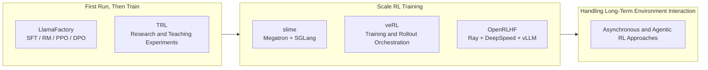

# 18.1 From Single-Machine Experiments to Industrial Training

From RLHF and DPO to GRPO, reasoning-model training, and process rewards, we have learned a series of post-training algorithms: how to align a model with human preferences, replace the Critic with within-group comparisons, train long-horizon reasoning, and search for better answers at inference time.

These algorithms look simple in small-model experiments because one script can connect generation, scoring, and updates. Training a production model with 7B, 70B, or more parameters immediately creates new problems. The Actor, Reference Model, and Reward Model together contain tens or hundreds of billions of parameters and do not fit on one GPU. Generating a response can take seconds while a parameter update takes only hundreds of milliseconds, leaving training GPUs idle. Newly updated weights also have to reach the generation workers promptly.

Chapter 18 gradually unfolds an industrial training task: this section first explains why single-machine experiments need to be scaled; [18.2](./industrial-post-training) connects data, training, evaluation, and data feedback into a complete flow; [18.3](./modern-industrial-practice) explains why training can become unstable; [18.4](./distributed-sync) describes how multiple GPUs can collaboratively execute this flow; [18.5](./data-engineering) then organizes tasks, environments, trajectories, and validation results into sustainable data assets.

Start with a simple example. Suppose the training data contains the question, “Why does the sky appear blue?” Whether the algorithm is PPO or GRPO, one training iteration goes through these steps:

1. **The Actor Generates Responses.** It is the language model being trained.
2. **The Reward Model scores the response.** A higher score means that the response better matches human preferences; verifiable tasks such as mathematics can instead use a rule-based verifier.
3. **The Reference Model provides a baseline.** It is a frozen copy of the model before training and is used to compute a KL penalty so that the Actor does not move too far in one update.
4. **The Critic estimates the advantage.** PPO uses it to estimate how much better the response is than expected; GRPO omits the Critic and uses relative scores within a response group.
5. **The Actor is Updated During Training.** The new parameters are then passed to the next round of generation for use.

When the model is relatively small, these roles can be run sequentially on the same machine. However, as the model and data scale, the main challenge arises from the execution approach: multiple models cannot be loaded simultaneously into limited GPU memory; generating responses typically takes longer than a single parameter update; and the newly trained parameters must be promptly passed to the generation process. If any of these steps takes too long, other GPUs will remain idle.

**The role of the training framework is to schedule these roles on which devices, when to exchange data, and when to synchronize new parameters.** It does not alter the mathematical definitions of PPO, GRPO, or reward models. Instead, it ensures that the same training process can run stably across multiple GPUs and multiple machines.

## 1. Understanding System Scale from Single-Machine Training

### 1.1 Training Scale and Framework Selection

Before choosing tools, first determine whether the model can be trained on the available machines.

- **Training your own model for the first time**: begin with LlamaFactory. Prepare the data and configuration, then run SFT, reward-model training, PPO, or DPO in sequence. Use it to see how data enters training and what model each stage produces.
- **The model does not fit or runs too slowly on one machine**: move to slime or veRL. Distribute model training and response generation across GPUs, and synchronize the newest model parameters after each update.

Wait until single-machine memory is insufficient or generation consumes most of the runtime before studying how a distributed framework schedules multiple GPUs. This order separates problems in the training method from problems in the multi-machine system.

This course will still use veRL to complete code generation RL experiments later. Both veRL and slime are capable of handling large-scale RL training, but they use different training and generation backends. OpenRLHF is another approach based on Ray, DeepSpeed, and vLLM, which will be introduced in the advanced comparison section.

### 1.2 Synchronous Training and Asynchronous Training

Suppose a batch of tasks includes nine short math problems and one task that requires repeatedly calling tools. The first nine problems finish quickly, while the last one takes several minutes to run.

- **Synchronous Training** waits for all tasks in the batch to complete before uniformly computing rewards and updating the model. The data is relatively fresh, and the process is easy to understand. However, all processes have to wait for the slowest task.
- **Asynchronous Training** allows completed results to enter the queue first, and the training process can continuously fetch data for updates. This reduces device waiting time, but the data may come from an earlier model, so it is also necessary to control the issue of stale experience.

The generation time of math and coding problems is relatively close, so synchronous training is typically used first. However, tasks involving tool calls, browser operations, and long-term environment interactions have significantly different execution times, making them more likely to benefit from asynchronous training.

::: tip Read this section on first pass
Remember this line: **Generate Answer → Compute Reward → Update Model → Synchronize New Parameters**. The following sections on frameworks, rewards, costs, and system design will explain how these four steps can be extended to larger models and clusters.
:::

### 1.3 From Training Scripts to Distributed Frameworks

Let's start with training a mathematical problem-solving model on a single machine. The program fetches a batch of problems, asks the model to generate answers, uses a reward validator to compute rewards, and then updates the model based on these rewards. When the model is small and the answers are short, these steps can be implemented within a single training script. At this stage, the most important thing is to confirm three things: whether the data format is correct, whether the rewards truly reflect the quality of the answers, and whether the accuracy improves after parameter updates.

LlamaFactory and TRL are suitable for this stage. [LlamaFactory](https://arxiv.org/abs/2403.13372) organizes SFT, reward modeling, DPO, and PPO using a unified configuration; [TRL](https://huggingface.co/docs/trl/index) provides implementations of SFT, DPO, GRPO, and PPO through the Trainer interface. During the first experiment, the value of the framework lies in connecting data, algorithms, and models, allowing learners to clearly see how a single training process is completed.

As the model grows larger, the same script will encounter new challenges. The Actor is responsible for generating and updating responses, the Reference Model is responsible for computing KL divergence, and PPO also requires a Critic. During the generation phase, multiple responses need to be sampled for each problem. These models and intermediate results may not fit into a single set of GPUs at the same time, and the answer generation process can cause the training GPUs to wait for a long time. At this point, the framework needs to decide: which GPUs should each model be placed on, which process should receive the generated results, and how to synchronize the new weights back to the generation end after the Actor updates.

[veRL](https://arxiv.org/abs/2409.19256) represents the Actor, Critic, Reference Model, Reward Model, and rollout engine as schedulable roles, and the Driver then calls them in the order of PPO or GRPO. OpenRLHF, NeMo-Aligner, and slime also address these issues, though they use different underlying components: OpenRLHF uses Ray, DeepSpeed, and vLLM; NeMo-Aligner uses NeMo and Megatron; slime uses Megatron and SGLang. The main differences between them lie in resource scheduling and the backends for training and generation, while the algorithms remain the ones previously studied—PPO, DPO, or GRPO.



#### Why Long Tasks Need Asynchronous Training

The length of answers to math problems is usually relatively consistent. Once a batch of questions begins to be generated, they often finish within a similar timeframe. Code repositories and browser tasks are different: some tasks pass the first test immediately, while others require repeated file reading, tool calls, and waiting for external environments. Tasks within the same batch can differ by several minutes or even longer.

Synchronous training must wait for the slowest task to finish before passing the entire batch of trajectories to the training process. Asynchronous training, on the other hand, places already completed trajectories into a queue, allowing the generation process to continue processing new tasks while the training process continuously samples data from the queue. This reduces GPU idle time, but introduces a new issue: a trajectory may be generated using an old version of the Actor, and by the time it is fed into training, the Actor may have already updated several times.

[AReaL](https://arxiv.org/abs/2505.24298) and [LlamaRL](https://arxiv.org/abs/2505.24034) are both addressing the issue of asynchronous progression in generation and training. AReaL generates a version of its policy for each trajectory and compares the generated policy with the current policy using importance sampling. Let the policy used to generate a trajectory be $\pi_{\theta_{\text{gen}}}$, and the policy used during training be $\pi_\theta$. The correction ratio for a particular action step is:

$$\rho_t^{\text{stale}} = \frac{\pi_\theta(a_t \mid s_t)}{\pi_{\theta_{\text{gen}}}(a_t \mid s_t)}$$

The numerator represents the probability that the current model selects action $a_t$ in state $s_t$, and the denominator represents the probability that the old model, which generated this trajectory, selected the same action at that time. If both are 0.2, the ratio is 1, indicating that the experience is consistent with the current policy. If they are 0.1 and 0.2 respectively, the ratio is 0.5, indicating that the current model is less likely to produce this action. The further the ratio deviates from 1, the older the trajectory. The system can reduce its training weight accordingly; when the versions differ too much, the trajectory can also be discarded directly.

#### Agent Training Also Has to Manage the Environment

A simple question-answering environment is straightforward: the program provides a question, and the verifier checks the answer. However, a single trajectory for a code-agent may involve reading files, modifying code, running tests, and handling errors; a browser agent also needs to save the webpage state, tool responses, and the reason for termination. As a result, the training framework must manage two threads: how the model updates, and how the external environment is created, interacted with, reset, and recycled.

[AgentRL](https://github.com/THUDM/AgentRL) manages multi-turn and multi-task environments using a Controller and Task Worker, and completes asynchronous GRPO using rollout, Actor, and Reference worker. [slime](https://github.com/THUDM/slime) integrates tool calls, sandbox interactions, and verifier feedback into the data generation process, then writes the data into the rollout buffer. Alibaba's [ROLL](https://alibaba.github.io/ROLL/) also provides environment and rollout interfaces, and integrates training and Agent deployment into a single lifecycle. They add environment management because Agent trajectories now include external states, and cannot be stored as just a segment of model responses.

#### Choose a Framework for the Problem at Hand

Now we can place the framework back into the problem it is intended to solve:

- **Get post-training running**: LlamaFactory and TRL first solve whether the data, reward, and algorithm configuration works correctly.
- **Scale to distributed RL**: veRL, OpenRLHF, NeMo-Aligner, and slime solve multi-model placement, generation throughput, and weight synchronization.
- **Train long-trajectory agents**: AReaL, LlamaRL, AgentRL, and ROLL solve asynchronous experience, environment lifecycles, and policy-version management.

First, determine which layer of the experiment you are currently addressing, and then consider the training and inference backends already in use by the team:

```text
What problem are you trying to solve?
├── First run of training
│   └── LlamaFactory / TRL
├── Need flexible orchestration of multiple models and various backends
│   └── veRL
├── Use Megatron + SGLang to scale RL
│   └── slime
├── Use Ray + DeepSpeed + vLLM
│   └── OpenRLHF
├── Already using NVIDIA NeMo / Megatron training stack
│   └── NeMo-Aligner
└── Long tool or environment interaction causing significant waiting
    └── Compare AReaL / LlamaRL / AgentRL / ROLL
```

## 2. Designing Training Rewards

Post-training commonly uses two types of rewards: verifiable tasks are judged by programs or rules, while open-ended tasks depend on human preferences or reward models. These two types of signals originate from different sources, and before mixed training, it is essential to understand their respective errors and applicability.

### 2.1 Definitions and Applicability of the Two Types of Rewards

**Verifiable Reward (VR)** comes from a deterministic validator function: given a prompt $q$ and a response $o$, the validator outputs a binary or continuous score:

$$r_{\text{VR}}(q, o) = \mathbb{1}[\text{extract}(o) == \text{answer}(q)]$$

Here, $q$ is the question, $o$ is the model's response, and $\text{extract}(o)$ extracts the final result from the response. The indicator function $\mathbb{1}[\cdot]$ returns 1 if the equality holds, and 0 otherwise. For example, if the correct answer is 42 and the extracted result is also 42, the reward is 1; if the extraction fails or the answer differs, the reward is 0.

Math problems can compare final answers, coding problems can run tests, and logical problems can use rule-based validators. Although the validation process can be repeated, it is still necessary to prevent issues such as incorrect answer parsing, insufficient test coverage, and environmental failures.

**Pairwise Preference Reward (PPR)** comes from a learned Reward Model $R_\phi$, which is trained on human preference data $(o_w, o_l)$ (chosen and rejected responses):

$$\mathcal{L}_{\text{RM}} = -\mathbb{E}\left[\log \sigma\left(R_\phi(q, o_w) - R_\phi(q, o_l)\right)\right]$$

$o_w$ is the better response in the preference data, and $o_l$ is the worse response. The reward difference $R_\phi(q, o_w) - R_\phi(q, o_l)$ being larger makes the output of $\sigma$ closer to 1, resulting in a smaller loss. After training, $R_\phi(q, o)$ provides a scalar reward. It learns the distribution of preferences in the annotated data, and thus is affected by annotation consistency, sample coverage, and generalization ability.

The main differences are:

- **Reward source**: VR comes from a rule-based verifier or execution environment; PPR comes from a learned Reward Model.
- **Noise source**: VR errors come from parsers, tests, and execution environments; PPR errors come from annotation disagreement and RM generalization.
- **Annotation cost**: VR is almost free to verify automatically; PPR requires costly pairwise comparisons.
- **Applicable tasks**: VR suits mathematics, code, logic, and tool use; PPR suits open-ended dialogue, writing, safety, and style.
- **Reward vulnerabilities**: VR must guard against incomplete tests and rule bypasses; PPR must guard against exploitation of RM biases.
- **Training constraints**: VR requires validation of the verifier and execution environment; PPR requires KL monitoring and independent evaluation.

### 2.2 Difficulty Filtering for Training Prompts

The success of VR training heavily depends on the quality of the prompts. A key observation from the Seed-Thinking paper [arXiv:2504.13914](https://arxiv.org/abs/2504.13914) is that **not all verifiable prompts are of training value**. If a question is too easy (all rollouts are correct) or too hard (all rollouts are incorrect) for the current policy, the group's reward variance becomes zero, and the advantage is also zero. Such data **contributes nothing to the gradient**.

Seed-Thinking provides three criteria for prompt selection:

1. **Learnability**: The pass rate of the current policy $\in [0.1, 0.9]$. Prompts that are always correct or always incorrect are filtered out.
2. **Diversity**: Questions cover different reasoning modes (algebra, geometry, combinatorics, number theory), avoiding the strategy collapsing into a single problem-solving template.
3. **Difficulty Stratification**: Prompts are bucketed based on the base model's pass rate (easy/medium/hard), and curriculum learning schedules tasks by bucket.

The concrete implementation uses rejection sampling: first sample $N=16$ rollouts from the base model for each problem, compute its pass rate $p_i$, keep only prompts with pass rates in $[0.1,0.9]$, and then bucket them by pass rate.

This strategy concentrates computational power on the current model's sometimes successful and sometimes failed questions. DAPO's Dynamic Sampling also continuously monitors the within-group reward variance for each prompt and reduces the sampling ratio for prompts with low variance.

### 2.3 Combining Verifiable Rewards and Generative Rewards

Product models typically face both verifiable tasks and open-ended tasks, and rewards can be combined based on task type:

$$R_{\text{total}}(q, o) = \alpha \cdot R_{\text{VR}}(q, o) + (1 - \alpha) \cdot R_{\text{GenRM}}(q, o)$$

Here $\alpha\in[0,1]$ controls the share of each reward. It can be close to 1 for mathematics or code and close to 0 for open-ended writing. The two reward scales still need to be aligned before mixing them.

**Generative reward models (GenRMs)** are a newer approach that reformulates reward modeling as generation. Given a prompt $q$ and two responses $o_1,o_2$, the LLM generates the token “A” or “B” to indicate which response is better. Compared with a conventional discriminative reward model, a GenRM reuses pretrained capabilities instead of learning a classification head from scratch, can reason before judging, and produces textual decisions that can be audited and debugged. Its cost is that every judgment requires extra generated tokens. In practice, a system can generate preferences and explanations offline, then train a smaller discriminative reward model for online RL.

When code tasks use only public unit tests, a model may hard-code its way around the checks. RTV (Rule-Test-Verifier) separates verification into format rules, public tests, and hidden verification. The rule layer filters malformed output and obvious hard-coding; the test layer checks known behavior; hidden tests and a model judge examine generalization, style, and efficiency. Each component should also be logged separately so that reward vulnerabilities can be traced to the layer that caused them.

### 2.4 Reward Scaling Alignment

The biggest engineering challenge when combining multiple rewards is **reward scale inconsistency**. The reward for a math problem is $\{0, 1\}$, the pass rate for a coding problem is $[0, 1]$, the GenRM score might be $[-3, 3]$, and the length penalty is $[-0.5, 0.5]$. Directly adding these rewards will let the large-scale rewards dominate the gradient.

The standard approach is to perform z-score normalization by task domain:

$$\tilde{r}_{\text{domain}} = \frac{r - \mu_{\text{domain}}}{\sigma_{\text{domain}}}$$

where $\mu_{\text{domain}}, \sigma_{\text{domain}}$ are the mean and standard deviation of the rewards within the same domain in the current batch. After normalization, all rewards are in the scale of $[-3, 3]$, making them safe to add together.

Another approach is to perform intra-group normalization for the $G$ rollouts of the same prompt. GRPO uses this statistic to construct relative advantages, ensuring that the original reward scales of different prompts do not directly enter the same intra-group comparison.

## 3. Estimating Training Costs

Training cost affects the choice of model, algorithm, and data scale. The goal of estimation is not to predict the exact runtime, but to determine quickly whether a plan is feasible with the available resources.

### 3.1 The Basic Cost Formula

First estimate the total FLOPs, divide by the FLOPs that one GPU actually completes per second, and then convert seconds to hours:

$$\text{GPU-hours} \approx \frac{6 \cdot N_{\text{active}} \cdot N_{\text{tokens}}}{\text{GPU\_FLOPS} \cdot \text{MFU} \cdot 3600}$$

- $N_{\text{active}}$ is the number of parameters that actually participate in computation for each token. It equals the total parameter count for a dense model; for an MoE model, it includes only the routed experts.
- $N_{\text{tokens}}$ is the number of training tokens.
- The factor 6 approximates forward and backward FLOPs: twice the forward cost plus four times the backward cost.
- $\text{MFU}$, or Model FLOPs Utilization, is the realized utilization rate, typically 30%–50%.

For an easy-to-check example, training a 7B dense model on one billion tokens with a per-GPU peak of 989 TFLOPS and 40% MFU requires about 29.5 GPU-hours. Real training also incurs communication, data-loading, checkpointing, and pipeline-idle overhead.

### 3.2 Cost Components of RL Training

RL training is more expensive to account for than SFT because several models perform work in every step. For GRPO in veRL, the cost of one step can be decomposed as:

$$C_{\text{RL-step}} = C_{\text{rollout}} + C_{\text{actor-update}} + C_{\text{ref-forward}} + C_{\text{reward}}$$

The four terms are the costs of generating responses, updating the Actor, running the reference model, and computing rewards. In a typical configuration with a 7B model and a batch of 512 prompts × 8 rollouts, rollout generation accounts for 50%–60% of total computation. Frameworks therefore optimize generation throughput, asynchronous scheduling, and parameter synchronization separately.

### 3.3 Cost-Control Strategies

- **Filter data before adding compute**: 10K high-quality examples can be more useful than 100K low-quality examples, although filtering itself also consumes compute.
- **Validate on a small model first**: test the algorithm and hyperparameters on a 7B model before scaling to 70B or 400B, avoiding failed retraining runs at large scale.
- **Use mixed precision**: BF16 training is about twice as fast as FP32, and FP8 on H100 can add another 1.5–2× speedup. Lower precision also imposes stricter stability requirements.
- **Reuse checkpoints**: retain checkpoints across pretraining, SFT, and RL instead of restarting each stage from scratch.

---

## Summary of This Section

- When scaling from single-machine experiments to industrial training, the basic definitions of PPO, GRPO, and reward models remain unchanged; executing them requires more devices and processes.
- The training framework is responsible for resource allocation and data flow between generation, reward computation, parameter updates, and weight synchronization.
- Rewards fall into verifiable and preference-based categories. Their noise sources differ, and their scales must be aligned before they are mixed.
- Not every problem provides a training signal. Prefer problems that the current policy sometimes solves and sometimes misses.
- LlamaFactory is suitable for first running through the pipeline before training; slime, veRL, and OpenRLHF handle the data flow and resource orchestration of scaled RL using different technical stacks.
- Synchronous training waits for the entire batch of generations to complete; asynchronous training continuously consumes completed data, making it more suitable for long tasks with varying execution times.

[18.2 Industrial Post-Training Pipeline](./industrial-post-training) will continue to explain how these steps compose a complete post-training process; [18.4 Distributed RL Training](./distributed-sync) will elaborate on the implementation details of multi-machine systems; [18.5 Large-Scale RL Data Engineering](./data-engineering) will explain how the tasks, environments, and trajectories required for training enter the same data production line.

## Further Reading

### Training Frameworks

- [HybridFlow: A Flexible and Efficient RLHF Framework (veRL, arXiv:2409.19256)](https://arxiv.org/abs/2409.19256)
- [OpenRLHF: An Easy-to-use, Scalable and High-performance RLHF Framework](https://arxiv.org/abs/2405.11143)
- [AReaL: A Large-Scale Asynchronous Reinforcement Learning System for Language Reasoning (arXiv:2505.24298)](https://arxiv.org/abs/2505.24298)
- [LlamaRL: A Distributed Asynchronous Reinforcement Learning Framework for LLMs (arXiv:2505.24034)](https://arxiv.org/abs/2505.24034)

### Reward Design and Data Strategy

- [Seed1.5-Thinking: Advancing Superb Reasoning Models with Reinforcement Learning (arXiv:2504.13914)](https://arxiv.org/abs/2504.13914)
- [Generative Reward Models](https://arxiv.org/abs/2410.12832)
- [DAPO: An Open-Source LLM RL System at Scale](https://arxiv.org/abs/2503.14476)
