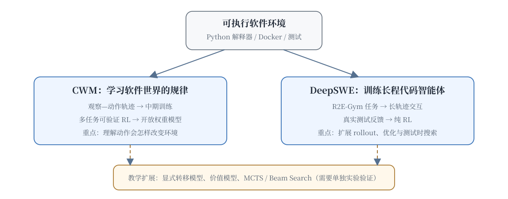

# 20.2 Code World Model and DeepSWE

After an agent edits a file and runs `pytest`, it must infer from the error log, current patch, and repository state what its action changed. A model that writes code without predicting consequences will repeat similar failed patches.

This section separates two works that are easily conflated. **CWM** is an open-weight 32B dense model trained on Python-interpreter and agentic Docker trajectories before multitask reasoning RL; it studies whether model weights can learn regularities of software execution. **DeepSWE** places Qwen3-32B in real R2E-Gym environments and trains a long-horizon coding agent with verifiable outcomes and pure RL. The former emphasizes learning from environment trajectories, while the latter emphasizes scaling rollouts and optimization in real environments.



## 20.2.1 Code World Model (CWM)

[Code World Model](https://arxiv.org/abs/2510.02387) (CWM, 2025.09) releases a 32B dense decoder-only model. It learns from observation-action trajectories in a Python interpreter and agentic Docker environments, followed by reasoning RL on verifiable code, mathematics, and multi-turn software tasks. Its “world model” is primarily the execution regularities learned in the model weights, not a separate transition model that has already replaced real tests.

### CWM's MDP Definition

Modeling SWE tasks as an MDP:

| MDP Elements                        | SWE Correspondence                                              |
| ----------------------------------- | --------------------------------------------------------------- |
| State $s_t$                         | Repository code + current modification history + test results   |
| Action $a_t$                        | The model's next step (read file, modify code, run test)        |
| Transition $T(s_{t+1} \| s_t, a_t)$ | Code execution — how the state changes after file modifications |
| Reward $r_t$                        | Step feedback (intermediate state) + final reward (test pass)   |

### Teaching Extension: An Explicit Next-State Model

CWM itself emphasizes mid-training one language model on environment trajectories. A more explicit model-based RL extension would train a separate transition model $\hat T$. The following formula and implementation are retained as a teaching derivation, not attributed to CWM's published recipe:

$$\hat{T}(s_{t+1} | s_t, a_t) \approx T(s_{t+1} | s_t, a_t)$$

This world model is a large language model (LLM), which takes as input $(s_t, a_t)$ and outputs $s_{t+1}$.

Training data:

- Trajectories collected from real SWE tasks
- $(s_t,a_t,s_{t+1})$ triplets as training samples
- Let the world model learn to "predict the next state given the current code state and action"

### Training Process of CWM

```text
┌────────────────────────────────────────────────────────────┐
│ Phase 1: World Model Pre-training                           │
│   - Collect trajectories from real SWE tasks               │
│   - Train the world model to predict code state transitions │
├────────────────────────────────────────────────────────────┤
│ Phase 2: RL with World Model                               │
│   - Policy interacts with the world model                  │
│   - The world model quickly simulates "code execution"    │
│   - Reduce some real test calls; speedup must be measured  │
├────────────────────────────────────────────────────────────┤
│ Phase 3: Real Testing Fine-tuning                          │
│   - Fine-tune the policy trained with the world model in  │
│   - the real environment for the final RL                  │
│   - Correct the deviation between the world model and the │
│   - real environment                                        │
└────────────────────────────────────────────────────────────┘
```

### Advantages of CWM

**Advantage 1: Speed**

A world model is an LLM forward—taking a few milliseconds. Real-world testing takes several seconds to several minutes. **CWM accelerates training by 100–1000 times**.

**Advantage 2: Ability to Simulate Failures**

A world model can simulate "what happens if we make this change"—a policy can explore many failure modes within the world model, learning to avoid them.

**Advantage 3: High Data Efficiency**

A world model learns the "rules" of code execution—these rules can generalize to new tasks.

### Limitations of CWM

**Limitation 1: Accuracy of the World Model**

A world model is an LLM, which can make mistakes. If it predicts the wrong "code execution result," the policy will learn an incorrect strategy.

Practical mitigation in industry: **Regularly correct the world model with real-world testing**—every N steps of rollout, use real-world testing ground truth to correct the model.

**Limitation 2: Complex Dependencies**

Code execution involves complex dependencies (library versions, environment variables, external services). A world model struggles to fully simulate these.

**Limitation 3: Training Cost**

Training a world model itself requires a large amount of trajectory data and computational power—more complex than directly training a policy.

### Relationship Between CWM and Model-Based RL

CWM is an application of model-based RL in the domain of Software Engineering (SWE). Classical model-based RL (e.g., MuZero, Dreamer) has already demonstrated value in games and control tasks. CWM brings this idea to the LLM + SWE domain.

Reference: [Chapter 8: Model Planning in Long-Horizon Tasks](../chapter10_ppo/rl-long-horizon-planning) and [24.3 VLA and Embodied World Models](../chapter28_vla/embodied-intelligence/model-based-rl/).

## 20.2.2 DeepSWE and Long Horizon Agents in RL

[DeepSWE-Preview](https://www.together.ai/blog/deepswe) (Agentica × Together AI, 2025.07) is another breakthrough in SWE-RL. Its core contribution is: **training long horizon agents (trajectories longer than 32 steps) with verifiable reward**.

### Core Idea of DeepSWE

[DeepSWE-Preview](https://www.together.ai/blog/deepswe), trained by Agentica and Together AI, starts from Qwen3-32B and runs pure RL for six days on 64 H100 GPUs across roughly 4,500 R2E-Gym software-engineering tasks. The published SWE-bench Verified result is 42.2% Pass@1 and about 59% with test-time scaling.

The public material shows that stable environments, rollout infrastructure, and verifiable outcomes can produce a strong long-horizon coding agent with pure RL. It also discusses system support for trajectory-level and step-level GRPO/PPO and verifiers for test-time scaling. The three techniques below—step shaping, a value model, and hierarchy—are useful teaching alternatives for credit assignment; they are not DeepSWE's disclosed architecture.

**Technique One: Step-level Reward Shaping**

Instead of only the final reward, DeepSWE gives a shaping reward to each step:

```python
def deep_swe_reward(trajectory, final_test_result):
    # Base reward: final test result
    base_reward = 1.0 if final_test_result else 0.0

    # Shaping reward: "contribution" of each step
    step_rewards = []
    for step in trajectory:
        # Use LLM judge to evaluate if this step is "meaningful"
        step_quality = llm_judge(step)
        step_rewards.append(step_quality)

    # Total reward = base + sum(step rewards)
    return base_reward + sum(step_rewards) * 0.1
```

This shaping allows the model to receive feedback at each step, avoiding the difficulty of credit assignment.

**Technique Two: Value Model**

DeepSWE reintroduces the value model (consistent with the VAPO approach) — [see Chapter 15 on VAPO](../chapter18_grpo/grpo-family).

The value model $V_\phi(s_t)$ estimates the "expected future reward" of the current state. This allows RL to use GAE for credit assignment:

$$\hat{A}_t = \delta_t + (\gamma\lambda)\delta_{t+1} + \ldots$$

where $\delta_t = r_t + \gamma V_\phi(s_{t+1}) - V_\phi(s_t)$.

**Technique Three: Hierarchical RL**

Breaking long trajectories into layers:

- **High-level policy**: Decides "which file to fix next" (coarse-grained)
- **Low-level policy**: Decides "how to modify this file" (fine-grained)

The high-level policy uses sparse reward (final test), while the low-level policy uses dense reward (shaping per step).

### Training Process of DeepSWE

```text
┌──────────────────────────────────────────────────────────┐
│ Phase 1: Data Collection                                │
│   - Rollout with the SFT model on SWE-bench             │
│   - Collect trajectories of 32–64 steps                │
├──────────────────────────────────────────────────────────┤
│ Phase 2: World Model Training (similar to CWM)          │
│   - Accelerate subsequent RL                           │
├──────────────────────────────────────────────────────────┤
│ Phase 3: Value Model Training                           │
│   - Train $ V_\phi $ using collected trajectories      │
├──────────────────────────────────────────────────────────┤
│ Phase 4: Hierarchical RL                                │
│   - High-level policy: PPO + sparse reward             │
│   - Low-level policy: GRPO + dense reward              │
├──────────────────────────────────────────────────────────┤
│ Phase 5: Test-time search                              │
│   - Use MCTS or Beam Search during inference           │
│   - Leverage the value model to evaluate intermediate states │
└──────────────────────────────────────────────────────────┘
```

### Achievements of DeepSWE

Performance of DeepSWE on SWE-bench Verified:

| Model                   | SWE-bench Verified |
| ----------------------- | ------------------ |
| Meta SWE-RL             | 41.0%              |
| **DeepSWE (ByteDance)** | **50.0%**          |
| SWE-Lancer (OpenAI)     | 45.0%              |
| Claude Opus 4.5 + Tools | 60%+               |

DeepSWE achieves 50% on open-source models — demonstrating the feasibility of long-horizon reinforcement learning training.

### Relationship Between DeepSWE and VAPO

The design of DeepSWE is highly similar to [ByteDance's VAPO](../chapter18_grpo/grpo-family) — both replace the "no critic" approach of GRPO with a value model. This reflects the consensus within ByteDance Seed that **"long-horizon tasks require critics."**

This also validates the conclusion from [Chapter 15 on GRPO improvements](../chapter18_grpo/grpo-family) — **critic-free is an engineering compromise, not an algorithmic necessity.** On long-horizon tasks (long CoT reasoning, long SWE trajectories), value models have once again proven their value.

## 20.2.3 Test-time Search Integration

CWM and DeepSWE both integrate **test-time search**—using MCTS or Beam Search during inference to improve performance.

### MCTS on CWM

CWM's world model makes MCTS efficient:

```python
def cwm_mcts(issue, model, world_model, depth=10):
    # Perform MCTS on the world model
    root_state = initialize_state(issue)

    for _ in range(N_iter):
        # Selection: Select the most promising child node using UCB
        node = select(root_state)

        # Expansion: Generate action using policy, simulate next state using world model
        action = model.policy(node.state)
        next_state = world_model.predict(node.state, action)

        # Simulation: Quick rollout to termination
        rollout_reward = quick_rollout(next_state, world_model)

        # Backprop: Update node statistics
        backpropagate(node, rollout_reward)

    # Return the best action from the root state
    return best_action(root_state)
```

The entire MCTS is performed on the world model—**no real-world testing is needed**, making it extremely fast.

### Beam Search on DeepSWE

DeepSWE uses Beam Search during inference:

```python
def deep_swe_beam_search(issue, model, value_model, K=4):
    beams = [{"state": init_state(issue), "score": 0}]

    for step in range(MAX_STEPS):
        candidates = []
        for beam in beams:
            # Generate K candidate actions
            actions = model.generate_actions(beam["state"], n=K)

            for action in actions:
                next_state = apply_action(beam["state"], action)
                # Use value model to evaluate
                value = value_model.estimate(next_state)
                candidates.append({
                    "state": next_state,
                    "score": beam["score"] + value
                })

        # Select top-K
        beams = sorted(candidates, key=lambda x: x["score"], reverse=True)[:K]

    return beams[0]["state"]
```

Beam Search allows DeepSWE to trade computational resources for higher accuracy during inference — consistent with [Chapter 19 on Test-time Compute Scaling](../chapter19_reasoning/test-time-scaling).

## 20.2.4 Comparison with Industrial Practices

By mid-2026, mainstream SWE-RL industrial solutions include:

| Route                           | Representative           | Publicly Supported Description                       | SWE-bench Verified                       |
| ------------------------------- | ------------------------ | ---------------------------------------------------- | ---------------------------------------- |
| Simple GRPO                     | Meta SWE-RL              | Open-source and simple                               | 41.0% Pass@1                             |
| Environment-trajectory modeling | Code World Model         | Mid-training on environment traces plus multitask RL | 65.8% with test-time scaling             |
| Long-horizon pure RL and search | DeepSWE                  | R2E-Gym training plus test-time scaling              | 42.2% Pass@1; about 59% scaled           |
| Multi-agent workflows           | Commercial coding agents | Training and orchestration often undisclosed         | Record by exact model and evaluation log |

These values use different scaffolds and test-time budgets and do not form one monotonic score ladder. A fair comparison records the environment, sampling budget, verifier, and aggregation procedure.

## Summary

Code World Model and DeepSWE represent two significant breakthroughs in SWE-RL:

- **CWM** learns software-execution regularities from environment trajectories in model weights. Replacing real tests with an explicit transition model remains a separate research extension.
- **DeepSWE** scales pure RL in real R2E-Gym environments and improves further with test-time scaling. Its public recipe should not be rewritten as a fixed value-model or hierarchical-RL architecture.

Both approaches show that long-horizon SWE requires reliable environments, verifiers, rollout infrastructure, and carefully stated evaluation settings. More algorithmic components are hypotheses to test, not automatic evidence of higher performance.

In the next section, we will examine Self-play SWE-RL — **letting models generate their own training data** — further reducing the reliance on human-generated data.
