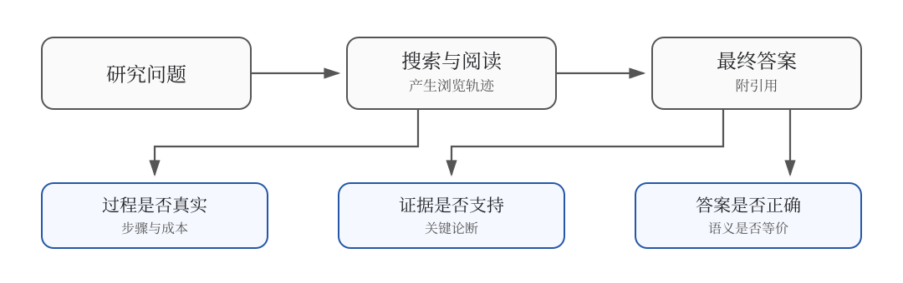

# 21.2 Evaluation Benchmarks and Open-Source Projects

[21.1](./browser-rl-harness) represented search, reading, and answer submission as an executable trajectory. The next question is whether two trajectories that produce the same answer have equal research quality.

Suppose the task asks where a paper's first author completed an undergraduate degree. Agent A answers from memory without opening a page. Agent B finds the author's profile, saves the education passage, and cites it. Both names may be correct, yet their evidence differs. Agent B may also cite a different person with the same name, producing a coincidentally correct answer with a broken evidence chain. Deep Research evaluation must therefore separate **answer, evidence, process, and cost**.



## Define the Evaluation Record First

A reproducible browser-agent task needs more than a question and answer:

```json
{
  "task_id": "author-education-001",
  "question": "Where did the paper's first author complete an undergraduate degree?",
  "reference_answers": ["Example University"],
  "created_at": "2026-08-01",
  "max_steps": 20,
  "max_tokens": 50000,
  "allowed_tools": ["search", "open"],
  "required_evidence": 1
}
```

The run record then preserves the answer, citations and quoted passages, trajectory path, steps, tokens, wall time, and termination status. Separating task conditions from behavior lets us compare models under the same budget and investigate a failure after the web changes.

## Layer 1: Final-Answer Correctness

For a unique short answer, exact match is

$$
\operatorname{EM}(\hat y,y)=
\mathbb{1}[\operatorname{norm}(\hat y)=\operatorname{norm}(y)].
$$

It works for names, dates, institutions, and short strings, but aliases such as “University of California, Berkeley” and “UC Berkeley” require normalization or an accepted-answer set.

Open reports have no unique string. Break the rubric into required facts and measure

$$
S_{\text{coverage}}=
\frac{\text{correctly covered facts}}
{\text{required facts}}.
$$

An LLM judge can help with semantic equivalence and completeness, but may favor longer responses or its own style. Freeze the judge model and prompt and calibrate them against a small human-labeled sample.

## Layer 2: Whether Citations Support Claims

A reachable URL proves only that a page exists. Evaluation must check that the quoted passage contains the relevant fact and refers to the same person, time, and object.

1. **Accessibility**: fetch the URL and record redirects, status, and time. A temporary timeout is a tool error, not automatically a fabricated citation.
2. **Correctness**: pair each cited claim with its passage. If $c_j=1$ when citation $j$ supports its claim, then

$$
S_{\text{citation}}=\frac{1}{n}\sum_{j=1}^n c_j.
$$

3. **Completeness**: measure how many claims that require evidence actually have supporting citations. High correctness with low completeness means that a few citations are good while most of the report is unsupported.

Save the evaluator's rationale so that same-name entities, date mismatches, and second-hand sources can be audited.

## Layer 3: Search-Process Effectiveness

Two agents can reach the same supported answer with five versus forty searches. Start with interpretable events:

- whether queries add constraints or repeat keywords;
- whether pages diversify sources or revisit the same URL;
- whether conflicting evidence triggers further checking;
- whether the agent stops once evidence is sufficient;
- whether it changes strategy after a tool failure.

A simple redundancy rate is

$$
S_{\text{redundancy}}=
\frac{\text{repeated queries}+\text{repeated visits}}
{\text{all tool calls}}.
$$

Lower is usually better, but aggressive optimization can suppress legitimate cross-checking. Use process metrics to explain behavior, not as a replacement for answer and evidence scores.

## Layer 4: Cost and Reliability

Record input and output tokens, search/open/browser actions, wall time, API cost, completion or error status, retries, and fallback-service calls. In a fixed budget $B$, report

$$
S_{\text{budget}}(B)=
\frac{\text{tasks completed within }B}{\text{all tasks}}.
$$

This is easier to interpret than “accuracy per token”: first set a limit such as 20 tool calls or 50K tokens, then compare how many tasks each system completes under the same resources.

## Mainstream Evaluation Benchmarks

### BrowseComp (Meta, 2025)

**BrowseComp** is a browser agent benchmark released by Meta in 2025, specifically designed to test an agent's ability to find information on the open web.

**Design Philosophy**:

- **Difficult to Answer Without a Browser**: Each question is designed in such a way that "it cannot be answered by the model's parameter memory alone."
- **Unique and Verifiable Answer**: Each question has a clear and precise answer that can be matched by string comparison.
- **Anti-Google**: Direct Google search cannot find the answer, requiring multi-step navigation.

**Example**:

> Q: "In the 1998 French World Cup 1/4 final, the player who scored the only goal for Argentina, where did he work as a youth coach after retiring?"
>
> A: "Argentinos Juniors" (exact string match)

To solve this problem, the model must: (1) Find the player who scored the only goal for Argentina in the 1998 World Cup 1/4 final → Batistuta; (2) Find where Batistuta worked as a youth coach after retiring; (3) Find the specific team. At least 3-5 steps of browser navigation are required.

**Metrics**: Exact Match Accuracy (EMA).

**State-of-the-Art Performance** (as of June 2026):

| System              | BrowseComp | Notes                          |
| ------------------- | ---------- | ------------------------------ |
| GPT-5 + Browser     | 38.2%      | OpenAI Operator upgrade        |
| Claude Opus 4.6     | 35.7%      | Anthropic internal             |
| Kimi K2.5 Swarm     | 72.1%      | Multi-agent collaboration      |
| Tongyi DeepResearch | 51.4%      | Alibaba, March 2026            |
| Human Expert        | 87.5%      | Single person, 30-minute limit |

Note that Kimi K2.5 Swarm outperforms single-agent systems by over 30 percentage points — this is practical evidence of [19.7 Multi-Agent Collaboration](../chapter22_agentic/multi-agent-swarm).

### xbench-DeepSearch (Tsinghua University, 2025)

**xbench-DeepSearch** is a Chinese Deep Research benchmark released by Tsinghua University and the University of Hong Kong in 2025, targeting several shortcomings of BrowseComp:

- **Chinese-centric**: BrowseComp is English-focused, while xbench-DeepSearch covers both Chinese and English.
- **Diverse task types**: BrowseComp consists of single-entity questions, whereas xbench-Deep/Searh includes multi-document synthesis, comparative analysis, and temporal reasoning.
- **Controllable difficulty**: Each question is annotated with a difficulty level (1–5 stars), allowing for the selection of subsets based on model capabilities.

**Task Types**:

| Type                     | Percentage | Example                                                                                   |
| ------------------------ | ---------- | ----------------------------------------------------------------------------------------- |
| Single-entity QA         | 30%        | "Which university did the 2025 Turing Award winner graduate from?"                        |
| Multi-document Synthesis | 25%        | "Compare the training cost of DeepSeek V3 and Llama 4"                                    |
| Comparative Analysis     | 20%        | "What are the differences in SSR performance between React 19 and Vue 3.5?"               |
| Temporal Reasoning       | 15%        | "What is the release date of Vision Pro in mainland China, announced at Apple WWDC 2024?" |
| Implicit Reasoning       | 10%        | "What is the expected accuracy rate of Y dataset using the method proposed in X paper?"   |

**Metrics**: In addition to EM (Exact Match), xbench-DeepSearch also reports:

- **Process Score**: Accuracy of intermediate steps
- **Efficiency**: Average steps / Minimum steps
- **Citation Quality**: Whether reliable sources are cited

### GAIA (Meta + HuggingFace, 2024)

**GAIA** (General AI Assistants) is an earlier benchmark, but it remains one of the standard test sets for Deep Research. GAIA defines three difficulty levels:

| Level   | Task Complexity | Average Steps | Example                                   |
| ------- | --------------- | ------------- | ----------------------------------------- |
| Level 1 | Simple          | 5–10          | "Find an image under specific conditions" |
| Level 2 | Medium          | 10–30         | "Organize a table from a PDF"             |
| Level 3 | Hard            | 30–100        | "Plan a multi-city trip across Europe"    |

**Metrics**: Accuracy + Average Steps (the fewer, the better).

GAIA differs from BrowseComp in key ways: GAIA tasks are closer to "personal assistant" scenarios, while BrowseComp is more aligned with "research tasks."

## Four Pitfalls in Evaluation

Deep Research evaluations have several unique pitfalls. If not carefully addressed, the scores can appear artificially high:

### Data Contamination

LLM pre-training data may already contain the answers. For example, if the question is "Who won the 2024 Nobel Prize in Physics," the model may answer based on memory (without needing a browser).

**Solutions**:

- Use **time-sensitive questions** (answers published after the training cutoff)
- Use **counterfactual questions** ("What would happen if event X did not occur?" — the model must investigate the actual occurrence of X)
- BrowseComp mitigates this to some extent through its design of "must-multi-step navigation"

### Diversity in Answer Expression

When asked to "contrast React and Vue", an agent's response of "React uses JSX, Vue uses template" or "Vue uses template, React uses JSX" is both correct, but EM (Exact Match) will mark it as incorrect.

**Solutions**:

- Use **LLM-as-Judge** (GPT-4 / Claude) to evaluate semantic equivalence
- Use **structured answers** (e.g., JSON, Markdown tables) to reduce expression differences
- xbench-DeepSearch uses LLM Judge for calibration

### Process Cheating

An agent may not actually browse, but instead generate answers that appear reasonable (hallucinate citations).

**Solutions**:

- **References must be clickable**: During evaluation, check whether the URLs provided by the agent are real
- **Web snapshots**: Save snapshots of the pages accessed by the agent during evaluation for later review
- BrowseComp designs a "reverse verification" mechanism: deliberately ask questions whose answers are random strings, which the agent cannot guess

### Cost Contamination

The token cost of different agents can vary by 10–30 times (as mentioned in [19.7](../chapter22_agentic/multi-agent-swarm), Kimi K2.5 Swarm is 15× more expensive than a single-agent system). Simply comparing accuracy will favor more expensive systems.

**Solutions**:

- Report **accuracy / token cost** efficiency metrics
- Compare under a fixed budget (e.g., "maximum of 100K tokens per question")

## A Reproducible Evaluation Protocol


A reproducible evaluation saves more than one model run. The task version, web environment, budget, trajectory, and scorer must be preserved together.

### Freeze Questions and Reference Evidence

Give every question a stable identifier and record its creation date, reference answers, acceptable aliases, and at least one supporting source. For open-ended tasks, specify the facts that a complete response must cover.

Split training, validation, and test data by question or entity. The same person or page template should not appear in both training and test sets.

### Fix the Environment Inventory

Record the search service, corpus version, browser version, allowed tools, and web-access time. Offline experiments should save the retrieval-index hash; live-web experiments should snapshot important pages.

Classify environment failures separately. A search-service 500 response, a page timeout, and an incorrect model answer are different failures.

### Fix the Inference Budget

At minimum, cap tool steps, generated tokens, concurrency, and wall time. For repeated sampling, report the number of trajectories per task and the rule used to select the final answer.

### Preserve Complete Artifacts

Save the final answer, citations, step-by-step actions, tool results, error codes, and cost for every run. A single aggregate score cannot support failure analysis or reproduction.

### Score Each Layer Before Aggregating

Compute answer, citation, process, cost, and reliability metrics separately. An application may assign weights to obtain one ranking score, but a research report should still show every component so that a high total cannot hide broken citations.

```python
def evaluate_run(task, run):
    answer_score = exact_match(
        run["final_answer"],
        task["reference_answers"],
    )
    citation_score = citation_support(
        answer=run["final_answer"],
        citations=run["citations"],
    )
    within_budget = (
        run["steps"] <= task["max_steps"]
        and run["input_tokens"] + run["output_tokens"] <= task["max_tokens"]
    )

    return {
        "answer": answer_score,
        "citation": citation_score,
        "within_budget": float(within_budget),
        "status": run["status"],
    }
```

The function deliberately keeps the components separate. This exposes cases such as “correct answer, incorrect citation” and “reliable evidence, over budget.”

## Choosing an Open-Source Project

Open-source projects solve different problems. Some generate reports quickly, some organize long articles, and some provide search-RL training code. Ranking them together would conflate their system goals.

### GPT Researcher: a Product-Oriented Research Workflow

[GPT Researcher](https://github.com/assafelovic/gpt-researcher) separates a research task into planning, parallel retrieval, source aggregation, and report writing. It supports multiple search backends and preserves sources, making it useful for studying how a report is assembled from several pages.

```bash
pip install gpt-researcher
```

```python
from gpt_researcher import GPTResearcher


async def research():
    researcher = GPTResearcher(
        query="Compare two browser-agent evaluation protocols",
        report_type="research_report",
    )
    await researcher.conduct_research()
    return await researcher.write_report()
```

It is primarily an inference-time research framework, not a complete on-policy RL loop. It is a good place to establish evaluation logs, citation checks, and cost accounting before connecting a training system.

### STORM: Organizing a Report Outline

The [STORM paper](https://arxiv.org/abs/2402.14207) studies writing Wikipedia-style long-form articles from scratch. It asks questions from several perspectives, simulates interviews grounded in trustworthy sources, and then organizes the information into an outline. Its [official repository](https://github.com/stanford-oval/storm) provides the `knowledge-storm` package:

```bash
pip install knowledge-storm
```

STORM is useful for evaluating perspective coverage, article structure, and whether citations follow claims. Browser RL is not its primary objective, so it is better treated as a long-form generation baseline or an evaluation target.

### Reproducing Search-R1

[Search-R1](https://github.com/PeterGriffinJin/Search-R1) provides veRL-based multi-turn search training code, data-processing scripts, a retrieval service, and model checkpoints. The paper uses a simple outcome reward and retrieved-token masking to distinguish model-generated tokens from environment-returned tokens.


A minimal reproduction sequence is:

```bash
git clone https://github.com/PeterGriffinJin/Search-R1.git
cd Search-R1

# Start the local retriever after preparing the required corpus.
bash retrieval_launch.sh

# Confirm that search/open interaction works before training.
python infer.py
```

Run an inference smoke test and freeze the corpus-index version before training. Search-R1 is suitable for studying query generation, search rounds, and outcome rewards; its offline retriever does not replace evaluation on real web pages.

### O-Researcher: Data Distillation

[O-Researcher](https://github.com/OPPO-PersonalAI/O-Researcher) builds an open research model with multi-agent data synthesis and two-stage training. Its repository provides 72B SFT/RL models, 2.92K SFT examples, 10K RL examples, and search, page-fetching, and inference services.

It is useful for studying the deployment and data composition of a complete Deep Research model, but requires substantially more resources than Search-R1. The default official deployment is a multi-GPU configuration for one instance and should not be presented as a single-GPU 7B starter project.

### OpenResearcher: Literature RAG

[GAIR-NLP/OpenResearcher](https://github.com/GAIR-NLP/OpenResearcher) is a scientific research assistant for an arXiv corpus and depends on vector retrieval and Elasticsearch. Its name resembles O-Researcher, but its goal and training method differ.

OpenResearcher is suitable for evaluating scientific retrieval, answer richness, and source relevance. For browser-based on-policy RL, use a training route such as Search-R1, DeepResearcher, or O-Researcher.

Other projects fit different positions on the roadmap:

- [DeepResearcher](https://github.com/GAIR-NLP/DeepResearcher) studies end-to-end RL on the open web and the effect of tool noise.
- [R1-Searcher](https://github.com/RUCAIBox/R1-Searcher) uses two-stage outcome-supervised RL, making it useful for comparing “learn when to search” with “learn how to search.”
- [Tongyi DeepResearch](https://github.com/Alibaba-NLP/DeepResearch) spans agentic continued pretraining, SFT, RL, and heavy inference.
- GPT Researcher and STORM are report-generation baselines, not substitutes for training frameworks.

## Run a Minimal Evaluation from Scratch

The first experiment does not need to train a 7B model. Select 20 questions with short answers and explicit evidence, then compare three baselines.

### Baseline A: No Tools

The model answers directly. This estimates how much of the set is already covered by parametric memory.

### Baseline B: One Fixed Search

Send the original question to a search engine and give the top five snippets to the model. This tests whether the simplest retrieval augmentation is sufficient.

### Baseline C: Multi-Turn Research Agent

Allow the model to search, open pages, and submit an answer for at most ten steps. This tests whether query reformulation and source checking add value.

Use the same model, search backend, and questions for all three baselines. Report short-answer accuracy, valid-citation correctness, success within budget, average tool calls, tool-error rate, and three representative failure trajectories.

If baseline B matches baseline C, the experiment has not shown that the task needs complex browser RL. If C improves answer accuracy but lowers citation quality, its search policy has improved the answer without learning reliable attribution.

::: details Earlier end-to-end training parameters

An earlier draft proposed Qwen2.5-7B, GRPO, `batch-size=256`, `lr=5e-7`, three epochs, and at most 30 BrowseComp steps, with an expected increase from 8% to 25–30%.

Those parameters were not tied to a specific repository commit, data file, or run log, so they are not a reproducible recipe. Start with the selected project's official README and scripts. Record the smoke test, peak memory, corpus index, random seed, and baseline before scaling up.

:::

## Use a Failure Atlas to Choose the Next Change

A lower aggregate score says that the system became worse, but not whether to change the model, environment, or verifier. Assign each failed trajectory to an actionable category:

- **No page found**: the query is too broad, long-tail recall fails, or the search backend has insufficient coverage.
- **Page found, answer not extracted**: parsing fails on body text, PDF, table, or dynamic content.
- **Evidence read, answer wrong**: entity alignment, temporal reasoning, or multi-hop reasoning fails.
- **Answer correct, citation wrong**: attribution and evidence binding fail.
- **Process correct, budget exceeded**: repeated search, context management, or stopping fails.
- **High variance on the same task**: the web environment, sampling temperature, or tool errors are uncontrolled.

Preserve at least one successful and one failed trajectory for every category. After a system change, rerun the relevant slices to test whether it repaired the intended failure.

## Summary

A Deep Research result is jointly produced by the question, web environment, search trajectory, evidence, and final answer. Short-answer benchmarks measure information finding, assistant benchmarks test multi-tool robustness, and open-ended tasks require fact-coverage and citation evaluation.

A credible experiment freezes the task version, environment, tools, and budget; saves the complete trajectory; and reports answer, citation, process, cost, and reliability separately. Choose open-source projects by purpose: GPT Researcher for product workflows, STORM for long-report organization, Search-R1 for search-RL reproduction, and O-Researcher for studying a complete training and deployment stack.

The next chapter, [22. Computer Use and GUI Agents](../chapter25_computer_use/training), expands the environment from web pages to the entire desktop. Evaluation must then include interface state, safety boundaries, and irreversible operations.
