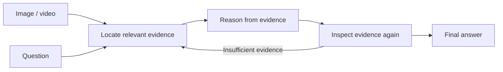
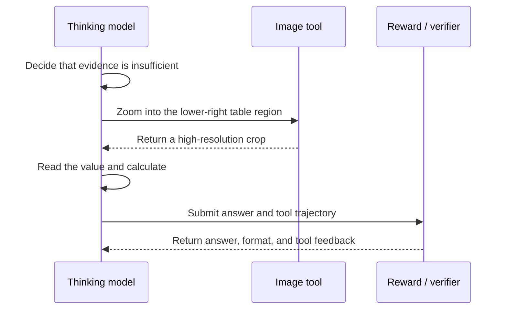

# 23.2 Visual Reflection RL: Answering with Evidence

Consider a chart in which bar A is 42, B is 57, and C is 39. Asked how much higher B is than A, a model that merely notices the tallest bar may answer 57. It must read both values and compute $57-42$ to obtain 15.

The missing capability is concrete: preserve visual evidence, complete the calculation, and inspect the image again before producing the final answer. We call this observation–reasoning–verification–answer process **visual reflection**. Its purpose is to reduce misreading, omission, and guesses based on language priors, not merely to make responses longer.

This section follows the [Qwen3-VL technical report](https://arxiv.org/abs/2511.21631). Qwen3-VL models began appearing in September 2025, and the technical report was released in November 2025. This was separate from the text-only Qwen3 release in April 2025.


## What Is Visual Reflection?

Visual reflection explicitly preserves visual evidence, performs intermediate reasoning, and checks the image again before the final answer. A person reading a receipt locates the subtotal and tax, reads both numbers, adds them, and returns to the receipt to confirm that they came from the correct regions. Visual reflection turns this repeated observation into a model trajectory.


A visual-reasoning trajectory contains at least three kinds of objects:

- **Visual evidence**: regions, text, objects, or time segments relevant to the question.
- **Intermediate reasoning**: comparisons, calculations, or causal links between those observations.
- **Final answer**: the requested number, option, coordinate, or natural-language response.

An outcome reward checks only the last item. It treats “misread then calculate correctly” and “read correctly then calculate incorrectly” as the same failure, and it rewards a lucky guess that ignored the image. Visual reflection makes part of the intermediate process observable and verifiable.



Compared with an ordinary VLM, a reflection trajectory exposes evidence and calculations, supports process rewards such as grounding accuracy and useful tool calls, and can request a new observation. Its central requirement is that the intermediate evidence must actually be used.

## How Visual Evidence Enters Language Reasoning

Reflection is limited by architecture. If fine visual detail is discarded before reaching the language model, no amount of chain-of-thought text can reconstruct it. Qwen3-VL retains the vision encoder–vision-language merger–language model structure and adds mechanisms that preserve evidence.[^qwen3vl]


### DeepStack

Shallow vision-encoder layers retain edges, textures, and local positions; deeper layers emphasize objects and semantics. Using only the last layer can compress small text and local geometry. DeepStack extracts features from several depths, processes them with separate merger modules, and injects them into early language-model layers. This gives the language model both local detail and high-level semantics without simply adding more visual tokens. It makes evidence available, but does not guarantee that the model will use the right evidence.

### Interleaved-MRoPE

Image tokens have two-dimensional positions, while video adds time. Qwen3-VL interleaves temporal, height, and width dimensions in rotary positional encoding so that the model can distinguish a header in the upper-left, a value in the lower-right, and an object appearing at second 12.

### Text Timestamps

Video questions often ask when an action occurred. Qwen3-VL represents temporal positions as text timestamps, allowing a response to cite evidence such as “near 3.0 seconds.” Time localization becomes an inspectable language object instead of remaining only in hidden vectors.

Together, DeepStack preserves details, positional encoding retains spatial and temporal relations, and timestamps make video evidence expressible. The report describes a native 256K interleaved multimodal context and 2B, 4B, 8B, and 32B dense models plus 30B-A3B and 235B-A22B MoE models.[^qwen3vl_repo]

## How the Thinking Variant Is Post-Trained

Qwen3-VL provides Instruct and Thinking variants. They share a multimodal base but use different post-training objectives. According to the report, the Thinking route proceeds through long-chain-of-thought cold start, strong-to-weak distillation, reasoning RL, and general RL.[^qwen3vl]


Cold-start demonstrations teach the model to read geometric relations, write intermediate equations, and then answer. Distillation gives a smaller model plausible high-quality trajectories before exploration. Reasoning RL covers text and multimodal mathematics, code, logic, grounding, and visual puzzles; verifiable tasks can reward answers, coordinates, boxes, or tool results. General RL then restores instruction following, interaction quality, and safety.

This differs from adding “please think step by step” to one prompt. Post-training raises the probability of an entire class of observation, calculation, and verification trajectories.

## Observe Again When Evidence Is Insufficient

Some details cannot be read in one forward pass, such as a label in a 4K circuit diagram or an amount in a long screenshot. Generating more text does not increase image resolution. The missing operation is a new observation.

Qwen3-VL's Thinking with Images connects zoom and search tools to reasoning. The model can decide that evidence is insufficient, call `image_zoom_in_tool` on a region, read the new visual input, and continue. The official repository provides this capability as a cookbook, while the report describes cold-start SFT and tool-integrated RL.[^qwen3vl_repo]



A teaching objective for this design space is

$$
R = R_{\text{answer}} + \lambda_f R_{\text{format}}
  + \lambda_t R_{\text{tool}} - \lambda_c C_{\text{tool}}.
$$

The terms check the answer, parseable format, valid tool use, and unnecessary tool cost. This is an explanatory simplification, not Qwen3-VL's disclosed training objective. The cost term prevents a policy from zooming repeatedly on every task merely because doing so sometimes improves accuracy.

## A Minimal Visual-Reflection Check

The following code uses the official `transformers` interface for the 4B Thinking model. It demonstrates inference, not RL training.

```python
from transformers import AutoModelForImageTextToText, AutoProcessor

model_id = "Qwen/Qwen3-VL-4B-Thinking"
model = AutoModelForImageTextToText.from_pretrained(
    model_id,
    dtype="auto",
    device_map="auto",
)
processor = AutoProcessor.from_pretrained(model_id)

messages = [{
    "role": "user",
    "content": [
        {"type": "image", "url": "./chart.png"},
        {"type": "text", "text": "Read bars A and B, compute B-A, and cite the evidence."},
    ],
}]

inputs = processor.apply_chat_template(
    messages,
    tokenize=True,
    add_generation_prompt=True,
    return_dict=True,
    return_tensors="pt",
).to(model.device)

output_ids = model.generate(**inputs, max_new_tokens=1024)
answer = processor.batch_decode(
    output_ids[:, inputs.input_ids.shape[1]:],
    skip_special_tokens=True,
)[0]
print(answer)
```

Do not inspect only the final number. Record whether the model read A and B, whether both readings came from the correct locations, whether the calculation is correct, and whether replacing the chart with the same layout but different values changes the evidence and answer. The final test is counterfactual: an invariant answer indicates reliance on task priors.

## How Visual Reflection Still Fails

Reflection may begin from a wrong observation. If the model reads 42 as 47, it can write a perfectly coherent subtraction. Grounding, OCR, or tool verification is required; a longer chain of thought does not repair the input.


Reasoning length can also substitute for evidence quality when a reward model favors detailed responses. Evaluation should therefore report accuracy, visual-evidence hit rate, output length, and tool cost together.

Thinking is unnecessary for some tasks. Long reasoning increases latency on direct OCR or localization and can introduce a calculation error after a correct observation. Perception-RFT reported that, for its document-QA setting, reasoning-free training of a 4B model outperformed its reasoning variant.[^perception_rft] This does not invalidate visual reasoning; it shows that the task bottleneck determines whether the model should observe more or reason longer.

Finally, a successful tool call is not a successful task. The trajectory must show that the returned observation changed the conclusion.

## Summary

Visual reflection makes observation–reasoning–verification–answer an observable trajectory. Qwen3-VL's DeepStack, position encoding, and timestamps address how evidence reaches language reasoning; cold start, distillation, reasoning RL, and general RL shape reflective behavior; tool integration enables a new observation when evidence is insufficient. Verification must still inspect intermediate evidence, counterfactual image substitutions, tool trajectories, and cost—not only the final answer.

The same principle extends to audio. A speech model can ignore acoustics and reason only from a rough transcript. [Step-Audio-R1](https://arxiv.org/abs/2511.15848) addresses acoustic grounding with MGRD, described in [24.1 Audio Reward Design](../chapter27_audio_rl/reward-design).

[^qwen3vl]: Qwen Team, [Qwen3-VL Technical Report](https://arxiv.org/abs/2511.21631), 2025.

[^qwen3vl_repo]: QwenLM, [official Qwen3-VL repository](https://github.com/QwenLM/Qwen3-VL).

[^perception_rft]: Harikrishnan P M, et al., [Stop Thinking, Start Looking](https://arxiv.org/abs/2607.14682), 2026.
