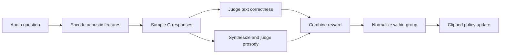
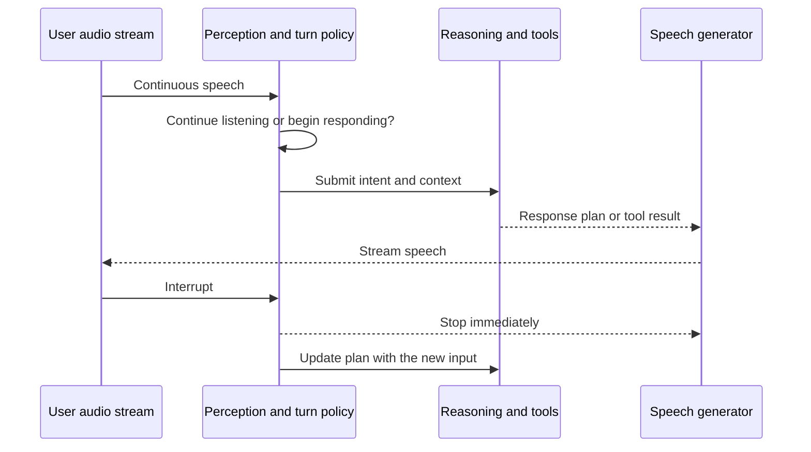

# 24.2 From Audio Rewards to Real-Time Agents: A Minimal Training Loop

[24.1](./reward-design) separated audio rewards into content, prosody, and real-time behavior. Knowing what to reward still does not explain how that reward changes the model. A trainer must sample several responses to the same audio, send text and synthesized speech to different evaluators, and propagate one response-level score back to generated tokens. If any interface is wired incorrectly, the signal updates a behavior other than the intended one.

This section follows one sample through audio encoding, grouped sampling, speech synthesis, reward calculation, within-group comparison, and policy update. The code explains the data flow rather than replacing an industrial training framework. We then place the single-turn model in a continuing environment and examine interruptions, tool calls, and multi-turn state.



## Hands-On: Minimal Audio GRPO Training

Industrial training requires distributed rollout, inference and reward services, and checkpoint management. The minimal workflow below keeps only the interface between reward design and policy updates.

### Experimental Setup

```python
# requirements: torch, transformers, librosa, soundfile
import torch
import torch.nn as nn
import torch.nn.functional as F

class AudioDialogueConfig:
    # Audio encoder (pseudo-code: actual use Qwen2-Audio encoder)
    audio_encoder_dim = 1280
    audio_frame_rate = 12.5  # Hz, after downsampling
    # LLM decoder (actual use Qwen2.5-32B, simplified here)
    llm_hidden = 4096
    vocab_size = 152000
    # RL configuration
    group_size = 16         # GRPO samples per group
    max_response_len = 1024
    clip_eps = 0.2          # PPO clip
    beta_kl = 0.0           # Step-Audio sets to 0, allowing free exploration
```

Two values deserve attention. `group_size = 16` is the number of responses sampled per question in Step-Audio-R1's published PPO setting. The paper also sets `beta_kl = 0`, omitting a reference-model KL penalty during RL. This expands exploration but increases the risk of drifting away from the initialized policy, so it should not be copied to a new task without an ablation.

### Model Structure

```python
class AudioDialoguePolicy(nn.Module):
    """Audio understanding policy: audio encoding → LLM reasoning → text response"""
    def __init__(self, config):
        super().__init__()
        # Audio encoder (frozen)
        self.audio_encoder = AudioEncoder(config.audio_encoder_dim)
        for p in self.audio_encoder.parameters():
            p.requires_grad = False
        # Adaptor: 25 Hz → 12.5 Hz
        self.adaptor = nn.Conv1d(config.audio_encoder_dim, config.llm_hidden,
                                  kernel_size=2, stride=2)
        # LLM decoder
        self.llm = TransformerDecoder(config.llm_hidden, config.vocab_size)

    def forward(self, audio, question, response_tokens):
        # 1. Encode audio
        audio_feat = self.audio_encoder(audio)         # (B, T, D)
        audio_feat = self.adaptor(audio_feat.transpose(1,2)).transpose(1,2)

        # 2. Concatenate [audio, question, response] sequences
        inputs = concat_modalities(audio_feat, question, response_tokens)

        # 3. Autoregressively predict response logits
        logits = self.llm(inputs)
        return logits
```

### Reward Function

Implement the three types of rewards described in Section 24.1:

```python
class AudioReward:
    def __init__(self, grm_model, prosody_ref_dist):
        self.grm = grm_model                # Generative Reward Model
        self.prosody_ref = prosody_ref_dist # Human Prosody Distribution

    def content_reward(self, response_text, ground_truth):
        """Content Accuracy"""
        # Use LLM-as-judge to assess semantic equivalence
        prompt = f"Judge whether the answer is equivalent: \nReference: {ground_truth}\nAnswer: {response_text}\nReturn 1 if equivalent, else 0"
        return float(self.grm(prompt))

    def prosody_reward(self, response_audio):
        """Prosody Naturalness"""
        f0 = extract_valid_f0(response_audio)     # Remove unvoiced frames
        f0_var = np.std(f0)
        # Wasserstein distance to human distribution
        f0_w = wasserstein_distance(
            np.histogram(f0, bins=50)[0] / len(f0),
            self.prosody_ref['f0_hist']
        )
        # Penalize flatness (a common failure mode in RLVR)
        flat_penalty = -max(0, 0.3 - f0_var)
        return -f0_w + 0.5 * flat_penalty

    def format_reward(self, response_text):
        """Check the <think>...</think> structure used by MGRD"""
        has_think = '<think>' in response_text and '</think>' in response_text
        return 1.0 if has_think else 0.0

    def total(self, response_text, response_audio, ground_truth, weights=(0.7, 0.2, 0.1)):
        w_c, w_p, w_f = weights
        return (w_c * self.content_reward(response_text, ground_truth)
              + w_p * self.prosody_reward(response_audio)
              + w_f * self.format_reward(response_text))
```

::: tip The Role of Format Reward
The Step-Audio-R1 paper found that removing the format reward ($w_f=0$) reduced the number of reasoning tokens from 2,800 to 1,500 and lowered the MMAU score by 1.2 percentage points. The optimizer had learned a shorter strategy: answer immediately and omit the `<think>...</think>` segment.

In the paper's experiment, the format term has weight 0.2 and raises MMAU from 76.5 to 77.7 while restoring late-stage reasoning length to roughly 2,300–2,800 tokens. This result belongs to that model and dataset; a new task still needs its own weight ablation. The format reward proves only that a reasoning segment exists. Whether it uses the correct acoustic evidence depends on MGRD's data filtering and grounding checks.
:::

### GRPO Training Loop

We use [GRPO](../chapter18_grpo/grpo-family) (Group Relative Policy Optimization) for training—no critic is needed, making it more suitable for large models:

```python
def grpo_train_step(policy, reward_fn, speech_synthesizer, batch, config):
    """One illustrative GRPO update"""
    token_losses = []

    for prompt, audio, ground_truth in batch:
        # 1. Sample G responses and retain rollout-time log probabilities
        responses = []
        for _ in range(config.group_size):
            with torch.no_grad():
                resp = policy.sample(audio, prompt, config.max_response_len)
                resp.log_prob_old = policy.log_prob(audio, prompt, resp.tokens)
            # Step-Audio-R1 itself outputs text. A separate synthesizer is
            # attached here only to demonstrate a prosody-reward branch.
            resp.audio = speech_synthesizer(resp.text)
            resp.reward = reward_fn.total(resp.text, resp.audio, ground_truth)
            responses.append(resp)

        # 2. Normalize rewards within the prompt group
        rewards = torch.tensor([r.reward for r in responses])
        advantages = (rewards - rewards.mean()) / (rewards.std() + 1e-8)

        # 3. Apply a token-level clipped policy objective
        for resp, advantage in zip(responses, advantages):
            logp_new = policy.log_prob(audio, prompt, resp.tokens)
            ratio = torch.exp(logp_new - resp.log_prob_old)
            clipped = torch.clamp(ratio, 1 - config.clip_eps, 1 + config.clip_eps)
            token_loss = -torch.min(ratio * advantage, clipped * advantage).mean()
            token_losses.append(token_loss)

    return torch.stack(token_losses).mean()

# Main loop
for epoch in range(num_epochs):
    for batch in dataloader:
        optimizer.zero_grad()
        loss = grpo_train_step(
            policy, reward_fn, speech_synthesizer, batch, config
        )
        loss.backward()
        torch.nn.utils.clip_grad_norm_(policy.parameters(), max_norm=1.0)
        optimizer.step()
```

::: details Why the pseudocode uses GRPO while the paper says PPO

[Step-Audio-R1](https://arxiv.org/html/2511.15848#S4.SS3) explicitly reports on-policy PPO: it samples 16 responses per question, uses a clipping coefficient of 0.2, and places reward on the final token. The paper does not call this GRPO and does not disclose replacing a value model with the group mean.

The pseudocode uses GRPO to connect with the course's earlier treatment of group-relative advantages and to show how several responses to one audio input can be compared without a separate critic. A reproduction must follow the paper and official code. Multi-sample PPO and GRPO are not interchangeable names.

:::

### Self-Cognition Correction

There's a non-mainstream but critical issue in industrial audio RL: **the model forgets it is an audio model**. Pretraining data is mostly text-based, so models often respond with "I can't hear anything" or "I am a text model." The self-cognition correction process for Step-Audio-R1:

```python
def self_cognition_correction(policy):
    """Two-stage correction for self-cognition errors"""
    # Stage 1: Iterative self-distillation + LLM judge filtering
    for t in range(T):
        responses = policy.sample(audio_perception_queries)
        # Judge only retains responses with correct self-cognition
        correct = [r for r in responses if judge_acknowledges_audio(r)]
        policy.sft(correct)

    # Stage 2: DPO fine-tuning
    # 8000 preference pairs: correct cognition (w) vs. incorrect cognition (l)
    pref_pairs = build_preference_pairs(correct_cog=positive, text_only=negative)
    policy.dpo(pref_pairs, beta=0.1)
```

The paper reports a self-cognition error rate of 6.76% for the base model, 2.63% after iterative self-distillation, and 0.02% after DPO. These numbers measure one dedicated self-cognition test set, not general audio accuracy. The correction matters in deployment because an otherwise capable audio model can still destroy the interaction by insisting that it cannot hear.

## Forms of Audio Agents

An audio model that answers questions is only the starting point. In a continuing environment it must maintain state across turns and decide when to listen, speak, stop, or call a tool. Three forms are common.

**Full-duplex dialogue agents.** A traditional assistant alternates turns. A full-duplex agent listens while speaking, can be interrupted, and must sometimes remain silent.



The difficult RL decisions are temporal: when to take the floor, when to yield it, and how to recover context after an interruption. These behaviors lack simple verifiable labels and usually require preference or trajectory-level rewards.

**Audio as an agent's perception channel.** Here audio supplies perception and output, while planning and tool use remain in text space. A meeting agent combines streaming ASR, speaker separation, summaries, and action-item extraction. Voice search and translation convert speech into tool calls and have verifiable retrieval or translation outcomes. A customer-service agent uses detected emotion to choose a response path, while escalation timing becomes a sequential decision. These systems connect directly to [multi-agent collaboration](../chapter22_agentic/multi-agent-swarm): the audio model perceives and expresses, a text agent plans and invokes tools, and the reward evaluates the whole trajectory.

**Audio as an output tool.** The core agent reasons in text and invokes speech as an output interface. RL must keep presentation consistent with the decision: serious content should not use a playful tone, and an urgent reminder may require slower, clearer delivery. Today this consistency is mainly supervised by rubric-based preferences; mature verifiable rewards remain limited.

## Future Directions

**Audio-native reasoning.** MGRD grounds a textual chain of thought in acoustic evidence, but the chain is still written in text. A future system could reason directly over prosody and timbre representations. Its reward would also have to move from text-verifiable to acoustically verifiable evidence.

**Streaming RL.** Step-Audio training primarily rewards complete responses, while real conversations contain interruptions, revisions, and follow-up questions inside a turn. Sentence- or chunk-level feedback is needed to train when to begin and stop speaking.

**Long-horizon credit assignment.** A poor tone in one turn may cause the user to leave five turns later. This is the same credit-assignment problem seen in agent RL, now with longer delays, acoustic observations, and sparser signals.

## Connections to Earlier Chapters

The illustrative training loop uses GRPO group normalization, while the Step-Audio-R1 paper itself reports PPO. The `<think>` format reward preserves the reasoning chain. Freezing the audio encoder mirrors differentiated VLM updates: RL changes the language policy without rewriting perceptual features. Meeting and service agents use trajectory-level rewards, and DPO preference pairs correct self-cognition and can support prosody alignment.

<details>
<summary>Question: Why is “when to speak” difficult to train with a verifiable reward?</summary>

The correct timing depends on the other person's live state: whether the user is hesitating, about to interrupt, or changing emotion. There is no discrete ground-truth label comparable to answer correctness. Available signals, such as whether the conversation continues or receives a high satisfaction score, are delayed and noisy. Timing therefore requires preference or trajectory-level feedback. This is the temporal extension of the verifiable-reward trap: once the easy-to-check part is optimized, the remaining part is central to the experience.

</details>

## Summary

The audio-GRPO teaching loop shares the basic structure of text GRPO, but reward evaluation adds speech synthesis and prosody branches. Format rewards and self-cognition correction address two deployment-critical behaviors that answer correctness does not cover. Full-duplex dialogue, audio perception for tool-using agents, and audio as an output tool lead respectively to timing, trajectory-reward, and presentation-consistency problems. Open directions are audio-native reasoning, streaming RL, and long-horizon credit assignment.

The next section, [24.3 VLA Models](../chapter28_vla/embodied-intelligence/), connects multimodal perception to physical action under continuous control, real-world costs, and physical constraints.

## References

- [Step-Audio-R1 Technical Report (arXiv:2511.15848)](https://arxiv.org/abs/2511.15848): training configuration and self-cognition correction
- [Step-Audio-R1 GitHub](https://github.com/stepfun-ai/Step-Audio-R1): open inference code and model weights
- [DeepSeek-R1 (arXiv:2501.12948)](https://arxiv.org/abs/2501.12948): the RLVR and GRPO training line that informed Step-Audio-R1
- [Moshi (arXiv:2410.00037)](https://arxiv.org/abs/2410.00037): full-duplex real-time dialogue and the Mimi codec
- [GPT-4o System Card (arXiv:2410.21276)](https://arxiv.org/abs/2410.21276): an industrial real-time speech-interaction reference
