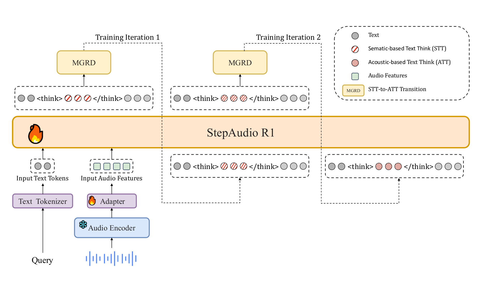
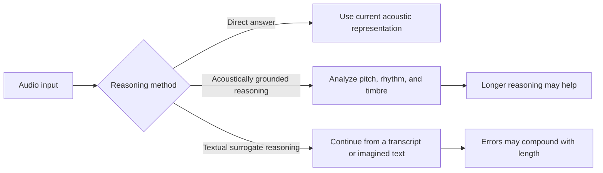
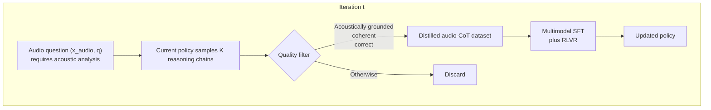
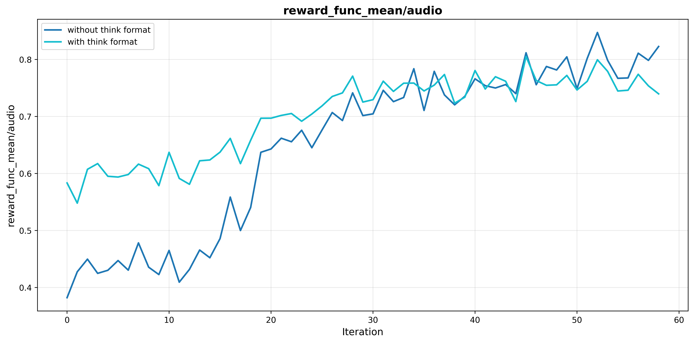
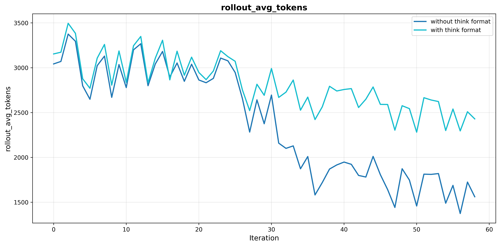
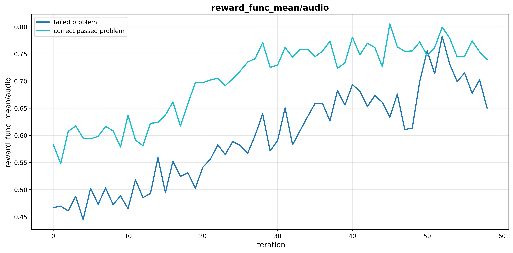
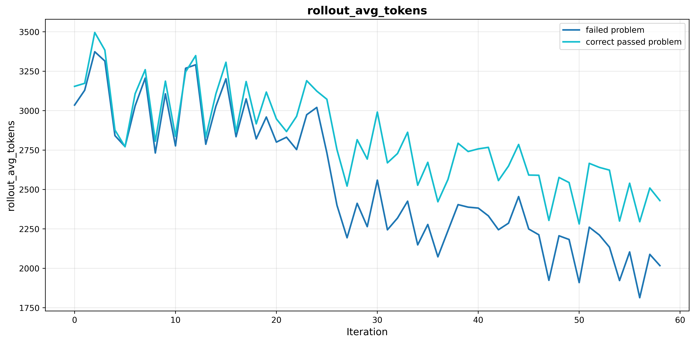
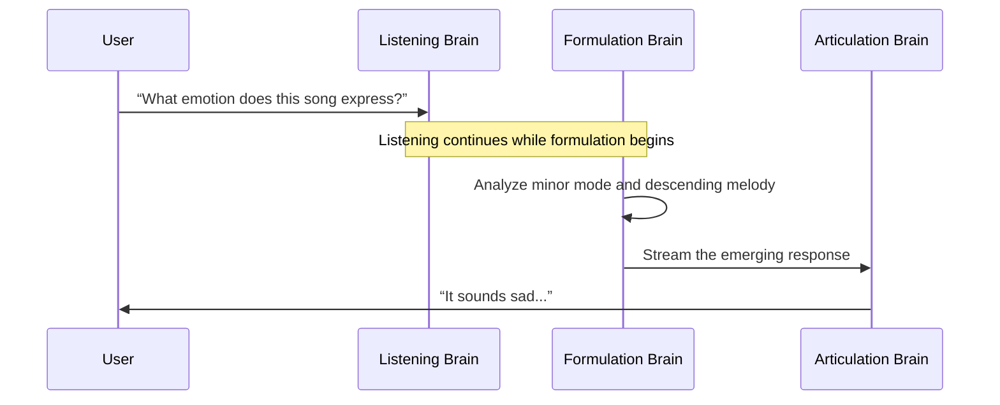
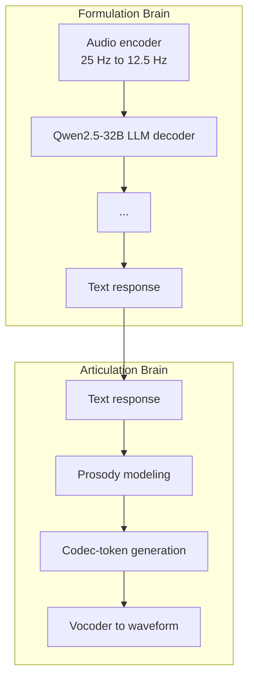
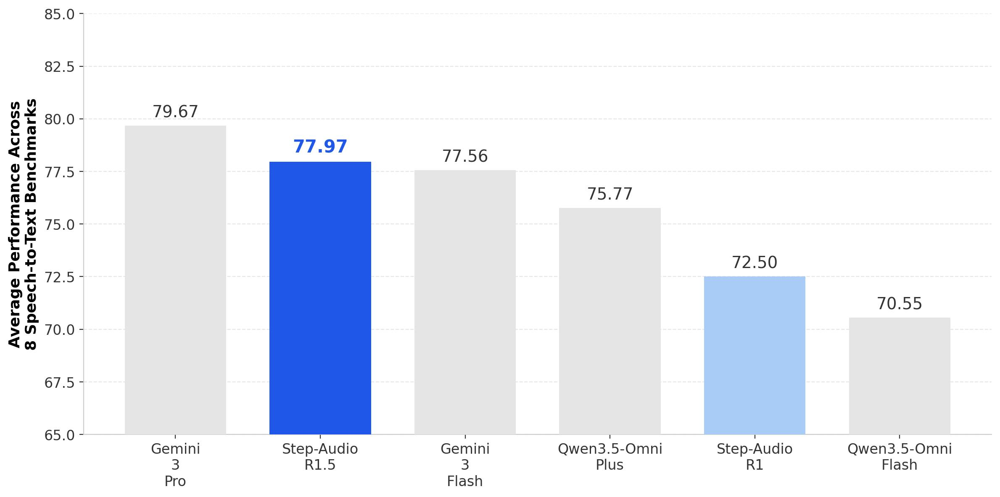

# 24.1 Audio Reward Design

Consider a three-second recording: a woman says, “It will rain tomorrow; remember an umbrella,” in a calm, slow voice with faint keyboard noise behind her. Asked for the speaker's emotion, the model answers “calm.” The answer is correct. Yet when this answer is spoken aloud, every sentence uses the same pitch and rhythm, whether the content is comforting, warning, or joking. The user does not say that the answer is wrong; the user simply does not want another conversation.

This is the central difficulty of audio RL. Many text-reasoning tasks can use answer correctness as their main reward. End-to-end speech interaction carries three layers of information: **what is said (content), how it is said (prosody), and how quickly it is delivered (real-time behavior)**. Rewarding only the first layer can degrade the other two. This section first explains audio tokenization, then constructs rewards for all three layers. Finally, it follows Step-Audio-R1 and Step-Audio-R1.5 to show how a single reward creates a trap and how multidimensional feedback restores interaction quality.



<div style="text-align: center; font-size: 0.9em; color: var(--vp-c-text-2); margin-top: -10px; margin-bottom: 20px;">
  <em>Figure 1: Step-Audio-R1 architecture. A 25 Hz audio encoder is downsampled to 12.5 Hz through an adapter, then passed to a Qwen2.5-32B LLM decoder that produces textual reasoning and responses. Source: <a href="https://arxiv.org/abs/2511.15848" target="_blank" rel="noopener noreferrer">Step-Audio-R1 Technical Report</a>.</em>
</div>

## Overview of Audio Language Models

### From Waveforms to Tokens

Text language models process discrete token sequences, while audio is a continuous waveform. At 24 kHz, one second contains 24,000 samples. A Transformer therefore usually receives a compressed discrete representation produced by a **neural audio codec**. The following are representative configurations; frame rates and codebook counts vary with bandwidth settings.

**SoundStream** (Google, 2021) typically uses 50 Hz and eight RVQ layers for speech synthesis. **EnCodec** (Meta, 2022) uses configurations such as 75 Hz and eight RVQ layers for general audio and music. **SpeechTokenizer** (2023) uses eight layers at 50 Hz, with the first layer guided toward semantics and the remaining layers carrying acoustic detail. **WavTokenizer** (ICLR 2025) targets high compression with one VQ layer at 40–75 Hz. **Mimi** (Kyutai, 2024) uses a 12.5 Hz joint semantic-acoustic representation for real-time dialogue in Moshi.

[SoundStream](https://arxiv.org/abs/2107.03312) and [EnCodec](https://arxiv.org/abs/2210.13438) use **residual vector quantization (RVQ)**. A single codebook rarely represents an encoded audio frame accurately, so successive codebooks quantize the residual left by the previous layer.

Let the encoder output be $e^{(0)}=\operatorname{Encoder}(x)$. Layer $k$ chooses the nearest entry in codebook $\mathrm{CB}_k$ and records the remaining error:

$$
c_k=\arg\min_c\left\|e^{(k-1)}-\mathrm{CB}_k[c]\right\|,
\qquad
e^{(k)}=e^{(k-1)}-\mathrm{CB}_k[c_k].
$$

The decoder reconstructs the waveform from all indices: $\hat{x}=\operatorname{Decoder}(c_1,\ldots,c_K)$. More layers can improve reconstruction, but each layer adds another token stream and increases autoregressive generation cost.

[SpeechTokenizer](https://arxiv.org/abs/2308.16692) modifies this structure by using HuBERT features to guide the first RVQ layer toward semantic information, while later layers supply acoustic details. This hierarchy provides an intuitive basis for separating content and prosody rewards later in the section.

### How Speech Generation Differs from Text Generation

Audio-token generation looks like ordinary autoregressive next-token prediction, but its constraints are different. Text sequence length grows mostly with the number of words; speech sequence length also grows with duration and codec frame rate. At 75 Hz with eight RVQ layers, one second contains $75\times8=600$ tokens, and ten seconds contains 6,000. The same content usually needs only a few hundred text tokens.

Speech evaluation must cover content, prosody, emotion, timbre, and rhythm. A wrong text token can leave a sentence readable, while one bad audio frame can create a click or electrical artifact. Multiple RVQ streams must remain synchronized, and real-time dialogue adds a strict latency budget. These constraints make audio-RL sampling substantially more expensive than text-RL sampling.

### Engineering Challenges in Real-Time Inference

Real-time speech dialogue must be **full duplex**: listening, reasoning, and speaking overlap. Three constraints dominate:

1. **First-packet latency:** the interval from the end of the user's speech to the first playable audio output. Hardware, networking, and model size determine the achievable threshold.
2. **Streaming decoding:** the system must emit chunks instead of waiting for a complete sentence.
3. **Interruptibility:** when the user speaks again, generation must stop and listening must resume immediately.

[Moshi](https://arxiv.org/abs/2410.00037) jointly models multiple audio and text streams. Production real-time systems do not disclose every internal detail, but all must stream input and output. Later we will see how Step-Audio-R1 Realtime pipelines formulation and articulation to achieve sub-second first-packet latency.

## Three Dimensions of Audio Reward

We begin with correctness, which is easiest to implement, then add prosody and latency. These signals differ in verifiability and can conflict when combined.

### Content Correctness

For a response $a$ and reference answer $a^*$, the simplest reward is binary:

$$
R_{\mathrm{content}}(a,a^*)=
\begin{cases}
1,&a=a^*,\\
0,&\text{otherwise}.
\end{cases}
$$

Useful variants include $1-\mathrm{WER}$ for speech recognition, embedding cosine similarity for semantic equivalence, and an LLM judge that returns a score in $[0,1]$. These rewards fit objective tasks such as mathematics, factual QA, and ASR. Open-ended dialogue has no unique reference answer, so correctness alone is insufficient.

### Prosody Naturalness

Prosody includes pitch, rhythm, intensity, and pauses. It has no single correct label, so preferences must be learned from human comparisons or acoustic statistics. A scalar reward model can be trained with the Bradley–Terry objective:

$$
\mathcal{L}_{\mathrm{RM}}
=
-\log\sigma\!\left(R_\phi(y_w)-R_\phi(y_l)\right).
$$

Suppose response A is factually correct but completely monotone, while response B is factually wrong but sounds natural. Different annotators may prioritize content or experience. A single scalar hides which dimension produced the preference.

Step-Audio-R1.5 instead uses rubric prompting so that an evaluator can consider correctness, fluency, prosody, emotional fit, and immersion under the current task. A teaching approximation is to assign each dimension a score and aggregate it with weights learned from human preferences:

$$
R_{\mathrm{prosody}}(y)=\sum_k w_k\,\mathrm{GRM}_k(y),
\qquad
w=\arg\min_w\left\|R_{\mathrm{human}}(y)-\sum_k w_k\,\mathrm{GRM}_k(y)\right\|^2.
$$

This weighted equation is an explanatory template, not Step-Audio-R1.5's published training formula. The paper uses a **generative reward model (GRM)**: given the multi-turn context, policy response, reference response, and an optional rubric, it generates a relative-quality judgment and maps that judgment to a scalar reward. The criterion can therefore change with the task instead of being compressed into one unexplained fixed score.

When preference data is unavailable, acoustic features can provide a diagnostic reward. The following illustrative code compares pitch and energy distributions with human references and explicitly penalizes monotony:

```python
def prosody_reward(audio):
    f0 = extract_pitch(audio)
    energy = extract_energy(audio)

    f0_score = -wasserstein(f0_dist(audio), f0_dist_human)
    energy_score = -wasserstein(energy_dist(audio), energy_dist_human)

    f0_var = np.std(f0)
    monotonicity_penalty = -max(0, 0.2 - f0_var)

    return 0.5 * f0_score + 0.3 * energy_score + 0.2 * monotonicity_penalty
```

The final term does not reward ideal prosody; it penalizes the absence of prosody. This is a first defense against the flattening caused by correctness-only RLVR.

### Real-Time Reward

Latency requires a precise measurement interval. Here it begins when the user's speech ends and finishes when the system emits its first playable audio packet. The following piecewise reward is a teaching example; product budgets and measurement conditions must determine the actual thresholds:

$$
R_{\mathrm{latency}}(y)=
\begin{cases}
1,&T_{\mathrm{first\text{-}packet}}<0.5\ \mathrm{s},\\
0.5,&0.5\ \mathrm{s}\le T_{\mathrm{first\text{-}packet}}<1.0\ \mathrm{s},\\
0,&T_{\mathrm{first\text{-}packet}}\ge1.0\ \mathrm{s}.
\end{cases}
$$

A continuous alternative, $R_{\mathrm{latency}}(y)=\exp(-\alpha T_{\mathrm{first\text{-}packet}})$, avoids abrupt behavior near thresholds.

Latency conflicts with deep reasoning: more deliberation delays the first packet. Architecture can hide part of that delay. The dual-brain design discussed below begins articulation while formulation is still in progress.

### Combined Reward

A teaching objective combines the three signals:

$$
R_{\mathrm{total}}
=w_cR_{\mathrm{content}}+w_pR_{\mathrm{prosody}}+w_lR_{\mathrm{latency}}.
$$

Customer-service QA emphasizes $w_c$ because factual accuracy determines business value. A companion emphasizes $w_p$ because conversation quality affects retention. Real-time translation emphasizes $w_l$ because excessive delay makes the system unusable. Step-Audio-R1.5's central lesson is that optimizing only $w_c$ creates a verifiable-reward trap; interaction preferences must also enter the reward.

## Case 1: Step-Audio-R1 and Modality-Grounded Reasoning

The Step-Audio series progresses from the audio-understanding and dialogue foundation of [Step-Audio 2](https://arxiv.org/abs/2507.16632) to Step-Audio-R1 in November 2025 and Step-Audio-R1.5 in April 2026. R1 asks a reward-design question: why can an audio model perform worse when it reasons for longer?

### The Inverted-Scaling Anomaly

Text and visual reasoning models often improve with more test-time reasoning tokens. Audio models can show the opposite behavior:



This diagram explains the mechanism; it is not a fabricated accuracy curve. The paper verifies the effect across audio benchmarks and ablations, with task-dependent values.

The [Step-Audio-R1](https://arxiv.org/abs/2511.15848) team calls the cause **textual surrogate reasoning**. Audio LLMs are often initialized with text chain-of-thought data, so they reason over a textual description of the audio instead of the acoustic evidence itself:

```text
❌ Textual surrogate reasoning:
“The lyrics mention sadness, so the song is sad.”

✅ Acoustically grounded reasoning:
“Minor harmony + descending melodic contour + slow tempo indicate sadness.”
```

The first chain may even hallucinate lyrics. As it grows longer, it compounds reasoning over the wrong substrate. Audio rewards therefore need to distinguish an answer grounded in acoustic evidence from a lucky answer based on text alone.

### MGRD: Modality-Grounded Reasoning Distillation

**MGRD (Modality-Grounded Reasoning Distillation)** is Step-Audio-R1's central training framework. Across $T$ iterations, it moves the basis of reasoning from textual surrogates to acoustic evidence:



The overall loss sums SFT and RLVR objectives across iterations:

$$
\mathcal{L}_{\mathrm{MGRD}}
=\sum_{t=1}^{T}\left(\mathcal{L}_{\mathrm{SFT}}^{(t)}+\mathcal{L}_{\mathrm{RLVR}}^{(t)}\right).
$$

Each iteration has three stages.

**1. Self-distillation sampling.** On tasks requiring acoustic analysis, the current policy samples $K$ candidates:

$$
(r^{(i)},a^{(i)})\sim\pi_{\theta_t}(\cdot\mid x_{\mathrm{audio}},q),
\qquad i=1,\ldots,K.
$$

A candidate is kept only when its reasoning explicitly cites perceptual features such as pitch, rhythm, or timbre; its steps are coherent; and its final answer is correct.

**2. Multimodal supervised refinement.** The model is trained jointly on distilled audio reasoning and original text-reasoning data:

$$
\mathcal{L}_{\mathrm{SFT}}^{(t)}
=\mathbb{E}_{\mathcal{D}_t^{\mathrm{audio\text{-}cot}}}\!\left[\log\pi_\theta(r,a\mid x_{\mathrm{audio}},q)\right]
+\mathbb{E}_{\mathcal{D}_{\mathrm{task}}}\!\left[\log\pi_\theta(r,a\mid q)\right].
$$

The mixture preserves text reasoning while acoustic grounding improves.

**3. Multimodal RL.** Text tasks use ordinary binary correctness. Audio tasks use a composite reward:

$$
R_{\mathrm{audio}}(r,a)
=0.8\,\mathbb{1}[a=a^*]+0.2\,\mathbb{1}[\text{reasoning is present in }r].
$$



<div style="text-align: center; font-size: 0.9em; color: var(--vp-c-text-2); margin-top: -10px; margin-bottom: 20px;">
  <em>Figure 2: The model with a format reward converges faster, reaches a higher reward, and remains more stable late in training. Source: <a href="https://arxiv.org/abs/2511.15848" target="_blank" rel="noopener noreferrer">Step-Audio-R1 Technical Report</a>.</em>
</div>



<div style="text-align: center; font-size: 0.9em; color: var(--vp-c-text-2); margin-top: -10px; margin-bottom: 20px;">
  <em>Figure 3: Without format reward, reasoning length falls from roughly 3,000 tokens to below 1,500; with it, the length remains around 2,300–2,800. Source: <a href="https://arxiv.org/abs/2511.15848" target="_blank" rel="noopener noreferrer">Step-Audio-R1 Technical Report</a>.</em>
</div>

The 0.8/0.2 split has experimental support. Removing the 0.2 format reward reduces reasoning length from 2,800 to 1,500 tokens and MMAU accuracy from 77.7 to 76.5. RL naturally favors a token-efficient shortcut—skip reasoning and emit the answer—so the training signal must explicitly preserve the reasoning process.

::: details MGRD data selection: pass@8 in [3, 6]
The RL dataset contains only 5,000 examples and is tightly filtered. The previous policy samples each question eight times, and training keeps questions with pass@8 between 3 and 6. Easier questions offer little learning signal; questions below that range are more likely to be ambiguous.





All-failure questions end with rewards around 0.45–0.70 and reasoning lengths around 1,800 tokens. Medium-difficulty questions reach roughly 0.75–0.80 while maintaining 2,300–2,800 tokens. Expanding to 200K unfiltered examples, ten times more data, does not improve the result. Here, data quality matters more than data volume.
:::

### Results and Real-Time Reasoning

MGRD produces **acoustically grounded reasoning** whose chains explicitly cite acoustic properties. On the reported MMAU-family evaluation, Step-Audio-R1 averages 83.6, compared with 68.3 for Step-Audio 2, 81.5 for Gemini 2.5 Pro, and 85.1 for Gemini 3 Pro. Its Big Bench Audio score is 98.7, while its reported Spoken MQA, MMSU, MMAU, and Wild Speech scores are 95.2, 75.9, 77.7, and 70.6. These values belong to the paper's evaluation configuration and should not be generalized to unrelated settings.

After correctness improves, latency becomes the next bottleneck. A serial system finishes reasoning before speaking. Step-Audio-R1 Realtime draws on listen-while-thinking and think-while-speaking designs to implement **Mind-Paced Speaking**:



The supporting **dual-brain architecture** separates formulation from articulation:



This structure comes from [Mind-Paced Speaking](https://arxiv.org/abs/2510.09592). The formulation brain encodes audio and produces reasoning plus text. The articulation brain turns that text into codec tokens carrying prosody, emotion, and timbre. Decoupling them permits pipelined execution. The Step-Audio-R1 report gives its Realtime model a Big Bench Audio speech-to-speech score of 96.1 and a first-packet latency of 0.92 seconds; in the same evaluation, GPT Realtime 0825 scores 83 at 0.98 seconds, and Gemini 2.5 Flash Native Audio scores 92 at 0.63 seconds.

Prosody, emotion, and timbre are created in the articulation layer. A reward that checks only answer correctness gives this layer no incentive to preserve expressive quality.

## Case 2: The Verifiable-Reward Trap and the RLHF Correction

Step-Audio-R1 combines MGRD with RLVR to obtain strong objective benchmark scores. In real dialogue, however, the team observed that better benchmark scores could coincide with less pleasant conversation.

### How the Trap Works

[Step-Audio-R1.5](https://arxiv.org/abs/2604.25719) calls this the **verifiable-reward trap**.

::: warning Verifiable-reward trap
When an audio benchmark's ground truth is a discrete label—an emotion class, ASR transcript, or scene label—RLVR rewards only the correct label. It structurally ignores prosodic naturalness, emotional continuity, and conversational fluency.
:::

The mechanism is direct:

```text
RLVR objective = answer correctness → token-efficient policy → short, mechanical, flat responses
                                      ↓
                              benchmark ↑  dialogue quality ↓
```

In the three-layer framework, RLVR optimizes only $w_c$. The model devotes capacity to content correctness while unrewarded prosody gradually disappears. It becomes an accurate answer engine with a hollow interaction style.

### Step-Audio-R1.5's Three-Stage Correction

R1.5 restores RLHF to the pipeline so that correctness, fluency, and emotional resonance all affect the reward.

**1. Audio-centric mid-training.** Before RLHF, the model strengthens its audio-understanding and reasoning foundation while retaining text reasoning:

$$
\mathcal{L}_{\mathrm{mid}}
=\mathbb{E}_{(x,q,r,y)\sim\mathcal{D}_{\mathrm{audio}}}\!\left[\log\pi_\theta(r,y\mid x,q)\right]
+\mathbb{E}_{(q,r,y)\sim\mathcal{D}_{\mathrm{text}}}\!\left[\log\pi_\theta(r,y\mid q)\right].
$$

Here $x$, $q$, $r$, and $y$ denote audio input, context, reasoning, and response.

**2. Cold-start SFT.** This stage aligns interaction behavior: maintaining context across turns, following content and format instructions, responding naturally, and handling clarification, interruption, and user corrections. It gives preference optimization a stronger initialization.

**3. RLHF with a rubric-based GRM.** Audio interaction mixes explicit constraints with qualities that are hard to encode as rules. R1.5 lets the generative reward model switch modes: it follows a supplied rubric when a task has explicit criteria and performs ordinary relative preference judgment otherwise.

Let $\mathcal{H}_{1:T}$ be the dialogue history through turn $T$, $y$ the policy response, $y^{\mathrm{ref}}$ a reference response, and $c$ an optional criterion. The GRM generates a relative judgment and maps it to a scalar:

$$
g=\mathcal{R}(\mathcal{H}_{1:T},y,y^{\mathrm{ref}};c),
\qquad c\in\mathcal{C}\cup\{\varnothing\},
\qquad r=\phi(g).
$$

With $c\ne\varnothing$, the evaluator can check a condition such as whether the response remembers a speed requirement given several turns earlier. With $c=\varnothing$, it compares overall naturalness.

Given advantages $\hat A_t$, the paper uses a PPO-style objective with a reference-policy KL term:

$$
\mathcal{L}_{\mathrm{RLHF}}(\theta)
=\mathbb{E}_t\!\left[
\min\!\left(
\rho_t(\theta)\hat A_t,
\operatorname{clip}(\rho_t(\theta),1-\epsilon,1+\epsilon)\hat A_t
\right)
\right]
-\beta D_{\mathrm{KL}}(\pi_\theta\|\pi_{\mathrm{ref}}).
$$

Here $\rho_t$ is the new-to-old policy probability ratio. Clipping limits one update, and the KL term keeps the policy near the reference. This objective comes from [Section 3.3 of Step-Audio-R1.5](https://arxiv.org/html/2604.25719#S3.SS3); it should not be described as DPO.

### Preserving Prosodic Naturalness

The clearest correctness-only RLVR regression is **prosodic flattening**: responses become shorter, more mechanical, and less emotionally continuous. R1.5 uses end-to-end interaction preferences so that the GRM compares complete responses for correctness, fluency, and emotional resonance; explicit rubrics check concrete task conditions. Its architecture outputs text. The paper does not claim that preference supervision is applied directly to acoustic RVQ codec tokens.



<div style="text-align: center; font-size: 0.9em; color: var(--vp-c-text-2); margin-top: -10px; margin-bottom: 20px;">
  <em>Figure 4: Step-Audio-R1.5's aggregate ranking over eight speech-to-text benchmarks. R1.5 averages 77.97 versus R1's 72.50. Source: <a href="https://arxiv.org/abs/2604.25719" target="_blank" rel="noopener noreferrer">Step-Audio-R1.5 Technical Report</a>.</em>
</div>

The evaluation covers eight speech-to-text benchmarks including AudioMultiChallenge, Big Bench Audio, MMSU, and MMAU. The 77.97 average exceeds R1's 72.50, with much of the gain coming from multi-turn interaction and long-context tasks while retaining analytical ability. This is more precise than claiming that every individual benchmark improves: RLHF improves the overall balance, but individual scores can move in either direction.

## Connections to Earlier Chapters

RLVR's binary reward reappears here as content correctness and creates the verifiable-reward trap when used alone. The preference reward model becomes a rubric-conditioned GRM in R1.5. PPO clipping and a reference KL term convert its judgment into stable policy updates. The 0.2 format reward prevents reasoning collapse, echoing the need to reward a necessary process rather than only its outcome. Textual surrogate reasoning is the audio counterpart of a visual shortcut: the model bypasses modality evidence and guesses from an easier representation.

<details>
<summary>Question: Why is the 0.2 format reward especially important in audio RL?</summary>

In text RL, a reasoning chain often improves correctness, so process and outcome rewards can point in the same direction. In audio, a long chain may be grounded in acoustics or may elaborate a hallucinated textual surrogate. Reasoning length can therefore correlate negatively with correctness. Outcome reward alone cannot distinguish these cases; explicit format and grounding signals keep optimization tied to acoustic evidence.

</details>

## Summary

Audio must be tokenized by a codec before it enters a language model. RVQ's semantic and acoustic hierarchy motivates separate content and prosody rewards. A complete audio objective must cover content, prosody, and latency. Correctness-only RLVR creates a verifiable-reward trap: benchmark accuracy rises while conversation quality falls.

Step-Audio-R1 uses MGRD to correct inverted scaling by grounding reasoning in acoustic evidence. Step-Audio-R1.5 uses a rubric-based GRM and PPO-style RLHF to restore interaction quality. The conflict between deep reasoning and real-time response is addressed architecturally: the formulation brain reasons while the articulation brain synthesizes speech in parallel.

The next section, [24.2 Multimodal Audio Agents](./future), implements a minimal audio-GRPO training loop and then examines tool use and multi-turn collaboration.

## References

- [Step-Audio-R1 Technical Report (arXiv:2511.15848)](https://arxiv.org/abs/2511.15848): the MGRD framework and acoustically grounded reasoning
- [Step-Audio-R1.5 Technical Report (arXiv:2604.25719)](https://arxiv.org/abs/2604.25719): RLHF and the verifiable-reward trap
- [Step-Audio 2 Technical Report (arXiv:2507.16632)](https://arxiv.org/abs/2507.16632): the Step-Audio foundation model
- [EnCodec (arXiv:2210.13438)](https://arxiv.org/abs/2210.13438): a representative RVQ neural codec
- [SpeechTokenizer (arXiv:2308.16692)](https://arxiv.org/abs/2308.16692): separating semantic and acoustic speech-token layers
- [Moshi (arXiv:2410.00037)](https://arxiv.org/abs/2410.00037): full-duplex dialogue and the Mimi codec
