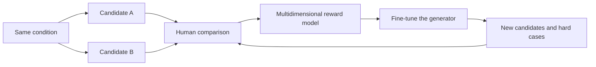

# 24.5 Temporal Consistency in Video

Imagine four sharp, naturally lit frames of a red ball hitting toy blocks. A frame-by-frame inspection passes. The prompt also passes: it asks for a collision followed by the ball stopping, and all of those objects and events appear. The timeline reveals a different failure. The ball's path breaks between seconds three and four, and the blocks fall before contact occurs.

This example needs four separate checks:

1. **Single-frame quality** checks anatomy, edges, lighting, and composition independently in every frame.
2. **Text and event alignment** checks whether the requested objects, actions, and event order appear.
3. **Temporal consistency** checks whether identity, position, appearance, and background structure remain explainable from one frame to the next.
4. **Physical and causal consistency** checks whether contact precedes its effect and whether motion follows a continuous path.

A single total score can hide the third and fourth failures behind high image quality. Training and evaluation must preserve these component signals.


<div style="text-align: center; font-size: 0.9em; color: var(--vp-c-text-2); margin-top: -10px; margin-bottom: 20px;">
  <em>Figure 1: Frames generated under the same condition after pretraining, continued training, supervised fine-tuning, and RLHF. Read each row along time; one attractive frame does not establish temporal consistency. Source: <a href="https://arxiv.org/abs/2506.09113" target="_blank" rel="noopener noreferrer">Seedance 1.0 Technical Report</a>.</em>
</div>

## 24.5.1 What a Time Axis Adds

For a video $x=(x_1,\ldots,x_F)$, $F$ is the frame count. Five seconds at 16 fps produces 80 frames; at 24 fps it produces 120. A generator must satisfy spatial constraints within each frame and temporal constraints across adjacent frames.

## 24.5.2 Why One Terminal Reward Is Not Enough

Video generation can be treated as a sampling trajectory $\tau$. The simplest objective gives one reward after the final video:

$$
R(\tau,c)=r_\phi(v,c).
$$

A five-second video may require roughly 50 denoising steps, each making decisions over latent representations for 80 frames—on the order of four thousand model evaluations. A teleportation defect at second three may arise from only a small part of that decision chain, while the terminal evaluator returns one scalar.

Suppose candidate A scores $(0.9,0.8,0.3,0.35)$ on the four components and candidate B scores $(0.6,0.55,0.6,0.65)$. Equal weighting produces 0.59 for A and 0.60 for B. The totals say only that B is slightly better. The components reveal that A has a localized temporal and causal failure, while B is uniformly mediocre. Those diagnoses require different updates.

Decomposing that score gives the following **teaching template**, not a shared objective disclosed by VADER, DanceGRPO, and Seedance:

$$
R=\lambda_qR_{\mathrm{quality}}+\lambda_aR_{\mathrm{alignment}}
+\lambda_tR_{\mathrm{temporal}}+\lambda_pR_{\mathrm{physics}}.
$$

Every component can itself be exploited. Adjacent-frame similarity rewards nearly static videos; unconstrained motion rewards meaningless camera shake. Each reward therefore needs an independent evaluation that was not used for training.

## 24.5.3 Three Routes for Video Alignment

### VADER: Differentiate Through the Denoising Chain

[VADER](https://arxiv.org/abs/2407.08737) differentiates a reward through a video diffusion model:

$$
J(\theta)=\mathbb{E}_{c,\,x_0\sim p_\theta(x_0\mid c)}[R(x_0,c)],
$$

$$
\nabla_\theta R(x_0,c)=\sum_{t=0}^{T}
\frac{\partial R(x_0,c)}{\partial x_t}
\frac{\partial x_t}{\partial\theta}.
$$

Backpropagating through the entire chain is memory intensive. VADER keeps gradients only through the last $K$ denoising steps and stops gradients earlier. It combines frame-level HPSv2 and PickScore alignment, a VideoMAE action score, and V-JEPA temporal predictability. Smooth representation dynamics improve temporal stability but do not by themselves prove Newtonian physics.

VADER also extends Stable Video Diffusion autoregressively by feeding the last generated frame into the next segment. Direct extension fails because the model has not trained on its own outputs; a V-JEPA consistency reward reduces the resulting distribution shift. The route is sample efficient because a differentiable evaluator supplies dense pixel-directed gradients, but it requires a stable differentiable reward whose bias becomes the optimization direction.

### DanceGRPO: Normalize Each Black-Box Reward

[DanceGRPO](https://arxiv.org/abs/2505.07818) constructs stochastic transitions for diffusion and rectified-flow sampling, generates a group under one condition, and updates from relative advantages. When rewards have different scales, it normalizes each reward within the group before summing:

$$
A_i=\sum_{k=1}^{K}\frac{r_i^k-\mu^k}{\sigma^k}.
$$

The paper reports that HPS-v2.1 alone can produce an unnatural glossy appearance; adding CLIP constrains that failure. In image-to-video generation, the input image already fixes much of content and alignment, leaving motion quality as the principal degree of freedom. Using VideoAlign's motion score produced a 118% relative improvement on that dimension. DanceGRPO can also learn from thresholded binary feedback, but each update must generate a complete group of videos.

### Video RLHF: Learn Multidimensional Preferences from Human Comparisons

A third route collects pairwise preferences. Reviewers compare two videos generated under the same condition for instruction following, image quality, motion naturalness, and temporal consistency. The comparisons can train a reward model for RL, supply preferred examples for SFT, or support direct preference optimization.



The interface should preserve whether a defect concerns appearance, events, time, or physics instead of compressing every comparison into an unexplained scalar.

## 24.5.4 Seedance: What the Public Report Discloses About Video RLHF

The [Seedance 1.0 report](https://arxiv.org/abs/2506.09113) connects data, architecture, SFT, RLHF, refinement, and inference acceleration in one industrial pipeline.

### One Architecture for Text-to-Video, Image-to-Video, and Multiple Shots

Seedance uses a DiT backbone with visual tokens from a VAE and text encoded by a tuned decoder-only language model. Its report describes pretraining, continued training, supervised fine-tuning, and RLHF, plus a separately trained super-resolution refiner. Continued training filters for aesthetics and optical-flow motion; short captions omit static information already supplied by the first frame, forcing alignment toward motion. SFT trains specialized models on curated categories and then merges them.

Spatial and temporal layers are decoupled. Interleaved multimodal positional encoding uses 3D MM-RoPE for visual tokens and an additional one-dimensional encoding for text. Multiple shots can be arranged in event order, each with its own detailed caption. RLHF can select among capabilities already present in the generator, but it cannot create motion knowledge absent from pretraining data.

### A Four-Stage Post-Training Pipeline

The report separates pretraining, continued training, supervised fine-tuning, and RLHF; the super-resolution refiner has its own pretraining, SFT, and RLHF sequence. Continued training selects a more aesthetic and motion-rich subset with aesthetic and optical-flow evaluators. Long captions retain static and dynamic content, while short image-to-video captions omit static information already known from the first frame so that the model must align to motion.

SFT uses human-curated video and corrected captions across hundreds of style and motion categories. Specialized models are trained on different subsets with smaller learning rates and early stopping, then merged to preserve both quality and text controllability.

### Direct Multidimensional Reward Maximization, Including the Refiner

The report describes direct maximization of multiple rewards during simulated inference and alternating updates of the diffusion model and reward models. It applies RLHF to the refiner as well. Distillation reduces sampling steps, a redesigned VAE decoder gives about a 2× decoding speedup, and the public measurement reports 41.4 seconds for a five-second 1080p video on an NVIDIA L20—about a 10× end-to-end speedup.


<div style="text-align: center; font-size: 0.9em; color: var(--vp-c-text-2); margin-top: -10px; margin-bottom: 20px;">
  <em>Figure 2: Seedance reports multiple reward curves. Base capability, motion, and aesthetics must be monitored separately; one aggregate curve cannot reveal whether all dimensions improve together. Source: <a href="https://arxiv.org/abs/2506.09113" target="_blank" rel="noopener noreferrer">Seedance 1.0 Technical Report</a>.</em>
</div>

### Speed Comes from Distillation and Systems Work Together

Multi-stage distillation reduces function evaluations. The report says the distilled model remains comparable to the original on prompt alignment, motion, visual fidelity, and first-frame consistency. Narrowing latency-dominant VAE decoder stages and retraining yields the reported roughly 2× decoding speedup. Together with systems optimizations, the public configuration generates five seconds of 1080p video in 41.4 seconds on an NVIDIA L20, about 10× faster end to end. RLHF is only one part of this serving pipeline.

## 24.5.5 LongCat-Video: Long-Horizon Ability Begins Before RL

[LongCat-Video](https://arxiv.org/abs/2510.22200) addresses accumulated identity, scene, and event errors in a 13.6B-parameter Diffusion Transformer.

### Conditioning-Frame Count Unifies Three Tasks

LongCat-Video unifies text-to-video, image-to-video, and continuation by varying the number of conditioning frames. It first generates 480p at 15 fps, then uses a LoRA refinement expert for 720p at 30 fps. Block-sparse attention selects the most relevant three-dimensional key blocks and retains under 10% of dense attention computation in the reported setting.

Text-to-video uses zero conditioning frames, image-to-video uses one, and continuation uses multiple. Continuation is part of pretraining, which the report credits for producing minute-scale videos without color drift or quality collapse.

### Coarse-to-Fine Generation and Block-Sparse Attention

The first stage generates the complete sequence at 480p and 15 fps. Trilinear upsampling feeds a LoRA refinement expert that maps the perturbed low-resolution distribution to 720p and 30 fps with flow matching. The disclosed noise strength is 0.5 and refinement takes five sampling steps. The report finds that this route can recover local distortions and produce stronger texture than direct 720p generation.

For attention, queries and keys are partitioned into non-overlapping 3D blocks. Block means identify the top-$r$ key blocks for each query block, and standard attention runs only inside the selected pairs. The report retains less than 10% of dense attention computation at near-lossless quality and releases forward and backward implementations.

### GRPO with Three Dimensions and Four Signals

Its GRPO post-training uses LoRA and stabilizes reward normalization with the maximum standard deviation across groups:

$$
\hat A_{k,t}^{i}=\frac{R_k(x_0^i,c_j)-\mu_k}{\sigma_{\max}}.
$$

The four disclosed signals cover visual quality, motion, and text-video alignment. A gray-scale VideoAlign reward isolates motion, while a color model checks alignment. Training only HPSv3 drives the model toward static video; the motion reward counteracts that exploit. For a 720p, 93-frame sample, the report reduces 1429.5 seconds for dense 50-step generation to 244.6 seconds after 16-step distillation and 116.5 seconds after coarse-to-fine generation and block-sparse attention.

HPSv3 is used twice: a fixed “A high-quality image” prompt averages visual quality over frames, while a caption-conditioned percentile score keeps the top 30% of frame scores to avoid penalizing legitimate content change. The maximum-standard-deviation normalization reduces the influence of groups whose tiny variance may be reward-model noise. At 720p and 30 fps, the report also gives 142 seconds for 189 frames, a 10.1× speedup. These are paper-specific configurations.

LongCat-Video and Seedance are separate works from different organizations. Similar release dates do not make them one training pipeline.

## 24.5.6 Separate Capability Demonstrations from Training Evidence

[Wan's technical report](https://arxiv.org/abs/2503.20314) and [official repository](https://github.com/Wan-Video/Wan2.1) disclose model information, code, and weights. Openness still does not imply that every post-training dataset and preference stage is public.

Product demonstrations from [Hailuo](https://hailuoai.video/), [Kling](https://klingai.com/), [Sora](https://openai.com/sora/), and [Veo](https://deepmind.google/models/veo/) are useful for inspecting motion, camera control, and physical failures. Unless a source says that a product uses DanceGRPO, CISPO, or another optimizer, its internal algorithm remains unknown. A separate vision-language model from the same company is not evidence about a video generator's recipe.

Product results show what a system can do. A technical report defines what its authors publicly claim about how it was trained.

## 24.5.7 Evaluating “Physical Plausibility”

“Looks physical” is too broad to score directly. Break it into observable events.

### Object Permanence

A cup hidden by a hand for one second should reappear with a color, shape, and position that follow from its previous motion. This checks whether the object remains present in the model's temporal representation.

### Continuous Trajectories

Let $\mathbf p_f$ be the tracked position of an object at frame $f$. At 16 fps, neighboring displacements

$$
\mathbf p_{f+1}-\mathbf p_f
$$

should usually change continuously in magnitude and direction. If one displacement is ten times the neighboring mean without a cut or collision that explains it, the tracker can mark that frame as a trajectory break. Comparing states immediately before and after the break localizes a teleportation defect.

### Contact and Causal Order

The prompt “a ball knocks over the blocks” contains at least three events: the ball approaches, contact occurs, and the blocks fall. If they occur at frames 8, 12, and 15, their order is consistent. If the blocks fall at frame 10 but contact occurs at frame 12, the causal order is reversed.

For event times $t_{\text{approach}}$, $t_{\text{contact}}$, and $t_{\text{fall}}$, the constraint is

$$
t_{\text{approach}} < t_{\text{contact}} < t_{\text{fall}}.
$$

A video that violates this order fails causal evaluation even if every frame looks realistic.

### Gravity, Support, and Occlusion

An unsupported object should move downward; an object resting on a table should not pass through it. Camera motion and temporary occlusion must not make an object disappear permanently. These tests do not require a complete physics engine, but they cover common visible failures.

## 24.5.8 Build a Minimal Video-Evaluation Harness

Before training, create small suites for identity, object permanence, continuous trajectories, collision order, gravity and support, and camera motion. Start with ten short prompts per category, controlling object count and background complexity. Fix several random seeds and use the same conditions before and after training.

Record image quality, text-video alignment, object tracking, and event order separately. Human blind review should catch failures missed by automatic evaluators. Save the prompt, seed, model and sampler version, frame rate, duration, and failed clip—not only the average score.

```python
for case in evaluation_cases:
    for seed in fixed_seeds:
        video = generator(case.prompt, seed=seed)
        report = {
            "visual_quality": quality_model(video),
            "text_alignment": video_text_model(video, case.prompt),
            "track_consistency": tracker_score(video),
            "event_order": event_order_score(video, case.events),
        }
        save_video_and_report(
            video,
            report,
            metadata={
                "prompt": case.prompt,
                "seed": seed,
                "model_version": generator.version,
            },
        )
```

The harness must also record evaluator confidence and tracker failures. When an automatic evaluator is uncertain, route the sample to human review instead of forcing a definite score.

## 24.5.9 Problems Beyond the Minimal Harness

**Longer video** accumulates state error. Minute-scale generation must remember identities, layout, and unfinished events; continuation training, sparse attention, and hierarchical time representations reduce cost, while evaluation must expand from one action to a complete event chain.

**Joint audio-video generation** adds synchronization. Footsteps must coincide with contact, lip motion must align with speech, and ambient sound must follow camera and spatial changes. Rewards must observe sound, image, and their temporal correspondence together.

**Interactive generation** turns one-shot sampling into continuing edits. A user may preserve the character but change the camera, or preserve motion while replacing the background. The system must know which state to freeze and which region to regenerate under a short latency budget.

**Fine control** adds pose, trajectories, cameras, lighting, and reference characters simultaneously. More conditions make it easier to satisfy one and ignore another, so component rewards, counterfactual prompts, and failed-case replay become more important than one leaderboard.

**Physical simulation** remains a longer-term goal. Physics engines, 3D scene representations, and world models may supply better state and constraints, but evaluation must still show that those internal constraints improve the video a user sees.

## Summary

Video generation adds a time axis to image generation. Single-frame quality is only the first check; identity, motion, event order, and physical causality require the complete clip. A trajectory with thousands of denoising decisions cannot be diagnosed from one terminal scalar, which makes component rewards and component evaluations necessary.

VADER sends gradients from a differentiable evaluator through the last $K$ denoising steps. DanceGRPO compares a group of samples under one condition and normalizes rewards separately before combining them. Preference-based video RLHF learns from human comparisons. Each route needs an independent evaluator so that optimization does not merely exploit its proxy.

Seedance's public report connects data filtering, model merging, multidimensional RLHF, refinement, and distillation. LongCat-Video shows that long-video quality also depends on continuation training, coarse-to-fine generation, and sparse attention. Product pages for systems with undisclosed objectives should be described by their observable capabilities, while the optimizer remains “not disclosed.”

## References

- [VADER paper](https://arxiv.org/abs/2407.08737) and [project page](https://vader-vid.github.io/)
- [DanceGRPO paper](https://arxiv.org/abs/2505.07818) and [official repository](https://github.com/XueZeyue/DanceGRPO)
- [Seedance 1.0 technical report](https://arxiv.org/abs/2506.09113) and [public report page](https://seed.bytedance.com/en/public_papers/seedance-1-0-exploring-the-boundaries-of-video-generation-models)
- [LongCat-Video technical report](https://arxiv.org/abs/2510.22200)
- [Wan technical report](https://arxiv.org/abs/2503.20314) and [official repository](https://github.com/Wan-Video/Wan2.1)
