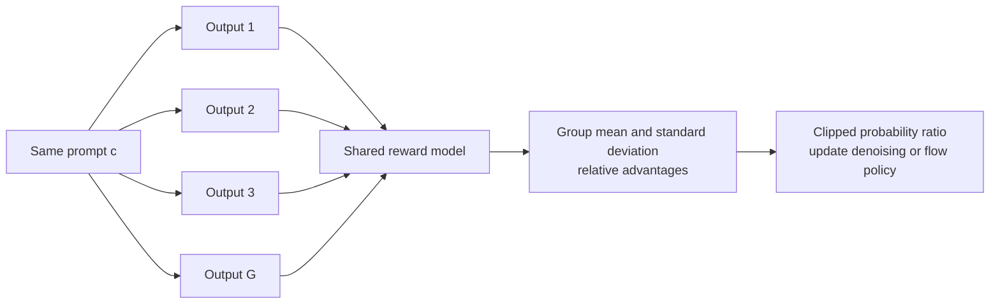

# 24.4 Reinforcement-Learning Alignment for Image Generation

Start with one prompt:

> Three red umbrellas in a glass corridor, with a blue sign on the right wall.

Suppose the model produces a polished corridor with two umbrellas and a green sign. An aesthetic scorer may reward the image, even though it failed two explicit requirements. Supervised fine-tuning can imitate good examples, but it does not directly express which of two plausible outputs better satisfies this prompt.

This is why reinforcement learning is useful here. The model generates an image, one or more evaluators score the result, and training makes high-scoring denoising trajectories more likely. The difficult part is deciding what an action is inside a diffusion sampler, how a final score reaches earlier denoising steps, and whether the evaluator measures the user's request or an exploitable shortcut.

By the end of this section, we will be able to read the state, action, probability ratio, advantage, and reward in a visual-generation RL paper. We will also be able to tell whether a method is improving aesthetics, prompt following, or merely the proxy chosen by its evaluator.


<div style="text-align: center; font-size: 0.9em; color: var(--vp-c-text-2); margin-top: -10px; margin-bottom: 20px;">
  <em>Figure 1: RL post-training results shown in the DDPO paper/project. Different rewards push the Diffusion model toward different generation preferences, intuitively illustrating the key insight of visual generation RL: reward design directly shapes the final image distribution. Source: <a href="https://github.com/kvablack/ddpo-pytorch" target="_blank" rel="noopener noreferrer">DDPO GitHub</a>, corresponding paper Black et al., 2024</em>
</div>

The algorithm storyline corresponding to this image comes from the DDPO paper; the subsequent exposition of writing Diffusion as MDP and then using policy gradients to update denoising trajectories also uses this paper as the core reference[^ddpo].

## 24.4.1 From Answering a Question to Generating an Image

A better way to understand the progression is not "can VLM directly transfer to generation," but to first look at a longer path:

> **LLM Text RL → VLM Understanding RL → Visual Generation RL**

All three use the same basic RL language: the model is the policy, model outputs form trajectories, rewards evaluate trajectories, and training uses KL, clipping, or advantage to stabilize updates. But with each step forward, the optimized object changes.

First, LLM. The input is a text context, and the output is also text. One response can be viewed as a token trajectory:

$$
y=(y_1,y_2,\ldots,y_T)
$$

Each step's action is "choose the next token." Rewards can come from human preference models, rule checks, math verifiers, code execution results, or format constraints. Methods like PPO, DPO, and GRPO differ in details but mostly revolve around "how to make text responses better match rewards."

Moving to VLM understanding, the input gains images:

$$
c=(\text{image}, \text{text prompt})
$$

But many tasks still output text, options, coordinates, or bounding boxes. That is, the model has more visual evidence, but actions still often fall on tokens or structured answers. Rewards are also relatively easy to write: is the answer correct, is the box well-aligned, is the IoU high enough, does the reasoning format meet requirements. This is the core of work like VLM-R1 / VISTA-Gym from previous sections: teaching the model to leverage visual information rather than relying on language priors to guess answers.

Then visual generation is where things truly shift to a different level. The model's goal is no longer "look at an image and answer," but "create a new visual result based on a prompt." The output is no longer a string of answer tokens, but an image, a video, or more precisely, a latent / denoising trajectory. The reward no longer mainly asks "does the answer equal the ground truth," but asks:

- Does the image match the prompt?
- Are counts, colors, and spatial relationships correct?
- Do humans prefer this result?
- Is the image natural, clear, and stylistically consistent?
- Are consecutive video frames coherent?

We can put these three stages in a table:

- **Stage — LLM text post-training**
  - Input: Text prompt
  - Output: Text response
  - Action in RL: Next token
  - Reward Resembles: Preference, rules, verifier
- **Stage — VLM understanding post-training**
  - Input: Image + text question
  - Output: Text, options, boxes, coordinates
  - Action in RL: Mostly tokens or structured answers
  - Reward Resembles: Answer correctness, IoU, tool verification
- **Stage — Visual generation post-training**
  - Input: Text / image condition
  - Output: Image, video, latent trajectory
  - Action in RL: Each denoising transition
  - Reward Resembles: Preference, alignment, quality, fine-grained constraints

So visual generation RL does not overturn what came before; it applies the same RL language to a harder object.

What can be inherited includes: policy gradient, advantage, KL regularization, PPO-style clipping, reward models, and judge models. What truly needs rewriting is state, action, trajectory, and reward.

This is why work like DDPO first does something seemingly simple but very important: translating Diffusion's denoising process into states, actions, trajectories, and rewards[^ddpo]. Only when this translation is clear do we know what policy gradients are actually updating.

## 24.4.2 How an Image Emerges from Noise

A diffusion model's generation process can be understood as "starting from noise, progressively denoising."

Initially, the model has a latent close to random noise, denoted $x_T$. Then the model generates step by step:

$$
x_T \rightarrow x_{T-1} \rightarrow \cdots \rightarrow x_1 \rightarrow x_0
$$

Here $x_0$ is the latent corresponding to the final image. After passing through a decoder, the user sees the image.

At each denoising step, the model looks at three things:

- **Symbol — $x_t$:** Current noisy latent
- **Symbol — $t$:** Current denoising timestep
- **Symbol — $c$:** Prompt or conditioning information

The model decides the next latent:

$$
x_{t-1}\sim p_\theta(x_{t-1}\mid x_t,t,c)
$$

This formula means: given the current noisy state $x_t$, timestep $t$, and prompt $c$, the model defines a probability distribution using parameters $\theta$ and samples the next step $x_{t-1}$ from it.

Why does this resemble a policy? Because in RL, a policy is defined as:

$$
\pi_\theta(a\mid s)
$$

"Given current state $s$, the probability distribution for choosing action $a$."

In LLMs, we are familiar with this form:

$$
\pi_\theta(y_t\mid y_{<t},c)
$$

Given preceding tokens $y_{<t}$ and context $c$, the model chooses the next token $y_t$. So tokens are actions, and text context is the state.

Diffusion's denoising distribution has the same shape:

$$
p_\theta(x_{t-1}\mid x_t,t,c)
$$

Given the current noisy latent, timestep, and prompt, the model chooses the next latent. So $(x_t,t,c)$ can be viewed as the state, and $x_{t-1}$ or the equivalent denoising direction as the action.

Of course, this statement only means "it can formally be viewed as a policy." It does not yet constitute RL. Only when we define a reward for the final image and use it to update $p_\theta$ does this sampling process truly become a reinforcement learning problem.

### Translating Diffusion into MDP Language

DDPO (Denoising Diffusion Policy Optimization)'s key observation is: Diffusion's sampling process can be viewed as a finite-length MDP. Black et al.'s DDPO paper explicitly treats denoising as a multi-step decision-making problem, then uses policy gradients to directly optimize downstream rewards[^ddpo].

This translation is very important. Let's examine each component:

- **RL Concept — State $s_t$:** Current latent, timestep, and prompt: $(x_t,t,c)$
- **RL Concept — Action $a_t$:** Sampling the next latent, or predicting the denoising direction
- **RL Concept — Trajectory $\tau$:** The complete denoising chain: $x_T,\ldots,x_0$
- **RL Concept — Reward $R$:** Score given by a reward model on the final image
- **RL Concept — Policy $\pi_\theta$:** The diffusion model's denoising distribution $p_\theta$

Thus, one generation is like an episode:

$$
\tau=(x_T,x_{T-1},\ldots,x_0)
$$

In RL, an episode refers to one complete interaction: starting from an initial state, the agent continuously chooses actions, the environment continuously provides the next state, until the task terminates. For example, in CartPole, from when the cart and pole are initialized until the pole falls or the maximum steps are reached, that is one episode. In text generation, from the start token to the end token can also be viewed as an episode.

The significance of an episode is to define the boundary of a "result." It tells us which states and actions belong to the same attempt, and which sequence of decisions should be reviewed for the final outcome. For image generation, looking at any single intermediate latent makes it hard to judge whether it is a "good image." What can truly be scored by human preference models, CLIP scores, aesthetic models, or task rewards is usually the final $x_0$. So we treat the entire chain from pure noise $x_T$ through step-by-step denoising to $x_0$ as one episode, with the terminal state being the final image.

After the episode ends, the reward model sees the final image and gives a score:

$$
R=r_\phi(x_0,c)
$$

Note that $r_\phi$ here is not the generation model itself, but a separate scoring model. Its parameters are $\phi$, while the generation model's parameters are $\theta$.

With this, the generation model's objective can be written as:

$$
J(\theta)=\mathbb{E}_{\tau\sim p_\theta}\left[r_\phi(x_0,c)\right]
$$

This reads: we want the average reward of the final image, sampled from the model's own trajectories, to be as high as possible.

## 24.4.3 DDPO: Propagating the Final Score Through the Denoising Trajectory

With the MDP translation above, DDPO is no longer mysterious. It essentially applies policy gradients on Diffusion sampling trajectories.

Let's first locate this derivation in the literature. The table below maps what we are about to do to its classic reference:

- **What We Do — Treat one denoising generation as an episode / MDP:** DDPO: Black et al., 2024[^ddpo]
- **What We Do — High-score samples increase probability, low-score samples decrease it; mathematically called policy gradient:** REINFORCE: Williams, 1992[^reinforce]
- **What We Do — Use old/new logprob ratio and clipping to keep each update small:** PPO: Schulman et al., 2017[^ppo]
- **What We Do — Use KL constraint to limit deviation from the reference model:** DPOK: Fan et al., 2023[^dpok]
- **What We Do — Train reward models using human or aesthetic preferences:** Pick-a-Pic / HPS v2[^pickapic][^hpsv2]

The most terminology-intimidating row is the second one. Its plain-language version is simple:

> If a denoising trajectory ultimately generates a high-scoring image, make the model more likely to sample the steps in that trajectory in the future; if the final score is low, make those steps less likely to be sampled.

The problem is, training a model requires more than just saying "make it more likely to happen." We need a computable gradient direction. The log-derivative trick in REINFORCE is exactly the step that converts this statement into a trainable formula.

Let's first align the symbols that will appear:

- **Symbol — $\theta$:** Diffusion model parameters — what training modifies
- **Symbol — $c$:** Prompt
- **Symbol — $\tau$:** A complete generation trajectory, from $x_T$ denoising to $x_0$
- **Symbol — $p_\theta(\tau)$:** Probability that the current model samples this trajectory
- **Symbol — $R(\tau,c)$:** Score for the final image generated by this trajectory
- **Symbol — $J(\theta)$:** Average score of the current model; training objective is to make it larger
- **Symbol — $\nabla_\theta$:** "Which direction to change parameters so $J(\theta)$ increases" — the gradient

Let's first write out the probability of one denoising trajectory. To simplify notation, we assume prompt $c$ is given:

$$
p_\theta(\tau\mid c)
=
p(x_T)\prod_{t=1}^{T}
p_\theta(x_{t-1}\mid x_t,t,c)
$$

This formula has two implications. First, the initial noise $x_T$ is usually sampled from a standard Gaussian distribution and does not depend on model parameters $\theta$. Second, what is truly controlled by the model is each denoising step's distribution $p_\theta(x_{t-1}\mid x_t,t,c)$.

This product is also intuitive: for the full trajectory to occur, step $T$ must sample $x_{T-1}$, step $T-1$ must sample $x_{T-2}$, and so on until $x_0$ is sampled. So the probability of the entire trajectory is the product of each step's probability.

The generation model wants to maximize the final reward:

$$
J(\theta)
=
\mathbb{E}_{\tau\sim p_\theta(\tau\mid c)}
\left[R(\tau,c)\right]
$$

where $R(\tau,c)=r_\phi(x_0,c)$, the reward model's score on the final image.

Let's first understand this with a small discrete example. Suppose under the same prompt, the model can only produce three denoising trajectories:

- **Trajectory — $\tau_1$**
  - Probability of model sampling it: $p_1$
  - Final reward: $R_1$
- **Trajectory — $\tau_2$**
  - Probability of model sampling it: $p_2$
  - Final reward: $R_2$
- **Trajectory — $\tau_3$**
  - Probability of model sampling it: $p_3$
  - Final reward: $R_3$

Then the average reward is:

$$
J=p_1R_1+p_2R_2+p_3R_3
$$

If $\tau_2$'s reward is high, we naturally want $p_2$ to increase. In other words, the intuition behind RL updates is not "directly push image pixels in some direction," but "change the model's sampling probability": increase the probability of high-scoring trajectories and decrease the probability of low-scoring ones.

Real Diffusion has not just three trajectories, but a continuous, enormous number of possible trajectories. Writing the above weighted average as an integral:

$$
J(\theta)
=
\int p_\theta(\tau\mid c)R(\tau,c)\,d\tau
$$

This integral need not be too intimidating. It is just "multiply all possible trajectories' probabilities by their scores and add them up." In the discrete case it is $p_1R_1+p_2R_2+p_3R_3$; in the continuous case it is written as an integral.

Now take the gradient with respect to $\theta$, asking: in which direction should we change model parameters so that average reward increases?

$$
\nabla_\theta J(\theta)
=
\int \nabla_\theta p_\theta(\tau\mid c)R(\tau,c)\,d\tau
$$

Now the problem: this expression contains $\nabla_\theta p_\theta(\tau\mid c)$, meaning "how does the probability of this complete trajectory change when model parameters change." But during training, we get a batch of trajectories sampled by the model — we cannot enumerate all trajectories. We want to rewrite the gradient as a "mean over sampled trajectories" form, so we can estimate it using actual samples.

Here we use a small identity called the **log-derivative trick**, also known as the **score-function trick**. It is the core technique behind REINFORCE-style policy gradient methods[^reinforce]:

$$
\nabla_\theta p_\theta(\tau\mid c)
=
p_\theta(\tau\mid c)\nabla_\theta\log p_\theta(\tau\mid c)
$$

This identity simply rewrites $\nabla p$ as $p\nabla\log p$. The reason is:

$$
\nabla_\theta\log p_\theta
=
\frac{1}{p_\theta}\nabla_\theta p_\theta
$$

Multiplying both sides by $p_\theta$:

$$
p_\theta\nabla_\theta\log p_\theta
=
\nabla_\theta p_\theta
$$

It sounds like a trick, but it is essentially just an algebraic rearrangement. Its benefit is that $p_\theta(\tau\mid c)$ reappears in the formula, and this exactly represents "sampling trajectories from the current model." So we can estimate the gradient using actually sampled trajectories.

Substituting back:

$$
\nabla_\theta J(\theta)
=
\int p_\theta(\tau\mid c)
\nabla_\theta\log p_\theta(\tau\mid c)
R(\tau,c)\,d\tau
$$

That is:

$$
\nabla_\theta J(\theta)
=
\mathbb{E}_{\tau\sim p_\theta}
\left[
\nabla_\theta\log p_\theta(\tau\mid c)R(\tau,c)
\right]
$$

This step is critical because it converts an intractable problem into one that can be estimated by sampling. During training, we only need to do three things:

1. Sample a trajectory $\tau$ using the current Diffusion model;
2. Score the final image using the reward model to get $R(\tau,c)$;
3. Look at this trajectory's log probability under the model, $\log p_\theta(\tau\mid c)$, and increase or decrease it based on the reward.

So policy gradient does not require differentiating through the reward itself. The reward model can be non-differentiable or a black-box scorer; we only need to know "what score did this trajectory get." DDPO exploits exactly this property: rewards can come from aesthetic models, compression rates, VLM feedback, or other objectives that cannot be directly backpropagated[^ddpo].

Next, expand the trajectory's log probability:

$$
\log p_\theta(\tau\mid c)
=
\log p(x_T)
+
\sum_{t=1}^{T}
\log p_\theta(x_{t-1}\mid x_t,t,c)
$$

Why take log? Because the original trajectory probability is a product of probabilities. Products are hard to handle when long; taking log converts multiplication into addition:

$$
\log(ab)=\log a+\log b
$$

So the log probability of the entire trajectory equals the sum of each step's log probability.

Since $\log p(x_T)$ does not depend on $\theta$, it vanishes when taking the gradient:

$$
\nabla_\theta\log p_\theta(\tau\mid c)
=
\sum_{t=1}^{T}
\nabla_\theta
\log p_\theta(x_{t-1}\mid x_t,t,c)
$$

So the most basic policy gradient is:

$$
\nabla_\theta J
=
\mathbb{E}\left[
\sum_{t=1}^{T}
\nabla_\theta \log p_\theta(x_{t-1}\mid x_t,t,c)
\cdot R(\tau,c)
\right]
$$

This is REINFORCE applied to Diffusion trajectories[^reinforce]: if a denoising trajectory receives a high reward, increase the probability of each step's sampled action along that trajectory; if the reward is low, decrease their probability. Black et al.'s DDPO paper applies exactly this approach to Diffusion denoising trajectories[^ddpo].

### Why Can We Subtract a Baseline and Use Advantage?

Updating directly with $R(\tau,c)$ will have high variance. One prompt may naturally tend to produce high-scoring images, while another is inherently harder. We care more about: is this sample better or worse than similar samples?

Therefore, we can subtract a baseline $b(c)$:

$$
\hat{A}=R(\tau,c)-b(c)
$$

Here $\hat{A}$ is called the advantage. It does not ask "what is this image's absolute score," but "how much better is it than the reference level." If the reward is 8 and the baseline is 6, the advantage is +2, meaning this generation is better than expected; if the reward is 5 and the baseline is 6, the advantage is -1, meaning this generation is worse than expected.

Why can we subtract a baseline? The intuition is: if we subtract the same constant from all scores in a group, the relative ranking doesn't change. What training truly needs is "relatively better" or "relatively worse."

Mathematically, we can verify it does not change the expected gradient. We only need to show: the baseline term that was subtracted averages to zero.

$$
\mathbb{E}_{\tau\sim p_\theta}
\left[
\nabla_\theta\log p_\theta(\tau\mid c)b(c)
\right]
=
b(c)\int p_\theta(\tau\mid c)
\nabla_\theta\log p_\theta(\tau\mid c)d\tau
$$

Here $b(c)$ is moved outside because it is a fixed number under the same prompt and does not depend on the specific sampled action. Using the same log-derivative trick:

$$
=
b(c)\int \nabla_\theta p_\theta(\tau\mid c)d\tau
=
b(c)\nabla_\theta \int p_\theta(\tau\mid c)d\tau
=
b(c)\nabla_\theta 1
=0
$$

Why is the last line 1? Because $\int p_\theta(\tau\mid c)d\tau$ means "sum of probabilities over all possible trajectories," which must equal 1. The gradient of 1 with respect to parameters is 0. So subtracting a baseline that does not depend on specific actions does not change the average update direction — it only makes updates more stable.

In practice, $\hat{A}$ can be computed in several common ways:

- **Advantage Method — $R-\bar{R}$:** Subtract the batch mean reward
- **Advantage Method — $R-b(c)$:** Subtract the prompt-level historical mean reward
- **Advantage Method — $R-V_\psi(x_t,t,c)$:** Subtract the value model's prediction for the current state
- **Advantage Method — Normalized reward:** Standardize batch rewards for more stable scale

With advantage, the commonly used DDPO policy gradient becomes:

$$
\nabla_\theta J
=
\mathbb{E}\left[
\sum_{t=1}^{T}
\nabla_\theta \log p_\theta(x_{t-1}\mid x_t,t,c)
\cdot \hat{A}_t
\right]
$$

If using only the terminal reward, each step can share the same $\hat{A}$. If a value model is trained, different timesteps can have different $\hat{A}_t$.

### How Does This Match Diffusion's Log Probability?

In many Diffusion implementations, each reverse transition step can be written as a Gaussian distribution:

$$
p_\theta(x_{t-1}\mid x_t,t,c)
=
\mathcal{N}\left(
\mu_\theta(x_t,t,c),
\sigma_t^2 I
\right)
$$

Here $\mu_\theta$ is the denoising mean predicted by the model, and $\sigma_t$ is the noise scale at this step. DDPO's implementation needs to record each step's log probability, which is essentially taking logprob on this reverse transition distribution[^ddpo]. The log probability of this action is approximately:

$$
\log p_\theta(x_{t-1}\mid x_t,t,c)
=
-
\frac{1}{2\sigma_t^2}
\left\|
x_{t-1}-\mu_\theta(x_t,t,c)
\right\|_2^2
+ \text{const}
$$

This formula has a straightforward interpretation: if the actually sampled $x_{t-1}$ is close to the model's predicted mean $\mu_\theta(x_t,t,c)$, the squared distance is small and the log probability is high; if it is far away, the squared distance is large and the log probability is low.

This explains what `step.logprob` means in pseudocode: it is not an abstract RL symbol, but the log probability that the current model sampled this particular $x_{t-1}$ at step $t$.

## 24.4.4 From Policy Gradients to a Stable Training Loss

Deep learning frameworks typically minimize loss, while policy gradient maximizes $J(\theta)$. So implementations write it with a negative sign:

$$
\mathcal{L}_{\text{pg}}
=
-
\mathbb{E}\left[
\sum_{t=1}^{T}
\log p_\theta(x_{t-1}\mid x_t,t,c)
\cdot \hat{A}_t
\right]
$$

Minimizing this loss is equivalent to maximizing the policy gradient objective. Intuitively:

- **Case — $\hat{A}_t>0$:** Increase the log probability of this step's sampled action
- **Case — $\hat{A}_t<0$:** Decrease the log probability of this step's sampled action
- **Case — $\hat{A}_t\approx 0$:** Essentially no update at this step

This is completely consistent with Chapter 6's REINFORCE, except the action has changed from "choosing a token" to "choosing the next latent."

### Why Still Need a KL Constraint?

If we only maximize reward, the model easily goes astray. The reason is simple: the reward model itself is not perfect. The model may find patterns that the reward model likes but humans do not truly prefer.

So practical training often keeps a reference model $p_{\text{ref}}$ and penalizes the current model for deviating too far from it. DPOK also uses "policy optimization + KL regularization" as the core structure for text-to-image diffusion RL fine-tuning[^dpok]:

$$
\mathcal{L}_{\text{DDPO}}
=
\mathcal{L}_{\text{pg}}
+
\beta\,
\mathbb{E}\left[
\sum_{t=1}^{T}
\mathrm{KL}\left(
p_\theta(\cdot\mid x_t,t,c)
\|p_{\text{ref}}(\cdot\mid x_t,t,c)
\right)
\right]
$$

This formula can be understood in two parts:

- **Term — Policy gradient term:** Makes high-reward sampling trajectories more likely
- **Term — KL term:** Prevents the model from straying too far from the original model in pursuit of reward

This is the same idea as in RLHF, DPO, and GRPO: make the model improve without drifting too far from the reference model.

### DDPO's Minimal Training Flow

The derivation above explains "why we can update." Now let's unpack the training process to see clearly: in one DDPO update, how does data flow from prompt to loss.

One sentence to remember:

> DDPO does not do supervised learning on existing images. It has the current model generate images itself, uses rewards to judge which generation results are good or bad, and then propagates the good/bad signal back to the sampling trajectories[^ddpo].

This is its core difference from ordinary diffusion fine-tuning. Supervised fine-tuning provides target images to imitate. DDPO compares samples from the current policy and increases the probability of the better-scoring denoising trajectories.

#### Step 1: Take a Batch of Prompts

The first step is not to take images, but prompts:

$$
\mathcal{B}=\{c_i\}_{i=1}^{B}
$$

where $B$ is the batch size and $c_i$ is the $i$-th prompt.

Prompt data quality directly affects training direction. If prompts are too simple, the model may only learn to improve general aesthetics; if prompts contain fine-grained constraints on count, color, position, and relationships, the reward model has the opportunity to train the model's instruction-following ability.

In practice, a good prompt batch often mixes several types:

- **Prompt Type — Simple scene prompts:** Stabilize base generation quality
- **Prompt Type — Multi-attribute prompts:** Train details like color, material, count
- **Prompt Type — Spatial relationship prompts:** Train left/right, up/down, occlusion, relative position
- **Prompt Type — Long instruction prompts:** Train instruction-following under complex conditions
- **Prompt Type — Benchmark-style prompts:** Align training objectives with final evaluation

This step may seem ordinary but is critical: RL can only optimize the model's behavior on the distribution of these prompts. If the prompt distribution is too narrow, the model may only improve in narrow scenarios.

#### Step 2: Rollout with the Current Model

The second step is generating images with the current Diffusion model. In RL, this step is typically called **rollout**, meaning letting the policy run a trajectory.

For each prompt $c_i$, the model starts from noise $x_T$ and samples a complete denoising chain:

$$
\tau_i=(x_T^{(i)},x_{T-1}^{(i)},\ldots,x_0^{(i)})
$$

There is a detail easily overlooked: during training, we cannot just save the final image — we must also save key information from each denoising step.

- **What to Save — $x_t$:** Later need to recompute this step's log probability
- **What to Save — $x_{t-1}$:** This is the actual action sampled at step $t$
- **What to Save — $\log p_{\theta_{\text{old}}}(x_{t-1}\mid x_t,t,c)$:** For PPO-style updates, need old logprob
- **What to Save — Final image $x_0$ or decoded image:** Reward model needs to score the final result

Why does $\theta_{\text{old}}$ appear? Because the model used for sampling is the pre-update model. By the time we do the gradient update, model parameters are about to change. To know "how much the new model changed the action probability relative to the old model," we often need to save old logprobs.

If doing only the most basic REINFORCE update, we can directly use the logprobs from sampling. But in real training, to improve sample utilization, we typically do multiple update epochs on the same rollout batch, and old logprobs become important. This old/new policy ratio idea comes from PPO[^ppo], and DDPO's importance-sampling variants also follow this "fix rollout, then use probability ratio to correct updates" approach[^ddpo].

#### Step 3: Score Final Results with Reward Model

The third step hands the generated images to the reward model:

$$
R_i=r_\phi(x_0^{(i)},c_i)
$$

Important note: the reward model only scores — it does not necessarily participate in backpropagation. Policy gradient needs "what score did this trajectory get," not the gradient of reward with respect to pixels or latents.

This is also an advantage of DDPO over differentiable reward backpropagation: rewards can come from very complex systems, such as VLM judges, human preference models, rule checkers, or even combinations of multiple models. As long as a scalar score can be produced, it can serve as a policy gradient signal. In contrast, work like DRaFT and VADER uses differentiable reward gradients to directly backpropagate into image or video diffusion models[^draft][^vader].

A common reward computation flow:

1. Decode latent $x_0$ into an image.
2. Use a text-image alignment model to check prompt compliance.
3. Use a preference or aesthetic model to score visual quality.
4. Use rules or VLM to check hard constraints like count, color, and spatial relationships.
5. Combine to get the final reward $R_i$.

The biggest risk at this step is unstable reward scales. For example, some rewards are in $[0,1]$, others in $[-10,10]$; directly adding them may let one term dominate training. Therefore, practical training often applies clipping, normalization, or hierarchical filtering.

#### Step 4: Convert Rewards to Advantages

The fourth step computes advantages from rewards. The simplest approach is batch-level centering:

$$
\hat{A}_i=R_i-\frac{1}{B}\sum_{j=1}^{B}R_j
$$

For even more stable scaling, divide by standard deviation:

$$
\hat{A}_i=
\frac{R_i-\mathrm{mean}(R)}
{\mathrm{std}(R)+\epsilon}
$$

After this, $\hat{A}_i>0$ means the $i$-th image is better than the batch average, and $\hat{A}_i<0$ means it is worse.

Why not use $R_i$ directly? Because absolute scores are often hard to interpret. One prompt may be inherently difficult, where generating a 0.6 score is already good; another prompt may be simple, where 0.8 is only average. Advantage cares about "relative performance," so training is more stable.

In more complete implementations, a value model can also be trained:

$$
V_\psi(x_t,t,c)\approx
\mathbb{E}[R\mid x_t,t,c]
$$

Then used as:

$$
\hat{A}_{i,t}=R_i-V_\psi(x_t^{(i)},t,c_i)
$$

This way different timesteps can have different advantages. But for introductory understanding of DDPO, batch mean baseline is sufficient to grasp the core.

#### Step 5: Compute Policy Gradient Loss

The fifth step is where the Diffusion model is actually updated.

First, the minimal REINFORCE loss. It does one thing: multiply "this trajectory's log probability" with "how good this trajectory is."

$$
\mathcal{L}_{\text{pg}}
=
-
\frac{1}{B}
\sum_{i=1}^{B}
\sum_{t=1}^{T}
\log p_\theta(x_{t-1}^{(i)}\mid x_t^{(i)},t,c_i)
\cdot \hat{A}_i
$$

This formula can be read at three levels:

- **Formula Part — $\log p_\theta(x_{t-1}^{(i)}\mid x_t^{(i)},t,c_i)$:** Log probability that the model sampled this denoising action at step $t$
- **Formula Part — $\hat{A}_i$:** How much better the $i$-th image is than average
- **Formula Part — Leading negative sign:** Because the optimizer minimizes loss by default, and we want to maximize good trajectory probability

If $\hat{A}_i>0$, this image is better than average; minimizing loss increases the log probability of each action along this trajectory. If $\hat{A}_i<0$, this image is worse than average; minimizing loss decreases the log probability of these actions.

Many implementations also use PPO-style importance ratios. This ratio and the subsequent clip objective correspond to PPO's core stabilization design[^ppo]:

$$
\rho_{i,t}(\theta)
=
\frac{
p_\theta(x_{t-1}^{(i)}\mid x_t^{(i)},t,c_i)
}{
p_{\theta_{\text{old}}}(x_{t-1}^{(i)}\mid x_t^{(i)},t,c_i)
}
=
\exp\left(
\log p_\theta(x_{t-1}^{(i)}\mid x_t^{(i)},t,c_i)
-
\log p_{\theta_{\text{old}}}(x_{t-1}^{(i)}\mid x_t^{(i)},t,c_i)
\right)
$$

This represents: how much the new model increased the probability of the same denoising action relative to the old model. For example, $\rho=1.2$ means the new model makes this action approximately 20% more likely; $\rho=0.7$ means it makes it less likely. In implementation, logprob subtraction followed by `exp` is used because logprobs are more stable and easier to save during sampling.

Then the clipped objective:

$$
\mathcal{L}_{\text{clip}}
=
-
\frac{1}{B}
\sum_{i=1}^{B}
\sum_{t=1}^{T}
\min\left(
\rho_{i,t}\hat{A}_i,
\mathrm{clip}(\rho_{i,t},1-\epsilon,1+\epsilon)\hat{A}_i
\right)
$$

The clip limits overly aggressive updates. Assuming $\epsilon=0.2$, the ratio is typically constrained to around $[0.8,1.2]$. Even if an image has a very high reward, the new model is not allowed to drastically increase any single action's probability in one step.

The `min` in this formula can also be read as: when the update direction is favorable, only allow limited benefit; beyond the clip range, further increasing the ratio does not improve the objective. This prevents the model from suddenly shifting due to a small batch of high-scoring samples. Applied to Diffusion, this means don't let one reward update push the denoising distribution too far from the original model; both KL regularization and ratio clipping control this[^ppo][^dpok].

#### Step 6: Add KL Regularization and Update Parameters

The final step combines the policy gradient loss, KL regularization, and other stabilization terms:

$$
\mathcal{L}
=
\mathcal{L}_{\text{clip}}
+
\beta\mathcal{L}_{\text{KL}}
$$

where:

$$
\mathcal{L}_{\text{KL}}
=
\frac{1}{B}
\sum_{i=1}^{B}
\sum_{t=1}^{T}
\mathrm{KL}\left(
p_\theta(\cdot\mid x_t^{(i)},t,c_i)
\|p_{\text{ref}}(\cdot\mid x_t^{(i)},t,c_i)
\right)
$$

$p_{\text{ref}}$ is typically the base Diffusion model from before RL started. It serves as an anchor, preventing the model from drifting too far in pursuit of the reward model's preferences.

The KL term can be understood as "the distance between two probability distributions." If the current model's denoising distribution at a step is close to the reference model's, KL is small; if the current model gives a very different distribution to chase reward, KL is large. $\beta$ controls the penalty weight: large $\beta$ means the model is more conservative; small $\beta$ means the model more aggressively pursues reward.

At this point, standard backpropagation is executed:

1. Compute total loss.
2. `loss.backward()` to get gradients.
3. Clip gradients to prevent explosion.
4. `optimizer.step()` to update the Diffusion model.
5. Move to the next batch of prompts and repeat rollout and update.

Combining the six steps above, we get pseudocode closer to real training. It is not a line-by-line reproduction of any specific repository, but places DDPO's rollout/reward update[^ddpo], PPO's clipped objective[^ppo], and DPOK's KL constraint[^dpok] in the same minimal training framework:

```python
for prompts in prompt_loader:
    # Step 1-2: rollout with the current policy
    with torch.no_grad():
        trajectories = diffusion.sample_trajectories(
            prompts,
            return_states=True,
            return_actions=True,
            return_logprobs=True,
        )
        old_logprobs = trajectories.logprobs
        images = decoder(trajectories.final_latents)

    # Step 3: score final images
    with torch.no_grad():
        rewards = reward_model(prompts, images)

    # Step 4: turn rewards into advantages
    advantages = (rewards - rewards.mean()) / (rewards.std() + 1e-6)

    # Step 5-6: update the diffusion policy
    for _ in range(update_epochs):
        logprobs = diffusion.logprob(
            states=trajectories.states,
            actions=trajectories.actions,
            prompts=prompts,
        )

        ratio = torch.exp(logprobs - old_logprobs)
        unclipped = ratio * advantages[:, None]
        clipped = ratio.clamp(1 - eps, 1 + eps) * advantages[:, None]
        policy_loss = -torch.minimum(unclipped, clipped).mean()

        kl_loss = diffusion.kl_to(reference_model, trajectories, prompts)
        loss = policy_loss + beta * kl_loss

        optimizer.zero_grad()
        loss.backward()
        torch.nn.utils.clip_grad_norm_(diffusion.parameters(), max_norm)
        optimizer.step()
```

This code has one more engineering detail than the earlier math formulas: **sampling and updating are separated.** Sampling uses the old model, so `old_logprobs` must be saved; updating recomputes `logprobs` with the current model, then uses the ratio to determine how much the new model changed relative to the old model.

If we compress DDPO into one engineering intuition:

> For the same batch of prompts, let the model generate its own samples; rank the generation results by reward; increase the probability of good samples' denoising trajectories, decrease the probability of bad samples' trajectories, while using KL and clipping to prevent the model from shifting too aggressively.

## 24.4.5 DanceGRPO: Why Generate a Group for the Same Prompt?

DDPO solves the basic problem of expressing diffusion sampling as policy gradients. Modern visual generation introduces two further difficulties.

First, many models use rectified flow or flow matching. Their ordinary differential equation paths are often deterministic: once the initial noise is fixed, each step is fixed. Policy gradients then have no stochastic transition probability to optimize.

Second, reward scales differ greatly across prompts. A simple composition may score highly across all samples, while a prompt with complex spatial relations may score poorly. Absolute rewards alone cannot distinguish an improved model from an easier prompt.

The [DanceGRPO paper](https://arxiv.org/abs/2505.07818) addresses both problems[^dancegrpo]. It rewrites diffusion and rectified-flow sampling as stochastic differential equations so that the transitions again have computable probabilities. It then generates $G$ outputs for the same condition and estimates advantage from their relative performance.



Consider three outputs with rewards `1, 2, 3`. Their mean is `2`, so subtracting it gives the first, second, and third outputs negative, zero, and positive update directions. Training also divides by the within-group standard deviation to keep advantages on comparable scales across conditions:

$$
\hat A_i
=
\frac{r_i-\operatorname{mean}(r_1,\ldots,r_G)}
{\operatorname{std}(r_1,\ldots,r_G)+\varepsilon}.
$$

The mean removes whether this prompt is generally easy or hard. The standard deviation stabilizes the reward scale. Training still uses a clipped probability ratio; only the advantage now comes from a group generated under the same condition.

DanceGRPO's public experiments cover image generation, text-to-video, and image-to-video with Stable Diffusion, FLUX, HunyuanVideo, and SkyReels-I2V. They combine aesthetic, text-image alignment, motion, and binary verifiable rewards[^dancegrpo-repo]. This demonstrates that the method spans diffusion and flow models. It does not show that every production video model uses DanceGRPO, nor does it reveal the internal algorithms of Seedance, Kling, or Hailuo.

### What DDPO and DanceGRPO Each Solve

- DDPO establishes the basic translation: denoising transitions are actions, a complete sample is a trajectory, and the final image score is the reward.
- DanceGRPO handles modern flow sampling and within-condition relative advantages, extending the same framework to more generators and tasks.
- Neither requires a differentiable reward. When reward gradients are reliable, DRaFT directly optimizes differentiable rewards, while VADER backpropagates reward gradients through video diffusion[^draft][^vader].

An algorithm name does not determine the hardware budget. The official DanceGRPO repository's paper-scale recipes use 8 H800 GPUs for Stable Diffusion, 16 for FLUX, and more for HunyuanVideo and SkyReels-I2V[^dancegrpo-repo]. These are reproduction configurations, not minimum requirements for learning the method. A smaller model, fewer sampling steps, and offline rewards are enough to validate the data flow first.

## 24.4.6 The Reward Model Determines What the Generator Learns

Reinforcement learning only increases the supplied reward. If that reward omits a property users care about, training will reliably optimize the wrong target.

### Human Preference: Which of Two Plausible Images Is Better?

Pick-a-Pic collects pairwise image preferences under the same prompt and uses those comparisons to train PickScore[^pickapic]. Annotators need not assign precise scalar scores; they select the image that follows the prompt more naturally, or indicate that neither is satisfactory.


<div style="text-align: center; font-size: 0.9em; color: var(--vp-c-text-2); margin-top: -10px; margin-bottom: 20px;">
  <em>Figure 2: Pick-a-Pic's pairwise preference interface. Annotators compare two results for the same prompt and may reject both. Source: <a href="https://stability.ai/research/pick-a-pic" target="_blank" rel="noopener noreferrer">Pick-a-Pic project page</a>.</em>
</div>

HPS v2 also studies human preference with a more systematic dataset and evaluation protocol[^hpsv2]. Preference rewards capture composition and naturalness that pixel metrics miss, but they also inherit biases from annotators, data distributions, and presentation choices.

### Text Alignment: Did the Attractive Image Complete the Task?

Return to the opening example with three red umbrellas. An aesthetic reward may miss a counting error, while a text-image alignment model checks whether the image satisfies the condition. A complex prompt can be decomposed into verifiable questions:

- Are there exactly three umbrellas?
- Are the umbrellas red?
- Is the sign on the right?
- Is the sign blue?

This decomposition makes errors easier to locate. It also creates a risk: if the counter, detector, or vision-language judge has a systematic bias, the generator can learn to satisfy the judge rather than the user.


<div style="text-align: center; font-size: 0.9em; color: var(--vp-c-text-2); margin-top: -10px; margin-bottom: 20px;">
  <em>Figure 3: Candidates for one prompt can receive different preference rankings. Ranking is useful for relative preference training, but independent evaluation is still needed to detect overfitting. Source: PickScore.</em>
</div>

### Visual Quality: A High Score Must Not Come Only from Pleasing the Judge

Clarity, composition, color, and artifacts can be evaluated by aesthetic or quality models such as [LAION-Aesthetics](https://laion.ai/blog/laion-aesthetics/). A common engineering starting point combines alignment, preference, and image quality. The following is a **teaching template**, not a fixed objective prescribed by one paper:

$$
R
=
\lambda_{\mathrm{align}}R_{\mathrm{align}}
+
\lambda_{\mathrm{pref}}R_{\mathrm{pref}}
+
\lambda_{\mathrm{quality}}R_{\mathrm{quality}}.
$$

Each $\lambda$ expresses a product tradeoff. More aesthetic weight can hurt exact counting; more alignment weight can produce rigid compositions. Adding components does not resolve their conflicts. Save every component separately, plot separate training curves, and validate with task metrics and human judgments that were not used to train the reward model.

## 24.4.7 Reward Can Be Used During Training or Inference

Once a reward model is reliable, it has two common uses.

Inference-time reranking generates several candidates for the same condition, scores each one, and returns the highest-scoring result. It leaves model parameters unchanged and has lower deployment risk, but every request requires multiple samples.

RL fine-tuning writes the preference back into the generator's parameters. A single future sample is then more likely to score well, at the cost of more expensive and riskier training. Any loophole in the reward can also become embedded in the output distribution.

DPOK fine-tunes diffusion models with KL-regularized reinforcement learning[^dpok], while DRaFT directly backpropagates through differentiable rewards[^draft]. For video, Emu Video factorizes text-to-video generation through explicit image conditioning[^emu], MLLM-feedback methods evaluate videos with multimodal models[^t2vfeedback], and VADER propagates differentiable reward gradients through video diffusion[^vader]. The reward enters at different points, but each method asks how to make the final visual result satisfy the intended objective.

## 24.4.8 Distilling Capabilities Discovered Online

Online sampling for visual RL is expensive, and a trained model may still require too many denoising steps for high-volume serving. On-policy distillation provides a continuation path: let the RL policy keep generating, retain high-reward samples, and train a smaller or faster-sampling student on them.

A minimal loop has three steps:

1. Generate images or denoising trajectories with the current RL policy.
2. Remove low-quality, duplicate, and suspected reward-hacking samples with rewards and rules.
3. Supervise the student on retained samples, periodically resampling from the updated online policy.

"On-policy" means that the data comes from the current policy. As the policy changes, old samples become less representative and must be refreshed. Distillation lowers inference cost; it does not correct reward bias. If the filter prefers one fixed composition, the student will further consolidate that preference.

## 24.4.9 How to Audit a Visual-Generation Experiment

Do not report only that training reward increased. Check at least four things:

1. Fix a set of held-out prompts and random seeds, then compare images before and after training.
2. Report text alignment, visual quality, preference, and diversity separately so that one aggregate score cannot hide degradation.
3. Include prompts that expose loopholes: exact counts, left-right relations, negation, and rare combinations.
4. Ask human reviewers who did not train the reward model to evaluate results blindly, including uncertain and “both poor” outcomes.

If training reward rises without an improvement in human preference, inspect the reward model and sample distribution first. The algorithm is following the supplied objective.

## Connections to Previous Chapters

This section brings several earlier threads into one visual-generation problem. REINFORCE supplies policy gradients for terminal rewards, PPO supplies probability ratios and clipping, and GRPO supplies relative advantages within one condition. A vision-language model can then serve as an image judge, turning counts, attributes, and spatial relations into rewards.

This connection also motivates the next chapter's treatment of reward hacking. A generator has an enormous output space; once a judge has a stable loophole, the policy can amplify the corresponding high-scoring pattern.

## Summary

Visual-generation RL begins with a concrete translation: write denoising as states, actions, and trajectories, then use the final image reward to update the full trajectory.

DDPO establishes this translation. PPO-style probability ratios, clipping, and KL regularization stabilize the update. DanceGRPO further places diffusion and rectified flow inside stochastic sampling processes with computable probabilities, then estimates relative advantages from a group of outputs under the same condition.

The reward ultimately limits training quality. Aesthetics, text alignment, and human preference each cover only part of what makes an image good. The next section, [24.5 Temporal Consistency in Video](./video-generation-modern), adds the time axis and examines identity, event order, and physical causality in rewards and evaluation.

## References

[^reinforce]: Williams, R. J. (1992). Simple statistical gradient-following algorithms for connectionist reinforcement learning. _Machine Learning_. <https://doi.org/10.1007/BF00992696>

[^ppo]: Schulman, J. et al. (2017). Proximal Policy Optimization Algorithms. <https://arxiv.org/abs/1707.06347>

[^ddpo]: Black, K., Janner, M., Du, Y., et al. (2024). Training Diffusion Models with Reinforcement Learning. _ICLR_. <https://arxiv.org/abs/2305.13301>

[^dancegrpo]: Xue, Z. et al. (2025). DanceGRPO: Unleashing GRPO on Visual Generation. <https://arxiv.org/abs/2505.07818>

[^dancegrpo-repo]: DanceGRPO official implementation and reproduction recipes. <https://github.com/XueZeyue/DanceGRPO>

[^dpok]: Fan, Y., Watkins, O., Du, Y., et al. (2023). DPOK: Reinforcement Learning for Fine-tuning Text-to-Image Diffusion Models. _NeurIPS_. <https://arxiv.org/abs/2305.16381>

[^draft]: Clark, K. et al. (2024). Directly Fine-Tuning Diffusion Models on Differentiable Rewards. _ICLR_. <https://arxiv.org/abs/2309.17400>

[^vader]: Prabhudesai, M. et al. (2024). Video Diffusion Alignment via Reward Gradients. <https://arxiv.org/abs/2407.08737>

[^pickapic]: Kirstain, S. et al. (2023). Pick-a-Pic: Open Dataset of Human Preferences for Text-to-Image Generation. _NeurIPS_. <https://arxiv.org/abs/2305.01569>

[^hpsv2]: Wu, X. et al. (2023). Human Preference Score v2: A Benchmark for Evaluating Human Preferences of Text-to-Image Synthesis. _NeurIPS_. <https://arxiv.org/abs/2306.09341>

[^emu]: Girdhar, R. et al. (2024). Emu Video: Factorizing Text-to-Video Generation by Explicit Image Conditioning. _ECCV_. <https://arxiv.org/abs/2311.10709>

[^t2vfeedback]: Wu, X. et al. (2024). Boosting Text-to-Video Generative Model with MLLMs Feedback. _NeurIPS_. <https://neurips.cc/virtual/2024/poster/96722>
